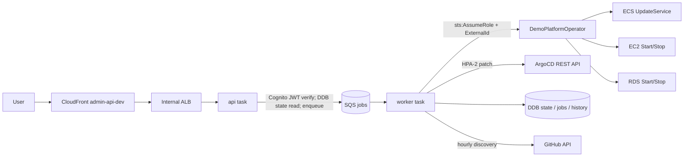

# Architecture

## System Overview

AWS Demo Platform is a hub-spoke control plane for managing GitHub-linked AWS demo projects across multiple AWS accounts. A single management EKS cluster (`mall-apne2-mgmt`) hosts Atlantis (PR-based Terraform automation), ArgoCD (GitOps for spoke workloads), and the external admin dashboard (planned Stage 3, ECS Fargate). All ingress flows through CloudFront → VPC Origin → Internal ALB → TargetGroupBinding, with no Kubernetes Ingress controllers and no public load balancers.

## Components

### Ingestion Layer
- **CloudFront** — Sole public entry point. Distributions for `atlantis.atomai.click`, `argocd.atomai.click`, and (planned) the dashboard. Origin protocol https-only; uses the `*.atomai.click` wildcard ACM cert.
- **CloudFront VPC Origin** — Private origin reaching the Internal ALB inside the VPC. The CF VPC Origin source SG (`sg-0a67fc7bfa9c2f0c6`) is added to the ALB SG ingress rule.
- **Internal ALB (`demo-platform-internal`)** — HTTPS:443 listener. Host-header rules route to per-component target groups (Atlantis, ArgoCD, future dashboard).

### Processing / Control Layer
- **EKS hub (`mall-apne2-mgmt`)** — Hosts Atlantis, ArgoCD v3.4.2, External Secrets Operator, and (in later stages) clickhouse-mgmt, tempo, prometheus, grafana, github self-hosted runners.
- **Atlantis** — Deployed via Kustomize (`k8s/system/atlantis`). IRSA → `AtlantisIRSARole` → cross-account assume of `DemoPlatformTerraformer`. GitHub App `atomoh-atlantis` webhook. `--write-git-creds` flag required.
- **ArgoCD** — Helm chart `argo/argo-cd` 9.5.15, self-managed. App-of-Apps: `master-system-root` watches `argocd-apps/system/`, `master-tenants-root` watches `argocd-apps/tenants/`. Spoke clusters registered via `argocd cluster add --upsert`.
- **External Secrets Operator (ESO)** — `ClusterSecretStore aws-secrets-manager` (v1 API). IRSA on hub via `ExternalSecretsIRSARole`. Provides `ExternalSecret` resources for Atlantis, ArgoCD admin, GitHub App, and future dashboard secrets.

### Storage Layer
- **AWS Secrets Manager** — All runtime secrets under `/demo-platform/...`. GitHub App credentials (4 slots), ArgoCD admin password, cross-account ExternalIds.
- **Terraform state** — Shared S3 backend `multi-region-mall-terraform-state` (cross-repo with `multi-region-architecture`), DynamoDB lock table `multi-region-mall-terraform-locks`.
- **Observability backends (hub)** — ClickHouse (otel traces/logs, Altinity CHI in `observability` ns) and Grafana Tempo (S3-backed traces) deployed as ArgoCD ApplicationSets `appset-clickhouse` / `appset-tempo` (mgmt-only). Spoke OTel Collectors fan in via internal NLBs (ADR-007).
- **Grafana dashboards and ingress (hub)** — `appset-grafana-dashboards` deploys 11 dashboard ConfigMaps and a TargetGroupBinding for the existing ClusterIP Grafana Service. Public requests use the existing Grafana CloudFront distribution → shared VPC Origin → `demo-platform-internal` HTTPS listener (priority 140) → `demo-platform-grafana` target group on port 3000. CloudFront and public DNS remain owned by `multi-region-architecture`; this repository owns the ALB, target group, and binding. The hub provisions `prometheus`, `clickhouse`, `tempo`, and `cloudwatch-korea`; the nodepool dashboard uses `prometheus`, while the US comparison dashboard stays unprovisioned until its regional datasources exist. See ADR-018 and the Grafana ingress runbook for deployment order and validation.
- **(Stage 3)** DynamoDB for dashboard project metadata + cache.

### Presentation Layer
- **Atlantis UI** — `https://atlantis.atomai.click` (PR triage, plan/apply outputs).
- **ArgoCD UI** — `https://argocd.atomai.click` (8 Applications: 2 master roots, 4 system, 2 tenant).
- **(Stage 3) Dashboard** — Next.js frontend + Node.js TS backend on ECS Fargate. Cognito for admin auth.

### Security Layer
- **IAM cross-account** — `OperatorRole` (read) and `DemoPlatformTerraformer` (write) per target account. Trust policy enforces ExternalId fetched from Secrets Manager.
- **Network isolation** — All LBs accept only CF VPC Origin source SG + `10.0.0.0/8`. No public LBs. No K8s Ingress.
- **Route 53 split-horizon** — Public hosted zone for CF; private hosted zone for internal name resolution.

## Full Architecture Diagram

```
┌──────────────────────────────────────────────────────────────────┐
│                       Public Internet                             │
│  Operator / Admin / Friend Accounts                               │
└────────────────────────┬─────────────────────────────────────────┘
                         │ HTTPS (atomai.click)
                         ▼
┌──────────────────────────────────────────────────────────────────┐
│                       CloudFront                                  │
│  ┌──────────────┐  ┌──────────────┐  ┌──────────────────────┐    │
│  │atlantis.     │  │argocd.       │  │(planned) dashboard.  │    │
│  │atomai.click  │  │atomai.click  │  │atomai.click          │    │
│  └──────┬───────┘  └──────┬───────┘  └──────────┬───────────┘    │
└─────────┼─────────────────┼─────────────────────┼────────────────┘
          ▼                 ▼                     ▼
        CloudFront VPC Origin (sg-0a67fc7bfa9c2f0c6)
          │
          ▼
┌──────────────────────────────────────────────────────────────────┐
│                Internal ALB demo-platform-internal                │
│  Host header rules → Target Groups                                │
│  ┌─────────────┐  ┌─────────────┐  ┌──────────────┐               │
│  │Atlantis TG  │  │ArgoCD TG    │  │Dashboard TG  │               │
│  │(port 4141)  │  │(port 8080)  │  │(planned)     │               │
│  └──────┬──────┘  └──────┬──────┘  └──────────────┘               │
└─────────┼────────────────┼─────────────────────────────────────────┘
          │ TGB            │ TGB
          ▼                ▼
┌──────────────────────────────────────────────────────────────────┐
│                   EKS hub: mall-apne2-mgmt                         │
│  ┌────────────────┐  ┌────────────────┐  ┌──────────────────┐    │
│  │Atlantis Pod    │  │ArgoCD          │  │ESO + CSS         │    │
│  │  IRSA:         │  │  hub control   │  │  IRSA:           │    │
│  │  AtlantisIRSA  │  │  plane         │  │  ExtSecretsIRSA  │    │
│  │  Role          │  │                │  │                  │    │
│  └────────┬───────┘  └────────┬───────┘  └────────┬─────────┘    │
└───────────┼───────────────────┼───────────────────┼──────────────┘
            │ AssumeRole         │ ArgoCD spoke      │ Reads
            │ (ExternalId)       │ connections       │ Secrets Mgr
            ▼                    ▼                   ▼
┌─────────────────────┐  ┌───────────────────┐  ┌─────────────────┐
│Target AWS Accounts  │  │EKS spoke clusters │  │AWS Secrets Mgr  │
│  atomoh-main        │  │  mall-apne2-az-a  │  │/demo-platform/* │
│  (+ friends planned)│  │  mall-apne2-az-c  │  │                 │
│DemoPlatformTerraformer│  │workloads:        │  │                 │
│OperatorRole         │  │cart, inventory,   │  │                 │
│                     │  │order, ...         │  │                 │
└─────────────────────┘  └───────────────────┘  └─────────────────┘
```

## Data Flow Summary

```
Browser -> CloudFront -> VPC Origin -> Internal ALB -> TGB -> Pod (Atlantis | ArgoCD | Dashboard)
                                                                  |
                                                  ┌───────────────┼───────────────┐
                                                  ▼               ▼               ▼
                                          GitHub webhook    Spoke EKS API   Secrets Manager
                                                |                 |                 |
                                                ▼                 ▼                 ▼
                                          atlantis plan/apply  argocd sync     ESO -> K8s Secret
                                                |
                                                ▼
                                          AssumeRole -> Target AWS Account -> Terraform apply
```

## Infrastructure

### Deployment Region
- `ap-northeast-2` (Seoul) — only region for Stage 1. The hub cluster lives here; spokes are AZ-pinned within this region.

### Terraform Modules (current)
| Module | Purpose |
|--------|---------|
| `infra/eks-mgmt` | Hub cluster cross-repo state reference |
| `infra/atlantis-bootstrap` | AtlantisIRSARole + Secrets Manager slots for GitHub App |
| `infra/alb-internal` | Internal ALB + SG (CF + 10.0.0.0/8 ingress) |
| `infra/cloudfront` | CF distribution + VPC Origin |
| `infra/route53-private-zone` | Split-horizon PHZ for `*.atomai.click` |
| `infra/cognito` | Admin auth (planned) |
| `infra/dashboard-ecs` | Dashboard runtime (planned) |
| `infra/iam` | DashboardEcsTaskRole-dev + ExecutionRole-dev + DemoPlatformOperator (Stage 2) + GHA OIDC roles (`demo-platform-gha-ecr-push`, `ai-trader-web-terraform-plan`/`-admin`, adopted `ai-trader-web-gha-deploy`) |
| `infra/global` | Account-global resources |
| `infra/dynamodb` | Lifecycle Controller state/jobs/history tables (Stage 2, dev) |
| `infra/sqs` | Lifecycle Controller job queue + DLQ (Stage 2, dev) |
| `infra/ecr` | `demo-platform/api` + `demo-platform/worker` image repos (Stage 2) |
| `infra/secrets-manager` | Dashboard secret slots: github PAT, argocd token, cognito (Stage 2) |
| `infra/modules` | Reusable submodules |

### Deployed Resources (Stage 1)
- Atlantis: `https://atlantis.atomai.click/`
- ArgoCD: `https://argocd.atomai.click/`
- CloudFront distributions: `ET2KPA4HLYFNF` (atlantis), `E30DX8JLNHJL7C` (argocd)
- VPC Origin: `vo_22VbzKdu79hDrHuT2h1j2B`
- Internal ALB: `demo-platform-internal`

## Lifecycle Controller (Stage 2)

Backend that toggles demo resources on/off and tracks state. Code in
`dashboard/backend/` (pnpm monorepo). Runs as two ECS Fargate services (Phase 4).



The task identity is `DashboardEcsTaskRole-dev`; it assumes `DemoPlatformOperator`
per `accounts.yaml` (ExternalId from Secrets Manager). HPA-2 patch = Deployment
`replicas=1` + HPA `min=max=1` via ArgoCD.

A third job operation, `scale`, flows through the same api→SQS→worker path to
size a resource up ahead of a demo (ArgoCD/HPA replicas, ECS `desiredCount`)
independent of the on/off state machine above — see
[ADR-017](decisions/ADR-017-demo-scale-job-operation.md).

**Status (dev, all deployed):** Phase 1 (code, LocalStack-tested) ✅ · Phase 2
(DDB/IAM/SQS/ECR/Secrets) ✅ · Phase 3 (GHA OIDC → ECR image push) ✅ · Phase 4
(ECS/ALB/CF/R53/Cognito runtime) ✅. The **api** service is LIVE:
`https://admin-api-dev.atomai.click/health` → `{"status":"ok"}`. The **worker** is
scaffolded at desiredCount=0 (needs github/argocd secrets + config bundling).

**Deployed resources (dev, atomoh-main):**
- DynamoDB: `demo-platform-{state,jobs,history}-dev` (deletion protection on)
- IAM: `DashboardEcsTaskRole-dev`, `DashboardEcsExecutionRole-dev`, `DemoPlatformOperator`, `demo-platform-gha-ecr-push` (OIDC), `ai-trader-web-terraform-plan`/`-admin` + adopted `ai-trader-web-gha-deploy` (external-repo OIDC, plan/apply privilege split — [ADR-012](decisions/ADR-012-ai-trader-web-oidc-plan-apply-split.md))
- SQS: `demo-platform-jobs-dev` + DLQ
- ECR: `demo-platform/api`, `demo-platform/worker`, `demo-platform/frontend`, `actions-runner-claude` (images pushed via GHA on main-merge, tags `sha-<sha>` + `main-latest`/`latest`)
- Secrets Manager: `dev/github/pat`, `argocd/admin-token`, `dev/cognito/*` (cognito slots populated by the cognito module)
- ECS: cluster `demo-platform-dev`, `demo-platform-api-dev` (running 1/1), `demo-platform-worker-dev` (0/0 scaffold)
- ALB: `demo-platform-api-dev` TG + listener rule (host `admin-api-dev.atomai.click`, 443)
- CloudFront: `E2PKX3B7RSC75R` (admin-api-dev) → VPC Origin → Internal ALB
- Route53: split-horizon `admin-api-dev` (public → CF, private → ALB)
- Cognito: User Pool `atomoh-demo-platform-dev` + `dashboard-dev` client + hosted-UI domain

**Remaining (worker enable / Stage 3):** populate `dev/github/pat` + `argocd/admin-token`, bundle `projects/*.yaml` + `accounts.yaml` into the worker image, scale worker to 1; register the `atomoh` Cognito user.

## Key Design Decisions

- **CloudFront-only ingress** — Single public surface, single TLS/WAF anchor, no public LBs. The CF VPC Origin feature (AWS Nov 2024) enables this without NAT.
- **TargetGroupBinding over Ingress** — TGs live in Terraform state (immutable infrastructure); pods opt in via TGB CRD. Avoids the cost of running an Ingress controller and keeps networking declarative in TF.
- **HPA-2 demo on/off pattern** — Instead of patching `replicas=0` (which alpha `HPAScaleToZero` would require), patch HPA `min=max=1`. Cluster-wide `argocd-cm.ignoreDifferences` covers Deployment/StatefulSet `/spec/replicas` and HPA `/spec/minReplicas`+`/spec/maxReplicas` so ArgoCD doesn't fight the patch.
- **App-of-Apps with two master roots** — `master-system-root` (`argocd-apps/system/`) for control-plane components and `master-tenants-root` (`argocd-apps/tenants/`) for per-project roots. Adding a new project = dropping a YAML in `argocd-apps/tenants/`.
- **Atlantis on hub via IRSA + cross-account** — No long-lived IAM users. Atlantis pod IRSA → `AtlantisIRSARole` → assumes `DemoPlatformTerraformer` in each target account using ExternalId from Secrets Manager.
- **Wildcard ACM cert reuse** — Use the existing `*.atomai.click` cert via `data` lookup instead of issuing per-subdomain certs. CF Origin DomainName matches the cert SAN to avoid SNI mismatch over HTTPS-only.
- **Helm + Kustomize hybrid** — Helm for upstream third-party charts (ArgoCD, ESO). Kustomize for repo-owned manifests (Atlantis). Avoids forking charts while keeping our own manifests transparent.
- **TF backend shared with multi-region-architecture** — Single S3 bucket + DDB lock table across both repos. TF 1.9.8 → `dynamodb_table` instead of TF 1.10+ `use_lockfile`.
- **Same-origin CloudFront for the dashboard** ([ADR-004](decisions/ADR-004-same-origin-cloudfront-dashboard.md)) — One distribution for `admin-dev`; `/api/*` routed to the api origin via `AllViewerExceptHostHeader` (CloudFront sets `Host`=origin domain → correct ALB rule) so the Cognito Bearer rides same-origin with no CORS.
- **Cognito Auth Code + PKCE for the SPA** ([ADR-005](decisions/ADR-005-cognito-spa-auth-code-pkce.md)) — Public client, no secret; the SPA sends the access token as Bearer; tokens in memory + refresh in sessionStorage; `AUTH_ENABLED=false` dev bypass mirrors the api `skipJwt`.
- **ARM64/Graviton images, native build** ([ADR-006](decisions/ADR-006-arm64-graviton-native-build.md)) — All ECS tasks `cpu_architecture=ARM64`; CI builds `linux/arm64` natively on the `aws-demo-platform-arm` runner (no QEMU). Image platform and task arch kept in lockstep.
- **Multi-AI PR review panel** ([ADR-016](decisions/ADR-016-multi-ai-pr-review-panel.md), [ADR-011](decisions/ADR-011-pr-review-kiro-roster-gpt55-drop-v3.md), [ADR-013](decisions/ADR-013-pr-review-gpt56-model-bump.md), [ADR-014](decisions/ADR-014-pr-review-opus5-model-bump.md), [ADR-015](decisions/ADR-015-pr-review-per-model-parallel-jobs.md)) — `pr-review.yml` runs a lens×model matrix: Codex (Bedrock `amazon-bedrock-runtime`, `global.openai.gpt-6-astra`) + Kiro (`claude-fable-5.1`/`gpt-5.6-sol`, tags `kiro-fable`/`kiro-sol`, via `kiro-cli chat` — no `--v3`; `glm-5` dropped per ADR-015 for being false-positive-prone) + a Claude self-review, each independently reviewing 4 lenses (L2–L5), all prompts/output English-only. Since ADR-015 this runs as **4 parallel `panel` jobs** (one per model, `pull-requests: read` only, GitHub tokens scoped to the `claude-self` cell), each uploading its 4 cells as a single-directory GitHub Actions artifact (both upload and download use one explicit path — not per-file wildcards — so the artifact's internal layout can't shift depending on which optional files exist); a separate `chair` job (`pull-requests: write`, `if: !cancelled()` so a total panel wipeout still fail-closes without racing a cancelled run's stale comment) resets its slot dir, downloads all artifacts (`continue-on-error: true`), judges coverage floors, and runs a Claude Fable 5.1 chair (fallback `claude-opus-5`, both `global.` inference profiles, no region pin) that synthesizes one lens-grouped review + fail-closed `VERDICT`. Runner image (`actions-runner-claude`) built in-repo; Kiro auth via ExternalSecret `ai-panel-keys` from Secrets Manager `/demo-platform/actions/AI-key`. Antigravity/`agy` is excluded because headless API-key auth does not work.
- **Self-hosted runner fleet (hub)** — ARC (`gha-runner-scale-set`) ApplicationSets under `argocd-apps/system/appset-helm-runner-{arm,claude-arm,x86}-<repo>.yaml` register per-repo scale sets in the `actions-runner-system` ns on `mall-apne2-mgmt` (all use `github-app-secret` for GitHub auth; arm/x86 add a DinD sidecar, claude-arm adds the shared `claude-runner` SA + `ai-panel-keys`). Covered repos include the internal `AWS-Demo-Platform` plus external repos, e.g. `ai-trader-web` (scale sets `ai-trader-web-arm`, `ai-trader-web-claude-arm`), whose Terraform will assume the OIDC roles above once its workflows migrate (follow-up PR) ([ADR-012](decisions/ADR-012-ai-trader-web-oidc-plan-apply-split.md)).

## Operations
- Deployment: see [docs/runbooks/.template.md](runbooks/.template.md) (concrete runbooks pending)
- Friend account onboarding: see [docs/onboarding/friend-account-setup.md](onboarding/friend-account-setup.md)
- Stage 1 retrospective: [docs/superpowers/retrospectives/2026-05-26-stage-1.md](superpowers/retrospectives/2026-05-26-stage-1.md)
