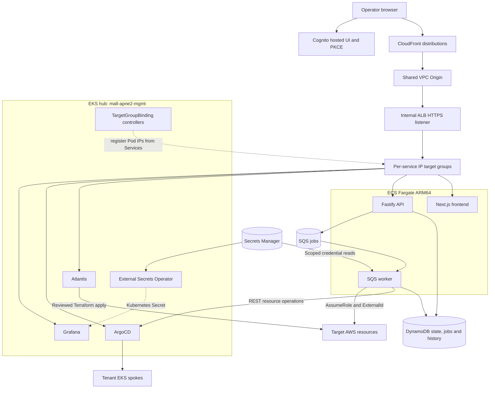

# Architecture

## System Overview

AWS Demo Platform is a hub-spoke control plane for GitHub-linked AWS demo projects.
The EKS hub `mall-apne2-mgmt` hosts Atlantis, ArgoCD, ESO, observability and CI
runners. The dashboard API, worker and Next.js frontend are separate ECS Fargate
services. These components are implemented and have Terraform/manifests in this
repository; this document is not a live-health or deployed-image inventory.

Public requests reach CloudFront, a VPC Origin and the internal ALB before target
IPs. For Kubernetes, TargetGroupBinding discovers/registers Pod IPs through a
Service; requests do not pass through the binding object. ECS services register
their task IPs with their own target groups. No Kubernetes Ingress is needed.

See [CLAUDE.md](../CLAUDE.md) for repository rules and the
[documentation map](README.md) for current versus historical sources.

## Components and ownership

| Component | Responsibility and source |
| --- | --- |
| CloudFront / shared VPC Origin | Platform distributions and private origin in `infra/cloudfront` |
| Internal ALB | HTTPS listener, restricted SG and target groups in `infra/alb-internal` |
| Dashboard runtime | API, worker and frontend Fargate definitions in `infra/dashboard-ecs` |
| Cognito | Dashboard user pool, public SPA client and hosted UI in `infra/cognito` |
| API / worker | `dashboard/backend`: request validation, job orchestration and controllers |
| Frontend | `dashboard/frontend`: discovery, detail drawer, briefing, bulk on and scale |
| Hub EKS | Owned by `infra/eks-mgmt`, not a duplicate module in the workload repository |
| ArgoCD | `master-system-root` watches `argocd-apps/system/`; `master-tenants-root` watches tenant roots |
| Atlantis | PR plan/apply through GitHub App auth, `AtlantisIRSARole` and scoped assume-role |
| ESO | `ClusterSecretStore aws-secrets-manager`; syncs Atlantis/ArgoCD/runner and Grafana credentials |
| Observability | Prometheus/Grafana, ClickHouse and Tempo on the hub; internal fan-in NLBs under ADR-007 |

### Grafana boundary

This repository owns Grafana's shared VPC Origin, internal ALB listener rule at
priority 140, `demo-platform-grafana` IP target group on port 3000, and
`monitoring/grafana` TargetGroupBinding. The binding references the existing
`prometheus-mall-apne2-mgmt-grafana` ClusterIP Service.

`Atom-oh/multi-region-architecture` owns the Grafana CloudFront distribution and
public DNS under `terraform/environments/production/ap-northeast-2/shared`.
Both `grafana-kr.atomai.click` and `grafana.atomai.click` use that distribution.
Do not import it into this repository's Terraform state. Inspect both owners
before altering or removing an origin.

The dashboard bundle has 11 ConfigMaps. The hub provisions `prometheus`,
`clickhouse`, `tempo` and `cloudwatch-korea`; the nodepool dashboard uses
`prometheus`. The US comparison dashboard remains source-only until its regional
datasources exist. Grafana's administrator is managed through
`/demo-platform/grafana/admin` → ESO `monitoring/grafana-admin` → Helm consumers.
See [ADR-018](decisions/ADR-018-grafana-private-origin.md) and the
[Grafana runbook](runbooks/grafana-private-ingress.md).

## Request and control flow

The dashboard uses one viewer origin (`admin-dev.atomai.click`) with distinct
CloudFront origins for frontend and API traffic. `/api/*` goes to
`admin-api-dev.atomai.click` at the ALB; `AllViewerExceptHostHeader` supplies the
origin Host and forwards Authorization. `CachingDisabled` prevents authentication
and mutations from being cached. The browser sends a Cognito access token; AWS
credentials remain in the backend's role/assume-role path.

Grafana keeps AllViewer and disabled caching; both viewer hosts match its ALB
rule. Its public availability depends on the external repository's CloudFront
configuration, not just this repository's ArgoCD status.

## Lifecycle and scale jobs

The `shared` package holds schemas and clients. API routes validate requests and
state, transition lifecycle actions to `transitioning`, persist jobs and enqueue
SQS work, returning 202. The worker executes resource controllers idempotently,
resumes running jobs after restart and uses the queue's three-receive redrive
policy. See [ADR-001](decisions/ADR-001-sqs-worker-for-async-jobs.md).

`turn_off` records restoration data by resource-unique `stepKey`; failed
`turn_on` preserves it for retry. Kubernetes off uses HPA `min=max=1` plus workload
replicas 1. ArgoCD REST performs the resource changes, with namespaces supplied
per call ([ADR-002](decisions/ADR-002-argocd-control-via-rest-api.md)).

`scale` is a separate job operation, leaving project on/off status unchanged.
Targets persist on the job for restart recovery. Scaling an HPA pins its range;
a write-once first-observed baseline lets a later off/on cycle restore the original
bounds. Do not replace that baseline on later scales. Accepted concurrency and
partial-failure limits remain in
[ADR-017](decisions/ADR-017-demo-scale-job-operation.md).

The current schema supports toggle controllers for ECS, EC2, RDS and ArgoCD apps;
several other resource types are intentionally visibility-only. A project entry
must match the schema and actual controller/ArgoCD owner, not a future design.

## Runtime and deployment contracts

- The configured platform compute region is `ap-northeast-2`; CloudFront is global
  and its existing viewer certificate is looked up in `us-east-1`.
- Terraform initializes API/frontend counts at 1 and worker at 0. Services ignore
  `task_definition` and `desired_count` drift; these values are not live counts.
- Backend/frontend CI builds and pushes ARM64 images on matching main changes.
  It does not update running ECS service revisions. Pin a task definition during
  rollout and verify the running revision, count, health and image architecture.
- Backend CI bundles project YAMLs into API/worker images and account configuration
  into the worker. Its current path filters cover `dashboard/backend/**` and its
  workflow file, so project/account-only changes require an explicit build/deploy
  step; merging those files alone does not refresh the running platform metadata.
- Kubernetes components auto-sync from Git. Provision a target group before merging
  its binding; require a Secret producer Ready before enabling its consumer.
- Grafana credential values are out-of-band, not Terraform state. Update the
  persisted database password, synchronize ESO and restart consumers when rotating;
  changing a Secret alone is insufficient. Reverting the consumer setting is not
  a password rollback.

Entry points configured by the infrastructure are `atlantis.atomai.click`,
`argocd.atomai.click`, `admin-dev.atomai.click`, `admin-api-dev.atomai.click`,
`grafana-kr.atomai.click` and `grafana.atomai.click`. Resolve current identifiers
from module outputs and live APIs; validate TLS and health before use. Historical
IDs in incident logs are not an active inventory.

## Terraform modules

Each root module uses its own key in `multi-region-mall-terraform-state` with
DynamoDB locking. Keep Terraform 1.9.6 and `dynamodb_table` consistent with Atlantis.
Remote-state consumers need their dependencies applied before a meaningful plan.

| Module | Purpose |
| --- | --- |
| `infra/eks-mgmt` | Authoritative hub cluster and shared runner identity |
| `infra/atlantis-bootstrap` | Atlantis identity/policy and GitHub App secret containers |
| `infra/alb-internal` | Internal ALB, SG, HTTPS rules and IP target groups including Grafana |
| `infra/cloudfront` | Platform distributions and shared VPC Origin; Grafana distribution is externally owned |
| `infra/route53-private-zone` | Platform public aliases and private hosted-zone records |
| `infra/cognito` | Admin user pool, public SPA client and Cognito ID publication |
| `infra/dashboard-ecs` | API, worker and frontend Fargate runtime definitions |
| `infra/iam` | Task/execution/operator roles and scoped GitHub OIDC roles |
| `infra/dynamodb` | Lifecycle state, jobs and history tables |
| `infra/sqs` | Job queue and DLQ |
| `infra/ecr` | Runtime/runner image repositories and cache/lifecycle configuration |
| `infra/secrets-manager` | Dashboard credential containers plus the Grafana admin container |
| `infra/modules` | Reusable submodules; not independently applied states |

## Security and review boundaries

The platform ALB permits HTTPS only from the CloudFront VPC Origin source SG and
`10.0.0.0/8`. Do not expand to other RFC1918 ranges or open ingress. ADR-007's
internal observability NLBs serve private fan-in and are not a public UI exception.
Reuse wildcard certificates; use certificate-compatible HTTPS origin hostnames.

Cross-account calls assume the configured role with an ExternalId from Secrets
Manager. Backend auth fails closed except for the literal development environment;
verified access-token usernames must be in `ADMIN_USERNAMES`. CI image publication
uses repository/main-scoped GitHub OIDC, not long-lived AWS keys.

The AI workflow's configured panel slots, actual responses and final findings are
different signals. Its scripts and runner config are authoritative for model IDs.
Do not infer complete coverage or safe deployment from a green job or PASS label.
Check current branch rules and use the
[review/release procedure](runbooks/review-and-release.md). The recovered
[gate-hardening proposal](superpowers/specs/2026-08-09-pr-review-gate-hardening-design.md)
remains distinct from implemented enforcement.

## Key design decisions

- [ADR-001](decisions/ADR-001-sqs-worker-for-async-jobs.md): asynchronous SQS jobs and state recovery.
- [ADR-002](decisions/ADR-002-argocd-control-via-rest-api.md): ArgoCD REST control.
- [ADR-003](decisions/ADR-003-gha-oidc-ecr-push.md): GitHub OIDC image publication.
- [ADR-004](decisions/ADR-004-same-origin-cloudfront-dashboard.md): same-origin dashboard routing.
- [ADR-005](decisions/ADR-005-cognito-spa-auth-code-pkce.md): Cognito PKCE and accepted token-storage trade-offs.
- [ADR-006](decisions/ADR-006-arm64-graviton-native-build.md): ARM64 native builds.
- [ADR-007](decisions/ADR-007-mgmt-observability-internal-nlb-exception.md): private observability fan-in exception.
- [ADR-012](decisions/ADR-012-ai-trader-web-oidc-plan-apply-split.md): external-repository OIDC privilege split.
- [ADR-016](decisions/ADR-016-multi-ai-pr-review-panel.md), amended by [ADR-011](decisions/ADR-011-pr-review-kiro-roster-gpt55-drop-v3.md), [ADR-013](decisions/ADR-013-pr-review-gpt56-model-bump.md), [ADR-014](decisions/ADR-014-pr-review-opus5-model-bump.md) and [ADR-015](decisions/ADR-015-pr-review-per-model-parallel-jobs.md): AI review roster/topology history.
- [ADR-017](decisions/ADR-017-demo-scale-job-operation.md): demo-scale jobs and limitations.
- [ADR-018](decisions/ADR-018-grafana-private-origin.md): private Grafana restoration, split ownership and credential rollout.

## Operations

- [Review and release](runbooks/review-and-release.md): checks, plans, controlled cutover and incident exceptions.
- [Grafana ingress and credentials](runbooks/grafana-private-ingress.md): resource owners, staged Secret rollout and live checks.
- [ECS runtime guide](../infra/dashboard-ecs/CLAUDE.md): initial definitions versus actual revisions/counts.
- [ARM64 migration record](runbooks/arm64-graviton-migration.md): historical migration mechanics, not current service status.
- [Public dashboard deployment record](runbooks/dashboard-public-deploy-execution.md): historical June 2026 execution plan, not current revisions or rollout approval.
- [Developer onboarding](onboarding.md) and [friend-account onboarding](onboarding/friend-account-setup.md).
