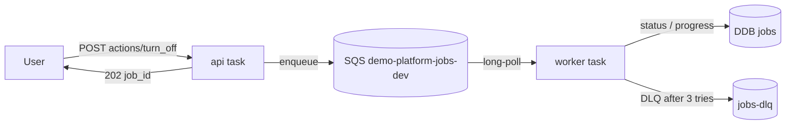
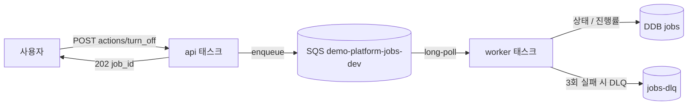

# ADR-001: SQS + dedicated worker for async lifecycle jobs

---

# English

## Status
Accepted (Stage 2, 2026-05-28)

## Context

The Lifecycle Controller turns demo resources on/off. A toggle ranges from
seconds (ECS desiredCount) to minutes (RDS start polling), so it must be
asynchronous: the API returns `202 + job_id` immediately and the work happens in
the background. We needed a queue + execution model.

## Options Considered

### Option 1: In-process queue in the API task
- **Pros**: Simplest; no extra infra; no extra Fargate task.
- **Cons**: In-flight jobs lost on task restart; couples API latency to job load.

### Option 2: SQS + a dedicated `worker` ECS service
- **Pros**: Durable; decoupled from API latency; restart-safe (startup sweep
  re-enqueues `running` jobs); DLQ isolates poison messages.
- **Cons**: One extra queue + one extra Fargate task to operate.

### Option 3: Step Functions
- **Pros**: Managed orchestration, retries, visual history.
- **Cons**: Over-engineered for a single-admin non-prod tool; new IaC + concepts.

## Decision

**Option 2.** The `api` service enqueues to `demo-platform-jobs-dev`; a separate
`worker` service long-polls and processes jobs idempotently. Job state lives in
the `jobs` DynamoDB table. On worker startup a sweep re-enqueues any job left in
`running` (crash recovery). SQS visibility timeout is 300s; long RDS-start
polling runs in a background promise after the message is deleted, to avoid
redelivery.

## Consequences

### Positive
- Durable across task restarts; the API stays responsive under load.
- DLQ (`maxReceiveCount=3`) captures poison messages.

### Negative
- One extra Fargate task — rough estimate ~$14/mo (0.25 vCPU / 0.5 GiB, 24×7) —
  plus SQS (negligible). Acceptable under the non-production tolerance.
- Idempotency is mandatory in every controller (already required for retries).

## References
- `docs/superpowers/specs/2026-05-28-stage-2-lifecycle-controller-design.md` §3.3, §4.1.5
- `dashboard/backend/packages/worker/src/poll-loop.ts`

---

# 한국어

## 상태
승인됨 (Stage 2, 2026-05-28)

## 배경

Lifecycle Controller는 데모 리소스를 켜고 끕니다. 토글 작업은 수 초(ECS
desiredCount)에서 수 분(RDS 시작 폴링)까지 걸리므로 비동기여야 합니다. API는
즉시 `202 + job_id`를 반환하고 실제 작업은 백그라운드에서 처리합니다. 따라서
큐 + 실행 모델이 필요했습니다.

## 검토한 옵션

### 옵션 1: API 태스크 내 인프로세스 큐
- **장점**: 가장 단순; 추가 인프라 없음; 추가 Fargate 태스크 없음.
- **단점**: 태스크 재시작 시 진행 중 작업 유실; API 지연이 작업 부하에 종속.

### 옵션 2: SQS + 전용 `worker` ECS 서비스
- **장점**: 내구성 있음; API 지연과 분리; 재시작 안전(부팅 시 `running` 작업 재큐);
  DLQ로 poison 메시지 격리.
- **단점**: 큐 1개 + Fargate 태스크 1개 추가 운영.

### 옵션 3: Step Functions
- **장점**: 관리형 오케스트레이션, 재시도, 시각적 이력.
- **단점**: 단일 관리자 비프로덕션 도구에는 과함; 새로운 IaC와 개념 도입.

## 결정

**옵션 2.** `api` 서비스가 `demo-platform-jobs-dev`로 enqueue하고, 별도의
`worker` 서비스가 long-poll로 멱등하게 처리합니다. 작업 상태는 `jobs` DynamoDB
테이블에 저장합니다. worker 부팅 시 `running` 상태로 남은 작업을 sweep로 재큐
처리합니다(크래시 복구). SQS visibility timeout은 300s이며, 긴 RDS 시작 폴링은
메시지 삭제 후 백그라운드 promise로 수행해 재전달을 피합니다.

## 결과

### 긍정적
- 태스크 재시작에도 내구성 유지; API가 부하에서도 응답성 유지.
- DLQ(`maxReceiveCount=3`)가 poison 메시지를 격리.

### 부정적
- Fargate 태스크 1개 추가 — 대략 월 ~$14 추정(0.25 vCPU / 0.5 GiB, 24×7) +
  SQS(미미). 비프로덕션 허용 범위 내.
- 모든 컨트롤러에서 멱등성 필수(재시도를 위해 이미 요구됨).

## 참고
- `docs/superpowers/specs/2026-05-28-stage-2-lifecycle-controller-design.md` §3.3, §4.1.5
- `dashboard/backend/packages/worker/src/poll-loop.ts`
