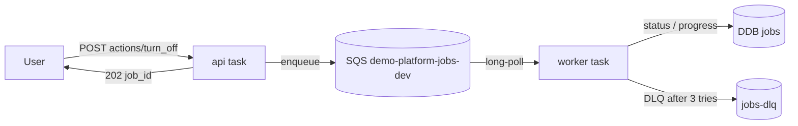

# ADR-001: SQS + dedicated worker for async lifecycle jobs

## Status
Accepted (Stage 2, 2026-05-28)

## Context

The Lifecycle Controller turns demo resources on/off. A toggle ranges from
seconds (ECS desiredCount) to minutes (RDS start polling), so it must be
asynchronous: the API returns `202 + job_id` immediately and the work happens in
the background. We needed a queue + execution model.

```mermaid
flowchart LR
  U[User] -->|POST actions/turn_off| API[api task]
  API -->|enqueue| Q[(SQS demo-platform-jobs-dev)]
  API -->|202 job_id| U
  Q -->|long-poll| W[worker task]
  W -->|status / progress| J[(DDB jobs)]
  W -->|DLQ after 3 tries| D[(jobs-dlq)]
```

## Options Considered

### Option 1: In-process queue in the API task
- **Pros**: Simplest; no extra infra; no extra Fargate task.
- **Cons**: In-flight jobs lost on task restart; couples API latency to job load.

### Option 2: SQS + a dedicated `worker` ECS service
- **Pros**: Durable; decoupled from API latency; restart-safe (startup sweep
  re-enqueues `running` jobs); DLQ isolates poison messages.
- **Cons**: One extra queue + one extra Fargate task to operate.

### Option 3: Step Functions
- **Pros**: Managed orchestration, retries, visual history.
- **Cons**: Over-engineered for a single-admin non-prod tool; new IaC + concepts.

## Decision

**Option 2.** The `api` service enqueues to `demo-platform-jobs-dev`; a separate
`worker` service long-polls and processes jobs idempotently. Job state lives in
the `jobs` DynamoDB table. On worker startup a sweep re-enqueues any job left in
`running` (crash recovery). SQS visibility timeout is 300s; long RDS-start
polling runs in a background promise after the message is deleted, to avoid
redelivery.

## Consequences

### Positive
- Durable across task restarts; the API stays responsive under load.
- DLQ (`maxReceiveCount=3`) captures poison messages.

### Negative
- One extra Fargate task — rough estimate ~$14/mo (0.25 vCPU / 0.5 GiB, 24×7) —
  plus SQS (negligible). Acceptable under the non-production tolerance.
- Idempotency is mandatory in every controller (already required for retries).

## References
- `docs/superpowers/specs/2026-05-28-stage-2-lifecycle-controller-design.md` §3.3, §4.1.5
- `dashboard/backend/packages/worker/src/poll-loop.ts`
