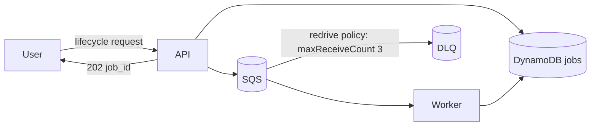

# ADR-001: SQS + dedicated worker for async lifecycle jobs

## Status

Accepted (Stage 2, 2026-05-28). Current applicability clarified 2026-09-13.

## Context and decision

Lifecycle requests range from short ECS updates to minutes of RDS startup.
The API must return `202 {job_id}` without waiting for resource readiness.

| Option | Trade-off at adoption |
| --- | --- |
| In-process API queue | Simple, but couples requests and jobs and loses queued work on restart |
| SQS + dedicated ECS worker (chosen) | Durable queue, independent execution and a DLQ; one additional service |
| Step Functions | Managed orchestration, but unnecessary complexity for a single-admin demo tool |

The API stores jobs in DynamoDB and enqueues to `demo-platform-jobs-dev`.
The worker long-polls; a startup sweep re-enqueues discovered `running` jobs.
Controllers aim to tolerate repeat calls. This choice provides best-effort
recovery, not transactional or exactly-once execution.

```mermaid
flowchart LR
  U[User] -->|lifecycle request| API[API]
  API --> J[(DynamoDB jobs)]
  API --> Q[(SQS)]
  API -->|202 job_id| U
  Q --> W[Worker]
  W --> J
  Q -->|redrive policy: maxReceiveCount 3| D[(DLQ)]
```

## Current applicability

- **Admission is conditional, persistence is not atomic.** Off requires `on`;
  on accepts `off` or `error`. The API conditionally enters `transitioning`, then
  creates/enqueues a job. Job creation failure can strand the transition.
  Enqueue failure attempts `markFailed` then state rollback; failure in either
  leaves manual recovery work. There is no transactional outbox.
- **Recovery replays work.** `markRunning` is unconditional; the runner neither
  rejects completed jobs nor skips `done` progress. Startup recovery scans only
  `running` jobs, without pagination or an age/ownership check. It does not
  repair pending jobs that never reached SQS, and can duplicate existing delivery.
- **Restoration is not checkpointed before mutation.** Off accumulates returned
  controller data in memory and saves it by `stepKey` at `markOff`. A crash after
  mutation can lose original capacity; replay can capture the reduced state.
  HPA baselines mitigate part of this, with the persistence limits in
  [ADR-017](ADR-017-demo-scale-job-operation.md).
- **Partial lifecycle outcomes differ from scale.** Off still marks `off` with
  available restoration data when a resource fails. Any lifecycle resource error
  produces `partial_failure`, even if all fail. On failures use `markError` and
  retain restoration data for retry; missing entries are skipped and can still
  produce `on`. Success clears the restoration map.
- **The DLQ does not contain every failed operation.** The queue/consumer use
  300-second visibility without renewal. Escaped handler errors leave the message
  for redelivery; handled resource failures finish the job and delete it.
  Malformed JSON and unknown project/account messages are also deleted.
- **Success is not readiness.** RDS availability polling is launched without
  awaiting it, before terminal job/history writes and message deletion. It can
  outlive the handler, is lost on restart and only logs failures. Other
  controllers likewise do not wait for full service readiness.
- **History is best-effort.** Job status and history writes are separate.
  The poll loop currently supplies actor `system`; the authenticated request actor
  is stored on lifecycle state, not propagated through the job. History is not a
  complete audit of the submitting user.

These limitations are relevant to the accepted non-production design. Review
saved data and actual resources before replaying a failed job.

## Evidence

- [Lifecycle route](../../dashboard/backend/packages/api/src/routes/actions.ts),
  [runner](../../dashboard/backend/packages/worker/src/job-runner.ts),
  [poll loop](../../dashboard/backend/packages/worker/src/poll-loop.ts)
- [DynamoDB jobs](../../dashboard/backend/packages/shared/src/ddb/jobs.ts),
  [state](../../dashboard/backend/packages/shared/src/ddb/state.ts),
  [queue configuration](../../infra/sqs/main.tf)
- [Runner tests](../../dashboard/backend/packages/worker/src/__tests__/job-runner.test.ts)
  and [poll-loop tests](../../dashboard/backend/packages/worker/src/__tests__/poll-loop.test.ts)
  cover dispatch/outcomes and recovery payloads, not complete crash recovery.
- [Original design](../superpowers/specs/2026-05-28-stage-2-lifecycle-controller-design.md)
  remains a dated rationale.
