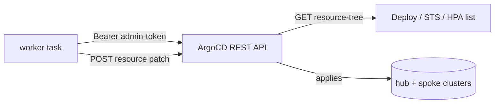
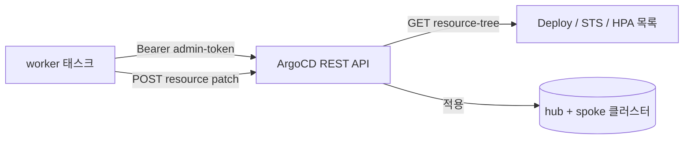

# ADR-002: Control ArgoCD Applications via REST API, not the Kubernetes API

---

# English

## Status
Accepted (Stage 2, 2026-05-28)

## Context

The worker's ArgoCD controller implements the HPA-2 on/off pattern: read the
workloads under an Application, capture replicas / HPA min-max, then patch
Deployment `replicas=1` and HPA `min=max=1` (and reverse on turn_on). It can
reach the cluster two ways — directly via the Kubernetes API, or via ArgoCD's
own REST API.

## Options Considered

### Option 1: Kubernetes API directly
- **Pros**: Lower latency; no ArgoCD token to manage.
- **Cons**: ECS task role must be wired into every spoke cluster's `aws-auth` +
  RBAC; more plumbing as spokes are added; bypasses ArgoCD (invisible in UI).

### Option 2: ArgoCD REST API (admin token)
- **Pros**: One credential (the ArgoCD token); actions behave like a human in the
  ArgoCD UI and are visible there; no per-cluster RBAC plumbing.
- **Cons**: Slightly higher latency; token lifecycle is manual in v0.X.

## Decision

**Option 2 (ArgoCD REST API).** The worker uses an ArgoCD API token
(`/demo-platform/argocd/admin-token` in Secrets Manager) and operates through
ArgoCD's `resource-tree` and resource GET/POST-patch endpoints.

## Consequences

### Positive
- Single credential to manage; spoke clusters need no extra `aws-auth`/RBAC.
- On/off actions are visible in the ArgoCD UI (same path as a human operator).

### Negative
- Slightly higher latency than direct k8s calls (fine for an admin tool).
- Token rotation is manual in v0.X; a dedicated ArgoCD service account with a
  managed token is deferred to Stage 4.
- `eks:DescribeCluster` is still granted to the task role for a future
  direct-k8s fallback, but is unused on this path today.

## References
- `docs/superpowers/specs/2026-05-28-stage-2-lifecycle-controller-design.md` §4.3
- `dashboard/backend/packages/shared/src/argocd/client.ts`

---

# 한국어

## 상태
승인됨 (Stage 2, 2026-05-28)

## 배경

worker의 ArgoCD 컨트롤러는 HPA-2 on/off 패턴을 구현합니다: Application 하위
워크로드를 읽어 replicas / HPA min-max를 캡처한 뒤 Deployment `replicas=1`,
HPA `min=max=1`로 패치합니다(turn_on 시 역순). 클러스터 접근은 두 가지 —
Kubernetes API 직접 호출, 또는 ArgoCD 자체 REST API — 가 가능합니다.

## 검토한 옵션

### 옵션 1: Kubernetes API 직접 호출
- **장점**: 낮은 지연; 관리할 ArgoCD 토큰 없음.
- **단점**: ECS 태스크 역할을 모든 spoke 클러스터의 `aws-auth` + RBAC에 연결해야
  함; spoke 추가 시 배선 증가; ArgoCD 우회(UI에서 안 보임).

### 옵션 2: ArgoCD REST API (admin token)
- **장점**: 자격증명 1개(ArgoCD 토큰); ArgoCD UI에서 사람이 한 것처럼 보이고
  가시성 확보; 클러스터별 RBAC 배선 불필요.
- **단점**: 지연 약간 증가; v0.X에서 토큰 수명 수동 관리.

## 결정

**옵션 2 (ArgoCD REST API).** worker는 ArgoCD API 토큰
(`/demo-platform/argocd/admin-token`, Secrets Manager)을 사용해 ArgoCD의
`resource-tree` 및 resource GET/POST-patch 엔드포인트로 동작합니다.

## 결과

### 긍정적
- 관리 자격증명 1개; spoke 클러스터에 추가 `aws-auth`/RBAC 불필요.
- on/off 액션이 ArgoCD UI에 보임(사람 운영자와 동일 경로).

### 부정적
- 직접 k8s 호출보다 지연 약간 증가(관리 도구에는 무방).
- v0.X에서 토큰 회전 수동; 관리형 토큰을 가진 전용 ArgoCD 서비스 계정은 Stage 4로
  연기.
- `eks:DescribeCluster`는 향후 direct-k8s 폴백용으로 태스크 역할에 부여돼 있으나
  현재 이 경로에서는 미사용.

## 참고
- `docs/superpowers/specs/2026-05-28-stage-2-lifecycle-controller-design.md` §4.3
- `dashboard/backend/packages/shared/src/argocd/client.ts`
