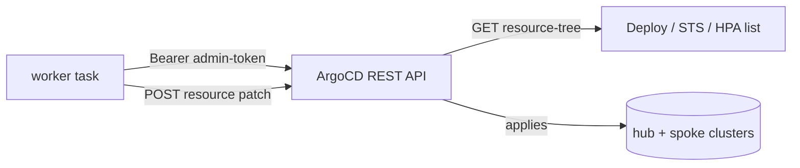

# ADR-002: Control ArgoCD Applications via REST API, not the Kubernetes API

## Status
Accepted (Stage 2, 2026-05-28)

## Context

The worker's ArgoCD controller implements the HPA-2 on/off pattern: read the
workloads under an Application, capture replicas / HPA min-max, then patch
Deployment `replicas=1` and HPA `min=max=1` (and reverse on turn_on). It can
reach the cluster two ways — directly via the Kubernetes API, or via ArgoCD's
own REST API.

```mermaid
flowchart LR
  W[worker task] -->|Bearer admin-token| A[ArgoCD REST API]
  A -->|GET resource-tree| RT[Deploy / STS / HPA list]
  W -->|POST resource patch| A
  A -->|applies| K[(hub + spoke clusters)]
```

## Options Considered

### Option 1: Kubernetes API directly
- **Pros**: Lower latency; no ArgoCD token to manage.
- **Cons**: ECS task role must be wired into every spoke cluster's `aws-auth` +
  RBAC; more plumbing as spokes are added; bypasses ArgoCD (invisible in UI).

### Option 2: ArgoCD REST API (admin token)
- **Pros**: One credential (the ArgoCD token); actions behave like a human in the
  ArgoCD UI and are visible there; no per-cluster RBAC plumbing.
- **Cons**: Slightly higher latency; token lifecycle is manual in v0.X.

## Decision

**Option 2 (ArgoCD REST API).** The worker uses an ArgoCD API token
(`/demo-platform/argocd/admin-token` in Secrets Manager) and operates through
ArgoCD's `resource-tree` and resource GET/POST-patch endpoints.

## Consequences

### Positive
- Single credential to manage; spoke clusters need no extra `aws-auth`/RBAC.
- On/off actions are visible in the ArgoCD UI (same path as a human operator).

### Negative
- Slightly higher latency than direct k8s calls (fine for an admin tool).
- Token rotation is manual in v0.X; a dedicated ArgoCD service account with a
  managed token is deferred to Stage 4.
- `eks:DescribeCluster` is still granted to the task role for a future
  direct-k8s fallback, but is unused on this path today.

## References
- `docs/superpowers/specs/2026-05-28-stage-2-lifecycle-controller-design.md` §4.3
- `dashboard/backend/packages/shared/src/argocd/client.ts`
