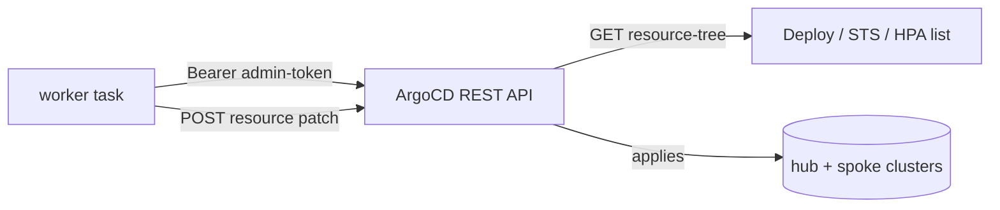

# ADR-002: Control ArgoCD Applications via REST API, not the Kubernetes API

## Status
Accepted (Stage 2, 2026-05-28)

Current applicability reviewed 2026-09-13; the decision remains in use.

## Context

The worker's ArgoCD controller implements the HPA-2 on/off pattern: read the
workloads under an Application, capture replicas / HPA min-max, then patch
Deployment `replicas=1` and HPA `min=max=1` (and reverse on turn_on). It can
reach the cluster two ways — directly via the Kubernetes API, or via ArgoCD's
own REST API.

```mermaid
flowchart LR
  W[worker task] -->|Bearer admin-token| A[ArgoCD REST API]
  A -->|GET resource-tree| RT[Deploy / STS / HPA list]
  W -->|POST resource patch| A
  A -->|applies| K[(hub + spoke clusters)]
```

## Options Considered

### Option 1: Kubernetes API directly
- **Pros**: Lower latency; no ArgoCD token to manage.
- **Cons**: ECS task role must be wired into every spoke cluster's `aws-auth` +
  RBAC; more plumbing as spokes are added; bypasses ArgoCD (invisible in UI).

### Option 2: ArgoCD REST API (admin token)
- **Pros**: One credential (the ArgoCD token); actions behave like a human in the
  ArgoCD UI and are visible there; no per-cluster RBAC plumbing.
- **Cons**: Slightly higher latency; token lifecycle is manual in v0.X.

## Decision

**Option 2 (ArgoCD REST API).** The worker uses an ArgoCD API token
(`/demo-platform/argocd/admin-token` in Secrets Manager) and operates through
ArgoCD's `resource-tree` and resource GET/POST-patch endpoints.

## Consequences

### Positive
- Single credential to manage; spoke clusters need no extra `aws-auth`/RBAC.
- On/off actions are visible in the ArgoCD UI (same path as a human operator).

### Negative
- Slightly higher latency than direct k8s calls (fine for an admin tool).
- Token rotation is manual; the proposed service-account/token-management
  replacement and direct-Kubernetes fallback are not implemented.

## Current applicability

One worker-wide client uses `ARGOCD_BASE_URL`. `listWorkloads(application,
namespace)` filters the Application's resource tree to Deployment, StatefulSet
and HPA handles in the requested namespace. The resource's `cluster` and
`hpa_handling` fields do not select another endpoint or alternate controller
behavior; the controller always uses the scale-to-one pattern.

Since 2026-08-20, each controller call supplies its resource's namespace,
replacing the former placeholder. Off captures live state, pins HPA min/max to 1,
then patches workload replicas to 1. On restores saved HPA bounds before workload
replicas. Scale uses the same HPA-first order and rejects an empty handle list;
on/off can complete without matching handles.

These are REST mutations, not readiness checks. Baseline persistence occurs
after controller completion, and ArgoCD diff exclusions alone do not protect
against a later sync. See [ADR-017](ADR-017-demo-scale-job-operation.md) for
baseline failure windows and sync-policy limits.

## References

- [Original controller design](../superpowers/specs/2026-05-28-stage-2-lifecycle-controller-design.md)
- [REST client](../../dashboard/backend/packages/shared/src/argocd/client.ts),
  [controller](../../dashboard/backend/packages/worker/src/controllers/argocd.ts),
  [controller tests](../../dashboard/backend/packages/worker/src/controllers/__tests__/argocd.test.ts)
