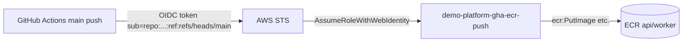
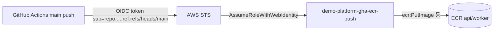

# ADR-003: GitHub Actions OIDC for ECR image push (no long-lived keys)

---

# English

## Status
Accepted (Stage 2 Phase 3, 2026-05-31)

## Context

`backend-ci.yml` must push the api/worker images to ECR on merge to `main`. The
runner needs AWS credentials with ECR push permission. We did not want long-lived
IAM access keys stored as GitHub secrets.

## Options Considered

### Option 1: Long-lived IAM access key in GitHub secrets
- **Pros**: trivial to set up.
- **Cons**: standing credential to rotate/leak; broad blast radius if exposed.

### Option 2: GitHub OIDC → short-lived role assumption
- **Pros**: no stored secret; tokens are short-lived; trust scoped to a specific repo + branch ref.
- **Cons**: needs an IAM OIDC provider + a role with a precise trust condition.

## Decision

**Option 2.** Reuse the existing `token.actions.githubusercontent.com` OIDC
provider. Role `demo-platform-gha-ecr-push` trusts only
`repo:Atom-oh/AWS-Demo-Platform:ref:refs/heads/main` with `aud=sts.amazonaws.com`,
and is scoped to ECR push on the two `demo-platform/{api,worker}` repos.
Images are tagged `sha-<sha12>` + `main-latest`; ECR is MUTABLE so `main-latest`
moves; the lifecycle policy's `sha` prefix expires old SHA tags (keep last 30).

## Consequences

### Positive
- No long-lived AWS keys in GitHub; trust is branch-scoped.
- `id-token: write` is granted only to the push job, not the whole workflow.

### Negative
- MUTABLE repo means `main-latest` (and a same-SHA rebuild) can be overwritten — a
  `concurrency` guard serializes pushes per ref to avoid races.
- Trust is repo+branch only; environment-scoped tokens (`:environment:dev`) are a
  future tightening.

## References
- `infra/iam/gha-ecr-push-role.tf`, `.github/workflows/backend-ci.yml`
- `infra/ecr/main.tf` (lifecycle + MUTABLE rationale)

---

# 한국어

## 상태
승인됨 (Stage 2 Phase 3, 2026-05-31)

## 배경

`backend-ci.yml`은 `main` 머지 시 api/worker 이미지를 ECR로 푸시해야 합니다. 러너에
ECR 푸시 권한이 있는 AWS 자격증명이 필요한데, 장기 IAM 액세스 키를 GitHub secret으로
저장하고 싶지 않았습니다.

## 검토한 옵션

### 옵션 1: 장기 IAM 액세스 키를 GitHub secret에 저장
- **장점**: 설정이 매우 간단.
- **단점**: 회전/유출 관리 부담의 상시 자격증명; 노출 시 blast radius 큼.

### 옵션 2: GitHub OIDC → 단기 역할 assume
- **장점**: 저장 secret 없음; 토큰 단기; 특정 repo + branch ref로 신뢰 범위 제한.
- **단점**: IAM OIDC provider + 정밀한 trust 조건의 역할 필요.

## 결정

**옵션 2.** 기존 `token.actions.githubusercontent.com` OIDC provider를 재사용.
역할 `demo-platform-gha-ecr-push`는 `repo:Atom-oh/AWS-Demo-Platform:ref:refs/heads/main`
(+ `aud=sts.amazonaws.com`)만 신뢰하고, `demo-platform/{api,worker}` 두 repo의 ECR
푸시로 권한을 제한합니다. 이미지는 `sha-<sha12>` + `main-latest`로 태깅, ECR은 MUTABLE
이라 `main-latest`가 이동하며, 라이프사이클의 `sha` prefix가 오래된 SHA 태그를 만료(최근 30개 유지)합니다.

## 결과

### 긍정적
- GitHub에 장기 AWS 키 없음; 신뢰가 브랜치 범위로 제한.
- `id-token: write`를 전체 워크플로가 아닌 push job에만 부여.

### 부정적
- MUTABLE repo라 `main-latest`(및 동일 SHA 재빌드)가 덮어쓰기 가능 — `concurrency`
  가드로 ref별 푸시를 직렬화해 race를 방지.
- 신뢰가 repo+branch까지만; environment 범위 토큰(`:environment:dev`)은 향후 강화 과제.

## 참고
- `infra/iam/gha-ecr-push-role.tf`, `.github/workflows/backend-ci.yml`
- `infra/ecr/main.tf` (라이프사이클 + MUTABLE 근거)
