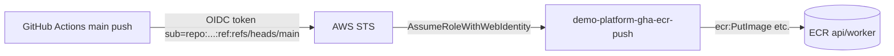

# ADR-003: GitHub Actions OIDC for ECR image push (no long-lived keys)

## Status
Accepted (Stage 2 Phase 3, 2026-05-31)

## Context

`backend-ci.yml` must push the api/worker images to ECR on merge to `main`. The
runner needs AWS credentials with ECR push permission. We did not want long-lived
IAM access keys stored as GitHub secrets.

```mermaid
flowchart LR
  GH[GitHub Actions main push] -->|OIDC token sub=repo:...:ref:refs/heads/main| STS[AWS STS]
  STS -->|AssumeRoleWithWebIdentity| R[demo-platform-gha-ecr-push]
  R -->|ecr:PutImage etc.| ECR[(ECR api/worker)]
```

## Options Considered

### Option 1: Long-lived IAM access key in GitHub secrets
- **Pros**: trivial to set up.
- **Cons**: standing credential to rotate/leak; broad blast radius if exposed.

### Option 2: GitHub OIDC → short-lived role assumption
- **Pros**: no stored secret; tokens are short-lived; trust scoped to a specific repo + branch ref.
- **Cons**: needs an IAM OIDC provider + a role with a precise trust condition.

## Decision

**Option 2.** Reuse the existing `token.actions.githubusercontent.com` OIDC
provider. Role `demo-platform-gha-ecr-push` trusts only
`repo:Atom-oh/AWS-Demo-Platform:ref:refs/heads/main` with `aud=sts.amazonaws.com`,
and was initially scoped to ECR push on `demo-platform/{api,worker}`.
Images are tagged `sha-<sha12>` + `main-latest`; ECR is MUTABLE so `main-latest`
moves. The original retention intent was to keep 30 tagged images; inspect the
actual lifecycle selector rather than assuming that every SHA tag is covered.

## Consequences

### Positive
- No long-lived AWS keys in GitHub; trust is branch-scoped.
- `id-token: write` is granted only to the push job, not the whole workflow.

### Negative
- MUTABLE repo means `main-latest` (and a same-SHA rebuild) can be overwritten — a
  `concurrency` guard serializes pushes per ref to avoid races.
- Trust is repo+branch only; environment-scoped tokens (`:environment:dev`) are a
  future tightening.

## Current applicability (2026-09-13)

The role now permits image operations on API, worker, frontend and
`actions-runner-claude`, plus `ghcr/actions/*` pull-through-cache operations.
`ecr:GetAuthorizationToken` uses resource `*`; repository push permissions are
scoped by ARN. The trust still requires this repository's main ref and STS audience.

Backend/frontend image jobs grant `id-token: write` only to their publication
jobs. Matching main pushes run checks then build/push; PR jobs do not publish.
The separate runner-image workflow also uses this role for its scheduled/manual
build, subject to the same branch trust.

The application ECR policy declares `tagPrefixList = ["main", "v", "sha"]`
with a count threshold of 30, and expires untagged images after seven days.
That configuration is not evidence that a retention preview has been validated.
Tags are mutable, including SHA tags.

Images include bundled project/account configuration, but metadata-only edits
do not match backend CI path filters. Neither application image workflow rolls
ECS or implements tag-to-production deployment. Use the
[release runbook](../runbooks/review-and-release.md) for explicit rollout.

## References

- [Role and policy](../../infra/iam/gha-ecr-push-role.tf),
  [ECR configuration](../../infra/ecr/main.tf)
- [Backend CI](../../.github/workflows/backend-ci.yml),
  [frontend CI](../../.github/workflows/frontend-ci.yml),
  [runner-image workflow](../../.github/workflows/runner-image.yml)
