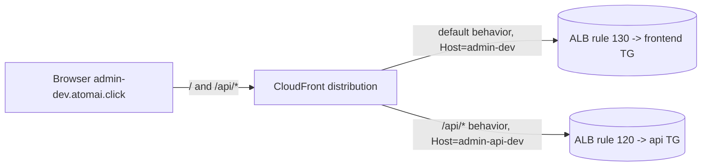

# ADR-004: Same-origin CloudFront for the dashboard (route /api/* to the api origin)

---

# English

## Status
Accepted (Stage 3, 2026-06-04)

## Context

The Next.js dashboard at `admin-dev.atomai.click` calls the Lifecycle Controller
api. The api is fail-closed Cognito-JWT, so the browser must send its access
token on every `/api/*` request. We must decide how the SPA reaches the api
without CORS and without dropping the token, under two existing constraints:
CloudFront-only ingress (no public ALB) and one CloudFront distribution per host
(VPC Origin → Internal ALB, routed by host-header listener rules).

## Options Considered

### Option 1: Cross-host — frontend and api on separate distributions, Next.js proxies /api/*
- **Pros**: two simple single-origin distributions; mirrors the existing per-host pattern.
- **Cons**: the Next.js server-side rewrite re-issues a server-to-api request that does not carry the browser's Cognito `Authorization` header by default; reintroduces CORS and token-forwarding fragility; two public hosts the browser must trust; an `API_ORIGIN` env to manage in the task.

### Option 2: Same-origin — one distribution for admin-dev with two origins/behaviors
- **Pros**: the browser stays on one origin, so no CORS; the access-token Bearer rides the same-origin `/api/*` request unchanged; client code uses relative `/api/*` paths; no `API_ORIGIN` in the ECS task.
- **Cons**: requires getting the CloudFront `Host`-header semantics exactly right (the subtle, error-prone part).

## Decision

**Option 2.** One distribution, `aliases = ["admin-dev.atomai.click"]`, with two
origins and two behaviors: the `default` behavior targets the frontend origin
(`domain_name = admin-dev.atomai.click`); an ordered `/api/*` behavior targets the
api origin (`domain_name = admin-api-dev.atomai.click`) so it matches the existing
ALB priority-120 api rule. Both behaviors use the AWS-managed
`AllViewerExceptHostHeader` origin-request policy plus `CachingDisabled`.

The critical point: the default `AllViewer` policy forwards the *viewer* `Host`
(always `admin-dev`) to the origin, which would send `/api/*` to the frontend ALB
rule (130) and break every api call. `AllViewerExceptHostHeader` makes CloudFront
set `Host` = the *origin's* `domain_name` (`admin-api-dev` → rule 120,
`admin-dev` → rule 130) while still forwarding `Authorization`. `CachingDisabled`
ensures POST toggles and auth are never cached.

## Consequences

### Positive
- Zero CORS; a single public host for the dashboard; the Cognito Bearer reaches the api unchanged.
- Client uses relative `/api/*`; no `API_ORIGIN` in the prod task; consistent with CloudFront-only ingress and per-host ALB rules.

### Negative
- The `AllViewer` vs `AllViewerExceptHostHeader` distinction is subtle and was an initial routing bug (the `/api/*` behavior with `AllViewer` mis-routed to the frontend); cross-host behaviors must keep `ExceptHostHeader`.
- `admin-api-dev.atomai.click` remains a separate public distribution; locking it to internal-only is a future tightening.

## References
- `infra/cloudfront/main.tf` (`aws_cloudfront_distribution.dashboard_frontend`)
- `infra/alb-internal/main.tf` (listener rules 120 api / 130 frontend), `dashboard/frontend/next.config.mjs`
- `docs/superpowers/specs/2026-06-03-dashboard-public-deploy-design.md` (locked decision #2); PR #19

---

# 한국어

## 상태
승인됨 (Stage 3, 2026-06-04)

## 배경

`admin-dev.atomai.click`의 Next.js 대시보드는 Lifecycle Controller api를 호출합니다.
api는 fail-closed Cognito-JWT라서 브라우저가 매 `/api/*` 요청에 access token을 실어
보내야 합니다. SPA가 CORS 없이, 토큰을 잃지 않고 api에 도달하는 방법을 정해야 하며,
두 가지 기존 제약이 있습니다: CloudFront 전용 ingress(공개 ALB 없음)와 호스트당 하나의
CloudFront 배포(VPC Origin → Internal ALB, host-header 리스너 규칙으로 라우팅).

## 검토한 옵션

### 옵션 1: 크로스-호스트 — frontend/api를 별도 배포로 두고 Next.js가 /api/* 프록시
- **장점**: 단순한 단일 오리진 배포 2개; 기존 호스트당 패턴과 동일.
- **단점**: Next.js 서버사이드 rewrite가 브라우저의 Cognito `Authorization` 헤더를 기본 전달하지 않는 서버→api 요청을 재발행; CORS·토큰 전달 취약성 재도입; 브라우저가 신뢰해야 할 공개 호스트 2개; 태스크에 관리할 `API_ORIGIN` env.

### 옵션 2: 동일 오리진 — admin-dev 단일 배포에 오리진/behavior 2개
- **장점**: 브라우저가 한 오리진에 머물러 CORS 없음; access token Bearer가 동일 오리진 `/api/*` 요청에 그대로 실림; 클라이언트는 상대 경로 `/api/*` 사용; ECS 태스크에 `API_ORIGIN` 불필요.
- **단점**: CloudFront `Host` 헤더 의미를 정확히 맞춰야 함(미묘하고 실수하기 쉬운 부분).

## 결정

**옵션 2.** 배포 1개, `aliases = ["admin-dev.atomai.click"]`, 오리진 2개 + behavior 2개:
`default` behavior는 frontend 오리진(`domain_name = admin-dev.atomai.click`),
ordered `/api/*` behavior는 api 오리진(`domain_name = admin-api-dev.atomai.click`)을
타깃으로 해 기존 ALB priority-120 api 규칙에 매칭됩니다. 두 behavior 모두 AWS 관리형
`AllViewerExceptHostHeader` origin-request 정책 + `CachingDisabled`를 사용합니다.

핵심: 기본 `AllViewer` 정책은 *viewer* `Host`(항상 `admin-dev`)를 오리진에 전달하므로
`/api/*`가 frontend ALB 규칙(130)으로 가서 모든 api 호출이 깨집니다.
`AllViewerExceptHostHeader`는 CloudFront가 `Host`를 *오리진의* `domain_name`
(`admin-api-dev` → 규칙 120, `admin-dev` → 규칙 130)으로 설정하게 하면서 `Authorization`은
계속 전달합니다. `CachingDisabled`로 POST 토글과 인증이 캐시되지 않게 합니다.

## 결과

### 긍정적
- CORS 없음; 대시보드 공개 호스트 단일화; Cognito Bearer가 api에 그대로 도달.
- 클라이언트는 상대 경로 `/api/*` 사용; prod 태스크에 `API_ORIGIN` 불필요; CloudFront 전용 ingress·호스트당 ALB 규칙과 일관.

### 부정적
- `AllViewer` vs `AllViewerExceptHostHeader` 구분이 미묘해 초기 라우팅 버그가 있었음(`/api/*` behavior가 `AllViewer`라 frontend로 오라우팅); 크로스-호스트 behavior는 `ExceptHostHeader`를 유지해야 함.
- `admin-api-dev.atomai.click`은 여전히 별도 공개 배포; 내부 전용으로 잠그는 것은 향후 강화 과제.

## 참고
- `infra/cloudfront/main.tf` (`aws_cloudfront_distribution.dashboard_frontend`)
- `infra/alb-internal/main.tf` (리스너 규칙 120 api / 130 frontend), `dashboard/frontend/next.config.mjs`
- `docs/superpowers/specs/2026-06-03-dashboard-public-deploy-design.md` (잠근 결정 #2); PR #19
