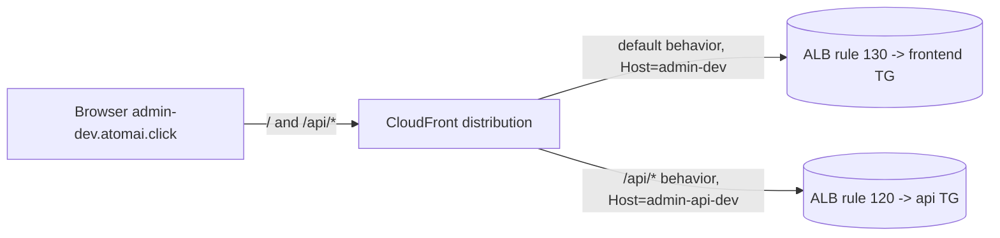

# ADR-004: Same-origin CloudFront for the dashboard (route /api/* to the api origin)

## Status
Accepted (Stage 3, 2026-06-04)

## Context

The Next.js dashboard at `admin-dev.atomai.click` calls the Lifecycle Controller
api. The api is fail-closed Cognito-JWT, so the browser must send its access
token on every `/api/*` request. We must decide how the SPA reaches the api
without CORS and without dropping the token, under two existing constraints:
CloudFront-only ingress (no public ALB) and one CloudFront distribution per host
(VPC Origin → Internal ALB, routed by host-header listener rules).

```mermaid
flowchart LR
  B[Browser admin-dev.atomai.click] -->|/ and /api/*| CF[CloudFront distribution]
  CF -->|default behavior, Host=admin-dev| FE[(ALB rule 130 -> frontend TG)]
  CF -->|/api/* behavior, Host=admin-api-dev| API[(ALB rule 120 -> api TG)]
```

## Options Considered

### Option 1: Cross-host — frontend and api on separate distributions, Next.js proxies /api/*
- **Pros**: two simple single-origin distributions; mirrors the existing per-host pattern.
- **Cons**: adds a server proxy and `API_ORIGIN` configuration whose header
  forwarding must be verified. Direct browser calls to a second host would
  additionally require CORS; a same-origin proxy does not inherently require it.

### Option 2: Same-origin — one distribution for admin-dev with two origins/behaviors
- **Pros**: the browser stays on one origin, so no CORS; the access-token Bearer rides the same-origin `/api/*` request unchanged; client code uses relative `/api/*` paths; no `API_ORIGIN` in the ECS task.
- **Cons**: requires getting the CloudFront `Host`-header semantics exactly right (the subtle, error-prone part).

## Decision

**Option 2.** One distribution, `aliases = ["admin-dev.atomai.click"]`, with two
origins and two behaviors: the `default` behavior targets the frontend origin
(`domain_name = admin-dev.atomai.click`); an ordered `/api/*` behavior targets the
api origin (`domain_name = admin-api-dev.atomai.click`) so it matches the existing
ALB priority-120 api rule. Both behaviors use the AWS-managed
`AllViewerExceptHostHeader` origin-request policy plus `CachingDisabled`.

The critical point: the default `AllViewer` policy forwards the *viewer* `Host`
(always `admin-dev`) to the origin, which would send `/api/*` to the frontend ALB
rule (130) and break every api call. `AllViewerExceptHostHeader` makes CloudFront
set `Host` = the *origin's* `domain_name` (`admin-api-dev` → rule 120,
`admin-dev` → rule 130) while still forwarding `Authorization`. `CachingDisabled`
disables response caching for these dashboard behaviors.

## Consequences

### Positive
- Zero CORS; a single public host for the dashboard; the Cognito Bearer reaches the api unchanged.
- Client uses relative `/api/*`; no `API_ORIGIN` in the prod task; consistent with CloudFront-only ingress and per-host ALB rules.

### Negative
- The `AllViewer` vs `AllViewerExceptHostHeader` distinction is subtle and was an initial routing bug (the `/api/*` behavior with `AllViewer` mis-routed to the frontend); cross-host behaviors must keep `ExceptHostHeader`.
- `admin-api-dev.atomai.click` remains a separate public distribution; locking it to internal-only is a future tightening.

## Current applicability (2026-09-13)

The two dashboard behaviors still use `AllViewerExceptHostHeader` with
`CachingDisabled`. Both origins use the shared VPC Origin/internal ALB;
the API remains independently authenticated. The separate API distribution
uses `AllViewer` for its own API hostname.

Next.js defines its rewrite unconditionally, but deployed `/api/*` traffic is
routed by CloudFront before reaching Next.js. The rewrite serves local
development; it is not evidence that Next.js drops Authorization by default.
The original choice was about routing ownership and avoiding an additional
production proxy, not a framework limitation.

## References

- [CloudFront](../../infra/cloudfront/main.tf),
  [ALB rules](../../infra/alb-internal/main.tf),
  [Next.js rewrite](../../dashboard/frontend/next.config.mjs)
- [Original public-deployment design](../superpowers/specs/2026-06-03-dashboard-public-deploy-design.md)
  (locked decision #2); PR #19
