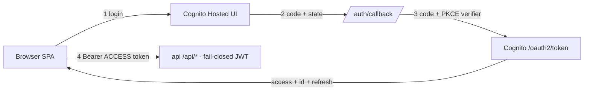

# ADR-005: Cognito Hosted-UI Authorization Code + PKCE for the dashboard SPA

---

# English

## Status
Accepted (Stage 3, 2026-06-04)

## Context

The dashboard at `admin-dev.atomai.click` is publicly reachable (CloudFront) and
the api is fail-closed Cognito-JWT. The single-admin SPA needs a browser login
flow, and we must decide three things: the OAuth flow for a public client (no
secret), which token to send to the api, and where to keep tokens.

## Options Considered

### Option 1: Implicit flow (tokens returned in the redirect fragment)
- **Pros**: no token-exchange step.
- **Cons**: deprecated for SPAs; access/id tokens land in the URL/history; no refresh token.

### Option 2: Authorization Code + PKCE (public client)
- **Pros**: the current standard for SPAs; the code is exchanged client-side using a PKCE verifier (no client secret); yields a refresh token for silent renewal.
- **Cons**: needs a callback route, a code-exchange step, and explicit token-storage handling.

### Token storage sub-decision: httpOnly-cookie BFF vs in-memory + sessionStorage
- **BFF (httpOnly cookie)**: not XSS-readable, but needs a Next server-side proxy holding tokens.
- **In-memory + sessionStorage**: simplest; access/id in memory, refresh in sessionStorage; XSS-exposed.

## Decision

**Authorization Code + PKCE.** The `dashboard-dev` app client is
`generate_secret = false`, `allowed_oauth_flows = ["code"]`. Flow: login → Hosted
UI → `/auth/callback` exchanges the code (with the PKCE verifier and a `state`
CSRF check) → tokens. The SPA sends the **access** token as
`Authorization: Bearer` — the api verifies `tokenUse:'access'` + `clientId` and
checks `cognito:username` ∈ `ADMIN_USERNAMES`, so the id token must NOT be sent.
Access/id tokens live in memory; the refresh token is kept in `sessionStorage` for
reload survival, with a silent refresh ~60s before expiry.
`NEXT_PUBLIC_AUTH_ENABLED=false` is the local-dev bypass mirroring the api
`skipJwt`. For a single-admin non-prod tool we accept in-memory + sessionStorage
over a BFF.

## Consequences

### Positive
- Standard, secret-less SPA auth; the access token matches exactly what the api verifier expects.
- The dev bypass keeps local development tokenless against the dev-server.

### Negative
- Tokens are XSS-exposed (documented; a cookie BFF is a future tightening).
- `NEXT_PUBLIC_*` are inlined at build time, so the prod image must be built with the prod Cognito values (client id, redirect/logout URIs, `AUTH_ENABLED=true`).
- Sending the wrong token type (id instead of access) is a silent 401 — easy to get wrong.

## References
- `dashboard/frontend/lib/{auth,auth-config,pkce,token-store}.ts`, `components/AuthProvider.tsx`, `app/auth/callback/page.tsx`
- `dashboard/backend/packages/api/src/plugins/jwt-cognito.ts`, `infra/cognito/main.tf`; PR #19

---

# 한국어

## 상태
승인됨 (Stage 3, 2026-06-04)

## 배경

`admin-dev.atomai.click` 대시보드는 공개(CloudFront)이고 api는 fail-closed
Cognito-JWT입니다. 단일 관리자 SPA에 브라우저 로그인 흐름이 필요하며, 세 가지를
정해야 합니다: public client(시크릿 없음)의 OAuth 흐름, api에 보낼 토큰 종류, 토큰 저장 위치.

## 검토한 옵션

### 옵션 1: Implicit flow (리다이렉트 fragment로 토큰 반환)
- **장점**: 토큰 교환 단계 없음.
- **단점**: SPA에 더 이상 권장되지 않음; access/id 토큰이 URL/히스토리에 남음; refresh token 없음.

### 옵션 2: Authorization Code + PKCE (public client)
- **장점**: 현재 SPA 표준; PKCE verifier로 클라이언트에서 code 교환(클라이언트 시크릿 없음); 무중단 갱신용 refresh token 제공.
- **단점**: callback 라우트, code 교환 단계, 명시적 토큰 저장 처리 필요.

### 토큰 저장 하위 결정: httpOnly 쿠키 BFF vs 메모리 + sessionStorage
- **BFF (httpOnly 쿠키)**: XSS로 못 읽지만, 토큰을 보관하는 Next 서버사이드 프록시 필요.
- **메모리 + sessionStorage**: 가장 단순; access/id는 메모리, refresh는 sessionStorage; XSS 노출.

## 결정

**Authorization Code + PKCE.** `dashboard-dev` 앱 클라이언트는 `generate_secret = false`,
`allowed_oauth_flows = ["code"]`. 흐름: 로그인 → Hosted UI → `/auth/callback`이
code를 교환(PKCE verifier + `state` CSRF 검증) → 토큰. SPA는 **access** 토큰을
`Authorization: Bearer`로 전송 — api가 `tokenUse:'access'` + `clientId`를 검증하고
`cognito:username` ∈ `ADMIN_USERNAMES`를 확인하므로 id 토큰을 보내면 안 됩니다.
access/id 토큰은 메모리에, refresh 토큰은 리로드 생존을 위해 `sessionStorage`에 두며,
만료 ~60초 전 무중단 갱신을 합니다. `NEXT_PUBLIC_AUTH_ENABLED=false`는 api `skipJwt`를
반영한 로컬 개발 우회입니다. 단일 관리자 비프로덕션 도구이므로 BFF 대신 메모리 +
sessionStorage를 수용합니다.

## 결과

### 긍정적
- 표준적이고 시크릿 없는 SPA 인증; access 토큰이 api 검증기가 기대하는 것과 정확히 일치.
- dev 우회로 로컬 개발은 dev-server에 토큰 없이 진행.

### 부정적
- 토큰이 XSS에 노출됨(문서화; 쿠키 BFF는 향후 강화 과제).
- `NEXT_PUBLIC_*`는 빌드 타임에 인라인되므로 prod 이미지는 prod Cognito 값(client id, redirect/logout URI, `AUTH_ENABLED=true`)으로 빌드해야 함.
- 잘못된 토큰 종류(access 대신 id) 전송 시 조용히 401 — 실수하기 쉬움.

## 참고
- `dashboard/frontend/lib/{auth,auth-config,pkce,token-store}.ts`, `components/AuthProvider.tsx`, `app/auth/callback/page.tsx`
- `dashboard/backend/packages/api/src/plugins/jwt-cognito.ts`, `infra/cognito/main.tf`; PR #19
