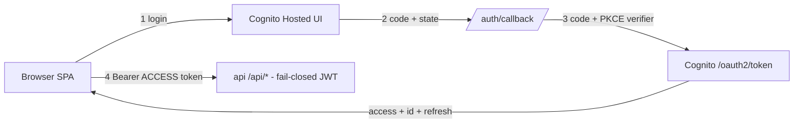

# ADR-005: Cognito Hosted-UI Authorization Code + PKCE for the dashboard SPA

## Status
Accepted (Stage 3, 2026-06-04)

## Context

The dashboard at `admin-dev.atomai.click` is publicly reachable (CloudFront) and
the api is fail-closed Cognito-JWT. The single-admin SPA needs a browser login
flow, and we must decide three things: the OAuth flow for a public client (no
secret), which token to send to the api, and where to keep tokens.

```mermaid
flowchart LR
  U[Browser SPA] -->|1 login| H[Cognito Hosted UI]
  H -->|2 code + state| CB[/auth/callback/]
  CB -->|3 code + PKCE verifier| T[Cognito /oauth2/token]
  T -->|access + id + refresh| U
  U -->|4 Bearer ACCESS token| API[api /api/* - fail-closed JWT]
```

## Options Considered

### Option 1: Implicit flow (tokens returned in the redirect fragment)
- **Pros**: no token-exchange step.
- **Cons**: deprecated for SPAs; access/id tokens land in the URL/history; no refresh token.

### Option 2: Authorization Code + PKCE (public client)
- **Pros**: the current standard for SPAs; the code is exchanged client-side using a PKCE verifier (no client secret); yields a refresh token for silent renewal.
- **Cons**: needs a callback route, a code-exchange step, and explicit token-storage handling.

### Token storage sub-decision: httpOnly-cookie BFF vs in-memory + sessionStorage
- **BFF (httpOnly cookie)**: not XSS-readable, but needs a Next server-side proxy holding tokens.
- **In-memory + sessionStorage**: simplest; access/id in memory, refresh in sessionStorage; XSS-exposed.

## Decision

**Authorization Code + PKCE.** The `dashboard-dev` app client is
`generate_secret = false`, `allowed_oauth_flows = ["code"]`. Flow: login → Hosted
UI → `/auth/callback` exchanges the code (with the PKCE verifier and a `state`
CSRF check) → tokens. The SPA sends the **access** token as
`Authorization: Bearer` — the api verifies `tokenUse:'access'` + `clientId` and
checks `cognito:username` ∈ `ADMIN_USERNAMES`, so the id token must NOT be sent.
Access/id tokens live in memory; the refresh token is kept in `sessionStorage` for
reload survival, with a silent refresh ~60s before expiry.
`NEXT_PUBLIC_AUTH_ENABLED=false` is the local-dev bypass mirroring the api
`skipJwt`. For a single-admin non-prod tool we accept in-memory + sessionStorage
over a BFF.

## Consequences

### Positive
- Standard, secret-less SPA auth; the access token matches exactly what the api verifier expects.
- The dev bypass keeps local development tokenless against the dev-server.

### Negative
- Tokens are XSS-exposed (documented; a cookie BFF is a future tightening).
- `NEXT_PUBLIC_*` are inlined at build time, so the prod image must be built with the prod Cognito values (client id, redirect/logout URIs, `AUTH_ENABLED=true`).
- Sending the wrong token type (id instead of access) is a silent 401 — easy to get wrong.

## References
- `dashboard/frontend/lib/{auth,auth-config,pkce,token-store}.ts`, `components/AuthProvider.tsx`, `app/auth/callback/page.tsx`
- `dashboard/backend/packages/api/src/plugins/jwt-cognito.ts`, `infra/cognito/main.tf`; PR #19
