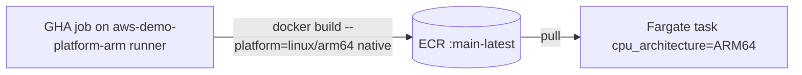

# ADR-006: ARM64/Graviton for ECS images, built natively on a self-hosted ARM runner

---

# English

## Status
Accepted (Stage 2/3, 2026-06-03)

## Context

The api, worker, and frontend run on ECS Fargate. A Fargate task's
`runtime_platform.cpu_architecture` must match the container image's platform — a
mismatch fails the task with `exec format error`. We must choose the CPU
architecture for all three images and how arm64 images get built in CI.

## Options Considered

### Option 1: amd64 / X86_64 everywhere
- **Pros**: the default; widest base-image coverage.
- **Cons**: forgoes Graviton price/performance.

### Option 2: arm64 / Graviton, built natively on a self-hosted ARM runner
- **Pros**: Graviton cost/performance; a native build is fast with no emulation; the `aws-demo-platform-arm` ARC scale-set (scale-to-zero on the hub) already exists.
- **Cons**: requires the self-hosted ARM runner; base images must be multi-arch (`node:20-alpine` is).

### Option 3: arm64 via QEMU emulation on GitHub-hosted amd64 runners
- **Pros**: no self-hosted runner.
- **Cons**: very slow builds; needs `buildx`/binfmt setup.

## Decision

**Option 2.** All ECS task definitions set `cpu_architecture = "ARM64"`, and CI
builds `--platform=linux/arm64` natively on the `aws-demo-platform-arm`
self-hosted runner. `node:20.16-alpine` is multi-arch, so the Dockerfiles are
unchanged. The image platform and the task `cpu_architecture` are kept in
lockstep — flipping one without the other crashes tasks (`exec format error`).
The migration landed mid-Stage-3 (PR #16 for api/worker), after which the
frontend was aligned to arm64 to match the rest of the cluster.

## Consequences

### Positive
- Graviton cost/performance; fast native builds (no QEMU); a consistent single-architecture cluster.

### Negative
- Image platform and task `cpu_architecture` are coupled — a partial change breaks task launch with `exec format error`.
- CI depends on the self-hosted ARM runner being available (ARC scale-to-zero on the hub cluster).
- A rollout must pin the new ARM64 task-def revision on `update-service` — a bare `--force-new-deployment` keeps the old revision. Migrating an in-flight branch (amd64 → an arm64 `main`) needs a merge plus an arch flip in the same change.

## References
- `.github/workflows/backend-ci.yml`, `.github/workflows/frontend-ci.yml` (`--platform=linux/arm64`, `runs-on: aws-demo-platform-arm`)
- `infra/dashboard-ecs/main.tf` (`runtime_platform.cpu_architecture = "ARM64"`)
- `docs/runbooks/arm64-graviton-migration.md`; PR #16

---

# 한국어

## 상태
승인됨 (Stage 2/3, 2026-06-03)

## 배경

api, worker, frontend는 ECS Fargate에서 동작합니다. Fargate 태스크의
`runtime_platform.cpu_architecture`는 컨테이너 이미지 플랫폼과 일치해야 하며, 불일치 시
`exec format error`로 태스크가 실패합니다. 세 이미지의 CPU 아키텍처와, CI에서 arm64
이미지를 빌드하는 방법을 정해야 합니다.

## 검토한 옵션

### 옵션 1: 전면 amd64 / X86_64
- **장점**: 기본값; 가장 넓은 베이스 이미지 커버리지.
- **단점**: Graviton 가격/성능 이점 포기.

### 옵션 2: arm64 / Graviton, self-hosted ARM 러너에서 네이티브 빌드
- **장점**: Graviton 비용/성능; 네이티브 빌드는 에뮬레이션 없이 빠름; `aws-demo-platform-arm` ARC scale-set(허브에서 scale-to-zero)이 이미 존재.
- **단점**: self-hosted ARM 러너 필요; 베이스 이미지가 멀티아치여야 함(`node:20-alpine`은 해당).

### 옵션 3: GitHub-hosted amd64 러너에서 QEMU 에뮬레이션으로 arm64 빌드
- **장점**: self-hosted 러너 불필요.
- **단점**: 빌드 매우 느림; `buildx`/binfmt 설정 필요.

## 결정

**옵션 2.** 모든 ECS task definition은 `cpu_architecture = "ARM64"`, CI는
`aws-demo-platform-arm` self-hosted 러너에서 `--platform=linux/arm64`로 네이티브
빌드합니다. `node:20.16-alpine`이 멀티아치라 Dockerfile은 그대로입니다. 이미지 플랫폼과
태스크 `cpu_architecture`는 lockstep으로 유지 — 한쪽만 바꾸면 태스크가 `exec format error`로
죽습니다. 마이그레이션은 Stage 3 중간(api/worker는 PR #16)에 반영됐고, 이후 frontend를
나머지 클러스터에 맞춰 arm64로 정렬했습니다.

## 결과

### 긍정적
- Graviton 비용/성능; 빠른 네이티브 빌드(QEMU 없음); 일관된 단일 아키텍처 클러스터.

### 부정적
- 이미지 플랫폼과 태스크 `cpu_architecture`가 결합 — 부분 변경 시 `exec format error`로 태스크 기동 실패.
- CI가 self-hosted ARM 러너 가용성에 의존(허브 클러스터의 ARC scale-to-zero).
- 롤아웃 시 `update-service`에 새 ARM64 task-def 리비전을 명시해야 함 — 단순 `--force-new-deployment`는 옛 리비전 유지. 진행 중 브랜치(amd64 → arm64 `main`)를 마이그레이션하려면 머지 + 동일 변경에서 아키텍처 전환 필요.

## 참고
- `.github/workflows/backend-ci.yml`, `.github/workflows/frontend-ci.yml` (`--platform=linux/arm64`, `runs-on: aws-demo-platform-arm`)
- `infra/dashboard-ecs/main.tf` (`runtime_platform.cpu_architecture = "ARM64"`)
- `docs/runbooks/arm64-graviton-migration.md`; PR #16
