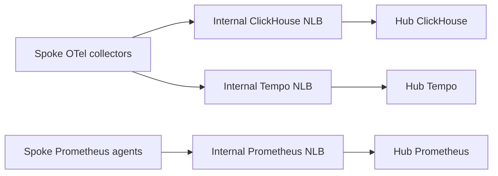

# ADR-007: Internal NLB exception for hub observability fan-in

## Status

Accepted (2026-06-14). Limited to private observability fan-in.

## Context

Public ingress uses CloudFront → VPC Origin → internal ALB → target IPs.
The AWS Load Balancer Controller reconciles TargetGroupBinding to register Pod
IPs from Services; TGB is not a traffic hop. The public-ingress convention does
not provide ClickHouse's native TCP transport between clusters.

The June 2026 hub handoff reported three existing internal NLBs carrying
spoke-to-hub telemetry. Retaining them avoided pruning active collection paths.
That is dated migration evidence, not a current health or consumer inventory.

## Decision and implemented scope

Keep the three Services in
[`internal-nlb-services.yaml`](../../k8s/system/clickhouse-mgmt/internal-nlb-services.yaml):

| Service | Namespace | Ports / purpose |
| --- | --- | --- |
| `clickhouse-nlb` | `observability` | 9000 native TCP, 8123 HTTP |
| `tempo-nlb` | `observability` | 4317 OTLP gRPC, 3200 HTTP |
| `prometheus-nlb` | `monitoring` | 9090 remote-write |

Each manifest selects IP targets, `scheme=internal` and
`loadBalancerSourceRanges: ["10.0.0.0/8"]`. The annotation naming load-balancer
**type** `external` selects the controller integration; it does not override the
internal scheme. Verify resulting SGs, targets and routes before operational
changes. These NLBs have no CloudFront origin and accept only the private source
range; the platform ALB separately permits its CloudFront source SG plus 10/8.

Alternatives were ALB-only transport, which cannot carry ClickHouse native TCP,
and ClusterIP-only backends, which would remove the chosen cross-cluster collection
path. Keep the NLB exception private and limited to fan-in; it never permits a
public Grafana NLB or Kubernetes Ingress.

## Consequences and accepted risk

The checked-in [ClickHouseInstallation](../../k8s/system/clickhouse-mgmt/clickhouse-installation.yaml)
sets the `default` user's network ACL to `10.0.0.0/8` and does not configure a
password. The handoff recorded unauthenticated exporters. Hosts with network
reachability within that range can therefore access the database without authentication
under this configuration; actual reachability/authentication still needs runtime
verification. This residual risk was accepted for the reused non-production hub,
not as a general database security pattern.

A future hardening change must coordinate credentials/exporters or narrower
source ranges. Inventory live consumers before removal: the owning
[ClickHouse ApplicationSet](../../argocd-apps/system/appset-clickhouse.yaml)
uses pruning, so deleting the Service manifests can remove their load balancers.
A single-cluster replacement needs its own verified cutover.

See [project tolerance and ingress rules](../../CLAUDE.md),
[architecture](../architecture.md) and [Grafana's separate route](ADR-018-grafana-private-origin.md).
