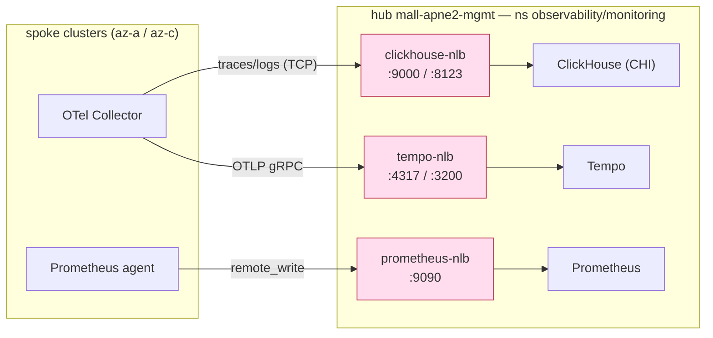

# ADR-007: Internal NLB exception for mgmt observability fan-in

## Status
Accepted (2026-06-14)

## Context
The demo platform's ingress convention is CloudFront → VPC Origin → Internal ALB → TargetGroupBinding, with **no NLB and no Kubernetes Ingress** (see CLAUDE.md, ADR-004).

However, the hub cluster (`mall-apne2-mgmt`) hosts the observability backends (Grafana Tempo, ClickHouse, Prometheus) that the spoke clusters (`mall-apne2-az-a`, `mall-apne2-az-c`) push into: spoke OTel Collectors send traces/logs to ClickHouse (native TCP :9000) and Tempo (OTLP gRPC :4317), and workload Prometheus agents remote-write to the hub Prometheus (:9090). This is an **L4 cross-cluster fan-in**, not L7 HTTP request ingress. ClickHouse's native TCP protocol in particular cannot be terminated by an L7 ALB.

The EKS clusters are **reused** from `multi-region-architecture` — the three internal NLBs (`clickhouse-nlb`, `tempo-nlb`, `prometheus-nlb`, all `scheme=internal`) already exist and carry live traffic. ArgoCD syncs these targets with `prune: true`, so dropping them from the migrated target set would **delete the live NLBs** and break the observability pipeline.

Source-range hardening: rather than depend on a hardcoded externally-managed SG (`sg-0613a5ecf8009daff` from the mall's shared remote_state), each NLB sets `spec.loadBalancerSourceRanges: ["10.0.0.0/8"]`, so the AWS Load Balancer Controller provisions a managed frontend SG that admits only the hub/spoke RFC1918 range — matching the platform convention ("every LB SG accepts only the CF VPC Origin SG + 10.0.0.0/8"). These NLBs sit behind no CloudFront origin (direct spoke→hub), so 10.0.0.0/8 is the sole allowed source.

_All three NLBs are `scheme=internal`, source-restricted to `10.0.0.0/8` (managed SG). No public exposure._

## Options Considered

### Option 1: Keep the internal NLBs as an explicit exception (chosen)
- **Pros**: No disruption to the live spoke→hub fan-in; faithful GitOps ownership handoff (no pruning of live resources); ClickHouse native TCP works; matches existing infra.
- **Cons**: Introduces a documented NLB exception to the otherwise NLB-free convention (scoped to internal data-plane only).

### Option 2: Replace the NLBs with TargetGroupBinding → internal ALB
- **Pros**: Conforms to the platform's ALB/TGB convention.
- **Cons**: L7 ALB cannot terminate ClickHouse native TCP (:9000); OTLP gRPC and Prometheus remote-write are also better served by L4. Would require re-architecting the spoke exporters and risks breaking the live pipeline. Not viable for the TCP backend.

### Option 3: In-cluster ClusterIP only — drop cross-cluster collection
- **Pros**: Zero NLB; fully convention-compliant.
- **Cons**: Spoke clusters could no longer ship telemetry to the hub backends, gutting centralized observability. Rejected — defeats the purpose of the shared hub.

## Decision
Keep the three internal NLBs in `k8s/system/clickhouse-mgmt/internal-nlb-services.yaml` as an **explicit, scoped exception** to the no-NLB convention. The exception is limited to internal (`scheme=internal`), source-range-restricted (`loadBalancerSourceRanges: 10.0.0.0/8`, managed SG) data-plane fan-in for observability. The platform's bans on **public** load balancers and on Kubernetes Ingress remain fully in force; external/admin ingress continues to use CloudFront → ALB → TGB.

## Consequences

### Positive
- Live spoke→hub observability fan-in continues uninterrupted through the ArgoCD ownership handoff.
- Faithful GitOps replication — no live resource is pruned when this repo takes over the hub root-app.

### Negative
- A data-plane-only NLB exception now exists alongside the no-NLB convention; future readers must consult this ADR. If the topology later collapses to a single cluster, this can be reclaimed with in-cluster ClusterIP. See [[non-production-tolerance]].

### Accepted security risk
- The ClickHouse `default` user has **no password** (the live OTel-collector exporters connect unauthenticated, and adding a password would break the reused live pipeline). With `clickhouse-nlb` reachable from `10.0.0.0/8`, any host in that range can read/write the otel traces/logs DB without auth. The user-level `networks/ip` ACL is tightened from `0.0.0.0/0` to `10.0.0.0/8` (matching the NLB source range) as defense in depth, but the residual unauthenticated-within-10/8 exposure is **explicitly accepted** for this non-production, cluster-reuse context. Future hardening (if promoted toward prod): set a `password_sha256_hex` via an ESO `ExternalSecret` and update the exporters, or narrow the ACL/source-range to the spoke node/pod CIDRs.

## References
- `docs/superpowers/specs/2026-05-26-aws-demo-platform-design.md`
- `docs/superpowers/specs/2026-06-14-mgmt-cluster-argocd-target-handoff-design.md`
- ADR-004 (same-origin CloudFront), CLAUDE.md (CloudFront-only ingress convention)
- `k8s/system/clickhouse-mgmt/internal-nlb-services.yaml`, `argocd-apps/system/appset-clickhouse.yaml`, `argocd-apps/system/appset-tempo.yaml`
