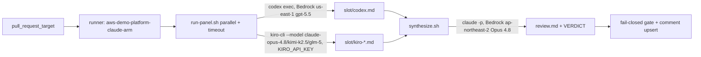

# ADR-007: Multi-AI co-agent PR review panel (Codex + Kiro) with a Claude chair

---

# English

## Status
Accepted (2026-06-14). Superseded in part by [ADR-011](ADR-011-pr-review-kiro-roster-gpt55-drop-v3.md)
(Kiro roster `kimi-k2.5` → `gpt-5.5`, drop `--v3`) — this document's roster/flag
references below are historical. Also amended in part by
[ADR-012](ADR-012-pr-review-kiro-diff-delivery-argv-embed.md) (Kiro tool-grant detail only:
`--trust-tools=read,grep`/`fs_read` → `--trust-tools=` + capped argv-embedded diff. The
panel/chair decision and this ADR's own later inline updates below are unaffected by either.)

## Context

`pr-review.yml` runs a single `claude` CLI review (Bedrock Opus 4.8) on the
self-hosted `aws-demo-platform-claude-arm` runner and gates the PR on a final
`VERDICT: PASS|FAIL` line. We want a multi-AI panel — Codex and Kiro — to feed a
Claude chair that synthesizes one review, mirroring the `/co-agent review`
pattern. The runner image (`actions-runner-claude`) was previously built outside
this repo; we also fold its build into this repo as the management area
consolidates here.

## Options Considered

### Option 1: Independent verdicts, combined gate
- **Pros**: simple; each AI emits its own VERDICT; gate = AND/majority.
- **Cons**: no synthesis; noisy comment; disagreement handling is mechanical.

### Option 2: Claude chairs & synthesizes (chosen)
- **Pros**: one coherent review; matches `/co-agent`; chair reconciles panel agreement/dissent; single VERDICT keeps the existing fail-closed gate unchanged.
- **Cons**: chair is a single point; 5 model calls/PR latency.

### Option 3: Panel + synthesis, both shown
- **Pros**: transparency of raw panel takes.
- **Cons**: bulky comment; raw panel output rarely actionable vs the synthesis.

## Decision

**Option 2.** Panel = Codex (1) + Kiro (`claude-opus-4.8`, `kimi-k2.5`, `glm-5`).
Panelists emit findings only; **Claude Opus 4.8 is the chair** and produces the
single review + `VERDICT`. Orchestration lives in repo scripts
(`scripts/pr-review/`), not inline YAML. Auth: **Codex uses Bedrock
natively** via baked `~/.codex/config.toml` (`model_provider = "amazon-bedrock"`,
`openai.gpt-5.5`, `us-east-1`) — no key, reusing the runner node IAM, whose
`ci_runner_bedrock` policy is already `Resource=*` (all regions). **Kiro uses
`KIRO_API_KEY`** read from the existing Secrets Manager secret
`/demo-platform/actions/AI-key` via an `external-secrets.io/v1` ExternalSecret
(`ai-panel-keys`) into the runner pod env — no new slot. The runner stays in **ap-northeast-2**
(cross-region Bedrock latency is negligible vs generation time; relocating would
need a new cluster/ECR/secrets in us-east). The runner image is built in this
repo (`docker/actions-runner-claude/` + `runner-image.yml`, ADR-003 OIDC→ECR).

No-hang is guaranteed by non-interactive flags (`codex exec`, `kiro-cli
--no-interactive --trust-tools=read,grep`) + `timeout` + stdin isolation; any
panelist failure/absence is a graceful `[skip]`, and an all-skip degrades to the
prior Claude-solo behavior.

## Consequences

### Positive
- Cross-family review diversity (OpenAI gpt-5.5 + Kiro opus/kimi/glm) with one synthesized verdict.
- Existing gate (fail-closed), comment upsert, and concurrency invariants are untouched.
- Runner image and its build pipeline are now owned and PR-reviewed in this repo.
- No new secret slot — reuses the existing `/demo-platform/actions/AI-key` secret.

### Negative
- Up to 5 model calls per PR (latency; acceptable for non-prod async review).
- Chair is a single synthesis point; a bad chair run still fail-closes via the VERDICT rule.
- `kimi-k2.5` may be account-tier gated → that panelist silently skips.
- Adds an ExternalSecret-syncing ArgoCD Application to operate.

---

# 한국어

## 상태
승인됨 (2026-06-14). [ADR-011](ADR-011-pr-review-kiro-roster-gpt55-drop-v3.md)(Kiro
로스터 `kimi-k2.5` → `gpt-5.5`, `--v3` 제거)로 일부 대체됨 — 아래 로스터/플래그 언급은
역사적 기록. [ADR-012](ADR-012-pr-review-kiro-diff-delivery-argv-embed.md)가 일부 추가
개정(Kiro 툴-그랜트 세부사항만: `--trust-tools=read,grep`/`fs_read` → `--trust-tools=` +
캡핑된 argv-embed diff). 패널/의장 결정과 아래 이 ADR 자신의 후속 인라인 업데이트는 둘
다 영향 없음.

## 배경

`pr-review.yml`은 self-hosted `aws-demo-platform-claude-arm` 러너에서 단일
`claude` CLI 리뷰(Bedrock Opus 4.8)를 돌리고 마지막 `VERDICT: PASS|FAIL` 줄로
PR을 게이트한다. 여기에 Codex·Kiro 패널을 더해 **Claude 의장**이 하나의 리뷰로
종합하게 한다(`/co-agent review` 패턴). 관리 영역을 이 repo로 통합하는 흐름에
맞춰, 외부에서 빌드되던 러너 이미지(`actions-runner-claude`) 빌드도 이 repo로
가져온다. (데이터 흐름은 위 Mermaid 참조.)

## 검토한 옵션

### 옵션 1: 독립 VERDICT + 결합 게이트
- **장점**: 단순, 각 AI가 자기 VERDICT, 게이트=AND/다수결.
- **단점**: 종합 없음, 코멘트 산만, 이견 처리가 기계적.

### 옵션 2: Claude 의장 종합 (채택)
- **장점**: 일관된 단일 리뷰, `/co-agent`와 일치, 의장이 합의/이견 조정, 단일 VERDICT라 기존 fail-closed 게이트 그대로.
- **단점**: 의장 단일점, PR당 5회 모델 호출 지연.

### 옵션 3: 패널 원본 + 종합 동시 노출
- **장점**: 패널 원본 투명성.
- **단점**: 코멘트 비대, 원본은 종합 대비 실효성 낮음.

## 결정

**옵션 2.** 패널 = Codex(1) + Kiro(`claude-opus-4.8`, `kimi-k2.5`, `glm-5`).
패널은 findings 만, **Claude Opus 4.8이 의장**으로 단일 리뷰+`VERDICT` 생성.
오케스트레이션은 인라인 YAML이 아닌 repo 스크립트(`scripts/pr-review/`). 인증:
**Codex는 Bedrock 네이티브** — baking된 `~/.codex/config.toml`(`amazon-bedrock`,
`openai.gpt-5.5`, `us-east-1`)로 키 불필요, 러너 노드 IAM 재사용
(`ci_runner_bedrock`가 이미 `Resource=*`라 추가 IAM 불필요). **Kiro는
`KIRO_API_KEY`** — 기존 Secrets Manager 시크릿
`/demo-platform/actions/AI-key` → `external-secrets.io/v1` ExternalSecret(`ai-panel-keys`) → 러너
env (신규 슬롯 없음). 러너는 **ap-northeast-2 유지**(크로스리전 Bedrock
지연은 생성시간 대비 무시 가능, 이전은 us-east에 클러스터/ECR/시크릿 신설 필요).
러너 이미지는 이 repo에서 빌드(`docker/actions-runner-claude/` +
`runner-image.yml`, ADR-003 OIDC→ECR).

no-hang은 비대화형 플래그(`codex exec`, `kiro-cli --no-interactive
--trust-tools=read,grep`) + `timeout` + stdin 격리로 보장. 패널 실패/부재는
graceful `[skip]`, 전원 skip 시 기존 Claude 단독 동작으로 강등.

## 결과

### 긍정적
- 교차 패밀리 리뷰 다양성(OpenAI gpt-5.5 + Kiro opus/kimi/glm) + 단일 종합 VERDICT.
- 기존 게이트(fail-closed)·코멘트 upsert·concurrency 불변식 그대로.
- 러너 이미지와 빌드 파이프라인을 이 repo에서 소유·PR 리뷰.
- 신규 시크릿 슬롯 없음 — 기존 `/demo-platform/actions/AI-key` 재사용.

### 부정적
- PR당 최대 5회 모델 호출(지연; 비프로덕션 비동기 리뷰에 허용).
- 의장 단일점이지만 의장 실패도 VERDICT 룰로 fail-closed.
- `kimi-k2.5`는 계정 등급 제한 가능 → 해당 항목 silent skip.
- 운영 대상에 ExternalSecret 동기화 ArgoCD App 추가.

---

## Update (2026-06-23) — weekly rebuild, baked plugins, Kiro v3 / 주간 재빌드·플러그인 베이킹·Kiro v3

Operational evolution of the runner image (decision unchanged):

- **Base re-pointed to the official ARC runner image (self-referential FROM fixed)** —
  the Dockerfile previously did `FROM actions-runner-claude:latest`, the *same* repo:tag
  it pushes to, so a weekly cron would recursively stack on its own output (≈+400 MB per
  build; base/claude-code frozen forever). Now it builds `FROM ghcr.io/actions/actions-runner`
  (Ubuntu 24.04 + .NET + runner agent) and installs only gh/aws/node/**claude-code**/codex/
  kiro-cli/plugins on top. The runner agent/OS/.NET come from upstream (no hand-rolled
  agent), and each weekly build is clean; `runner-image.yml` uses `docker build --pull` so
  the weekly cron refreshes the base instead of reusing a stale daemon cache. Adds
  `infra/ecr/pull-through-cache.tf` (`ecr-pullthroughcache/ghcr` PAT slot, manual value,
  and an explicitly-enabled optional PTC rule) and grants the build role `ghcr/actions/*`
  import + the previously-missing `actions-runner-claude` push. (`actions/runner-images`
  is VM images, not a container base.) Standard Atlantis apply creates the secret slot
  only; after PAT injection, `enable_ghcr_pull_through_cache_rule=true` creates the
  optional ECR PTC rule in a follow-up apply without making the weekly cron depend on it.
- **Weekly rebuild** — `runner-image.yml` gains a `schedule` (`cron: 0 18 * * 6`,
  Sun 03:00 KST) alongside `workflow_dispatch`, keeping the base image / CLIs /
  plugins fresh. Best-effort: a failed build never reaches `docker push`, so the
  live `:latest` and running runners are untouched.
- **Pinned runner CLI inputs** — Dockerfile pins Claude Code `2.1.186`, Codex `0.142.0`,
  Kiro CLI `2.8.1`, installer script SHA-256 values, gh/aws/node archive SHA-256 values,
  and the Kiro ARM64 zip SHA-256. The build verifies checksums and installed versions
  before proceeding.
- **Baked Claude Code plugins** — the image ships with `codex@openai-codex`,
  `code-review@claude-plugins-official`, and `github@claude-plugins-official`
  pre-installed under the runner's `~/.claude`, and the Codex plugin pre-configured
  (companion `setup`, stop-time review gate disabled). Available to any `claude`
  invocation on the runner. (github plugin runtime auth — PAT vs OAuth — is a
  follow-up verify item; install/enable only for now.)
- **Kiro v3** — panel calls use `kiro-cli --v3 chat …` (binary is `kiro-cli`, never
  bare `kiro`); the build verifies `kiro-cli --v3 chat --help` and the actual panel
  flags (`--no-interactive`, `--trust-tools`, `--wrap`) so a missing/renamed flag
  fails the weekly build loudly.
- **Antigravity (`agy`) dropped** — removed from `run-panel.sh`, the Dockerfile,
  runner pod env, and ExternalSecret because headless API-key auth does not work
  and the CLI requires interactive OAuth.
- **Runner credentials fix** — runner pods use the shared `claude-runner` SA, but it
  was missing from `infra/eks-mgmt` `runner_service_accounts`, so no EKS Pod Identity
  Association existed → pods got no `ci_runner` role and the node role has no Bedrock.
  codex (gpt-5.5 needs `bedrock-mantle:*`, only on `ci_runner`) failed. Fixed by adding
  `claude-runner` to the association list (Atlantis apply `infra/eks-mgmt`).

See `docs/superpowers/specs/2026-06-23-runner-weekly-rebuild-plugins-design.md`.

러너 이미지의 운영상 진화(결정 자체는 불변):

- **주간 재빌드** — `runner-image.yml` 에 `schedule`(`cron: 0 18 * * 6`, 일 03:00 KST)
  추가. best-effort(빌드 실패 시 push 미도달 → live `:latest`·동작 중 러너 무영향).
- **러너 CLI 입력 핀** — Dockerfile 이 Claude Code `2.1.186`, Codex `0.142.0`,
  Kiro CLI `2.8.1`, 설치 스크립트 SHA-256, gh/aws/node 아카이브 SHA-256,
  Kiro ARM64 zip SHA-256 를 고정하고 checksum 과 설치 버전을 검증.
- **Claude Code 플러그인 베이킹** — `codex@openai-codex`, `code-review@`/`github@claude-plugins-official`
  3종을 러너 `~/.claude` 에 사전 설치, Codex 플러그인은 사전 구성(리뷰 게이트 비활성).
  github 플러그인 런타임 인증은 후속 verify 항목.
- **Kiro v3** — 패널이 `kiro-cli --v3 chat …` 사용(바이너리는 `kiro-cli`, bare `kiro` 아님),
  빌드가 `kiro-cli --v3 chat --help` 와 실제 패널 플래그(`--no-interactive`,
  `--trust-tools`, `--wrap`)를 검증.
- **Antigravity(`agy`) 제거** — 헤드리스 API-key 인증이 동작하지 않고 CLI가 인터랙티브
  OAuth를 요구하므로 `run-panel.sh`, Dockerfile, 러너 pod env, ExternalSecret에서 제거.
- **러너 자격증명 수정** — 러너 파드는 공유 `claude-runner` SA 사용하나 `runner_service_accounts`
  목록에 없어 Pod Identity Association 부재 → `ci_runner` 역할 미수령, 노드 역할엔 Bedrock 없음 →
  codex(gpt-5.5=bedrock-mantle 필수) 실패. 목록에 `claude-runner` 추가로 수정.

---

## Update (2026-06-23b) — plugins used in-review: Claude self-review panelist / 리뷰에서 플러그인 활용

Baking plugins into the image is inert unless the review pipeline uses them. Wired
them in so the panel actually exercises the plugins:

- **Panel = Codex(exec) + Kiro×3 (opus/kimi/glm) + a Claude self-review (new) → Claude chair.**
- **Claude self-review** (`run-panel.sh`): an independent `claude -p` review on the
  plugin-equipped runner, applying the code-review methodology and using read-only tools
  (gh pr diff/view·search, Read/Grep/Glob, github MCP read tools) to pull context beyond
  the truncated diff. Findings only — no comment, no VERDICT. Slot `claude-self.md` feeds
  the chair like any other panelist.
- **Claude chair** (`synthesize.sh`): synthesis + VERDICT, with the same read-only tools
  allowed to verify panel disagreements.
- **Auth**: the review job token (`github.token`) → `GH_TOKEN` (gh) + `GITHUB_PERSONAL_ACCESS_TOKEN`
  (github MCP). Job-scoped, not a pod-wide PAT.
- **Security**: in the `pull_request_target` write context, tools are a read-only allowlist —
  `gh api` / `gh pr comment` are NOT allowed, so the panel/chair cannot mutate or comment
  (only the existing single upsert step posts).
- **Honest scope**: the `codex` plugin overlaps `codex exec`, and the `github` plugin overlaps
  `gh`; in the headless panel their unique value is the code-review methodology (self-review)
  and interactive `claude` use on the runner. The `/code-review` slash command itself self-comments
  and self-fetches, so its methodology is applied in the self-review rather than invoked verbatim.
- **Verify**: exact github-MCP tool names on the runner (`mcp__github__*` prefix) and headless
  `--allowedTools` tool execution.

플러그인은 리뷰가 실제로 호출해야 의미가 있다. 패널 = Codex + Kiro×3 + **Claude 셀프리뷰** → Claude 의장.
셀프리뷰는 플러그인 컨테이너에서 code-review 방법론 + read-only 도구(gh·Read·github MCP)로 맥락을
확인하고 findings 만 출력(코멘트/VERDICT 금지). 인증은 잡-스코프 토큰. `pull_request_target` 쓰기
컨텍스트라 도구는 read-only allowlist 만(`gh api`/코멘트 불가). codex/github 플러그인은 `codex exec`/`gh`
와 중복 → 고유 가치는 code-review 방법론·인터랙티브 사용.

See `docs/superpowers/specs/2026-06-23-runner-weekly-rebuild-plugins-design.md`.

See [ADR-010](ADR-010-bedrock-account-data-retention-for-fable-mythos.md) for the Bedrock account-level data retention requirement behind the Fable 5 chair model.
