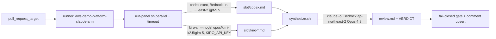

# ADR-007: Multi-AI co-agent PR review panel (Codex + Kiro) with a Claude chair

---

# English

## Status
Accepted (2026-06-14)

## Context

`pr-review.yml` runs a single `claude` CLI review (Bedrock Opus 4.8) on the
self-hosted `aws-demo-platform-claude-arm` runner and gates the PR on a final
`VERDICT: PASS|FAIL` line. We want a multi-AI panel — Codex and Kiro — to feed a
Claude chair that synthesizes one review, mirroring the `/co-agent review`
pattern. The runner image (`actions-runner-claude`) was previously built outside
this repo; we also fold its build into this repo as the management area
consolidates here.

## Options Considered

### Option 1: Independent verdicts, combined gate
- **Pros**: simple; each AI emits its own VERDICT; gate = AND/majority.
- **Cons**: no synthesis; noisy comment; disagreement handling is mechanical.

### Option 2: Claude chairs & synthesizes (chosen)
- **Pros**: one coherent review; matches `/co-agent`; chair reconciles panel agreement/dissent; single VERDICT keeps the existing fail-closed gate unchanged.
- **Cons**: chair is a single point; 5 model calls/PR latency.

### Option 3: Panel + synthesis, both shown
- **Pros**: transparency of raw panel takes.
- **Cons**: bulky comment; raw panel output rarely actionable vs the synthesis.

## Decision

**Option 2.** Panel = Codex (1) + Kiro (`opus`, `kimi-k2.5`, `glm-5`). Panelists
emit findings only; **Claude Opus 4.8 is the chair** and produces the single
review + `VERDICT`. Orchestration lives in repo scripts (`scripts/pr-review/`),
not inline YAML. Auth: **Codex uses Bedrock natively** via baked
`~/.codex/config.toml` (`model_provider = "amazon-bedrock"`, `openai.gpt-5.5`,
`us-east-2`) — no key, reusing the runner node IAM, whose `ci_runner_bedrock`
policy is already `Resource=*` (all regions). **Kiro uses `KIRO_API_KEY`** from
Secrets Manager (`/demo-platform/kiro/api-key`) via an `external-secrets.io/v1`
ExternalSecret into the runner pod env. The runner stays in **ap-northeast-2**
(cross-region Bedrock latency is negligible vs generation time; relocating would
need a new cluster/ECR/secrets in us-east). The runner image is built in this
repo (`docker/actions-runner-claude/` + `runner-image.yml`, ADR-003 OIDC→ECR).

No-hang is guaranteed by non-interactive flags (`codex exec`, `kiro-cli
--no-interactive --trust-tools=read,grep`) + `timeout` + stdin isolation; any
panelist failure/absence is a graceful `[skip]`, and an all-skip degrades to the
prior Claude-solo behavior.

## Consequences

### Positive
- Cross-family review diversity (OpenAI gpt-5.5 + Kiro opus/kimi/glm) with one synthesized verdict.
- Existing gate (fail-closed), comment upsert, and concurrency invariants are untouched.
- Runner image and its build pipeline are now owned and PR-reviewed in this repo.

### Negative
- Up to 5 model calls per PR (latency; acceptable for non-prod async review).
- Chair is a single synthesis point; a bad chair run still fail-closes via the VERDICT rule.
- `kimi-k2.5` may be account-tier gated → that model silently skips.
- Adds a Kiro secret + an ExternalSecret-syncing ArgoCD Application to operate.

---

# 한국어

## 상태
승인됨 (2026-06-14)

## 배경

`pr-review.yml`은 self-hosted `aws-demo-platform-claude-arm` 러너에서 단일
`claude` CLI 리뷰(Bedrock Opus 4.8)를 돌리고 마지막 `VERDICT: PASS|FAIL` 줄로
PR을 게이트한다. 여기에 Codex·Kiro 패널을 더해 **Claude 의장**이 하나의 리뷰로
종합하게 한다(`/co-agent review` 패턴). 관리 영역을 이 repo로 통합하는 흐름에
맞춰, 외부에서 빌드되던 러너 이미지(`actions-runner-claude`) 빌드도 이 repo로
가져온다. (데이터 흐름은 위 Mermaid 참조.)

## 검토한 옵션

### 옵션 1: 독립 VERDICT + 결합 게이트
- **장점**: 단순, 각 AI가 자기 VERDICT, 게이트=AND/다수결.
- **단점**: 종합 없음, 코멘트 산만, 이견 처리가 기계적.

### 옵션 2: Claude 의장 종합 (채택)
- **장점**: 일관된 단일 리뷰, `/co-agent`와 일치, 의장이 합의/이견 조정, 단일 VERDICT라 기존 fail-closed 게이트 그대로.
- **단점**: 의장 단일점, PR당 5회 모델 호출 지연.

### 옵션 3: 패널 원본 + 종합 동시 노출
- **장점**: 패널 원본 투명성.
- **단점**: 코멘트 비대, 원본은 종합 대비 실효성 낮음.

## 결정

**옵션 2.** 패널 = Codex(1) + Kiro(`opus`, `kimi-k2.5`, `glm-5`). 패널은 findings
만, **Claude Opus 4.8이 의장**으로 단일 리뷰+`VERDICT` 생성. 오케스트레이션은
인라인 YAML이 아닌 repo 스크립트(`scripts/pr-review/`). 인증: **Codex는 Bedrock
네이티브** — baking된 `~/.codex/config.toml`(`amazon-bedrock`, `openai.gpt-5.5`,
`us-east-2`)로 키 불필요, 러너 노드 IAM 재사용(`ci_runner_bedrock`가 이미
`Resource=*`라 추가 IAM 불필요). **Kiro는 `KIRO_API_KEY`** —
Secrets Manager(`/demo-platform/kiro/api-key`) → `external-secrets.io/v1`
ExternalSecret → 러너 env. 러너는 **ap-northeast-2 유지**(크로스리전 Bedrock
지연은 생성시간 대비 무시 가능, 이전은 us-east에 클러스터/ECR/시크릿 신설 필요).
러너 이미지는 이 repo에서 빌드(`docker/actions-runner-claude/` +
`runner-image.yml`, ADR-003 OIDC→ECR).

no-hang은 비대화형 플래그(`codex exec`, `kiro-cli --no-interactive
--trust-tools=read,grep`) + `timeout` + stdin 격리로 보장. 패널 실패/부재는
graceful `[skip]`, 전원 skip 시 기존 Claude 단독 동작으로 강등.

## 결과

### 긍정적
- 교차 패밀리 리뷰 다양성(OpenAI gpt-5.5 + Kiro opus/kimi/glm) + 단일 종합 VERDICT.
- 기존 게이트(fail-closed)·코멘트 upsert·concurrency 불변식 그대로.
- 러너 이미지와 빌드 파이프라인을 이 repo에서 소유·PR 리뷰.

### 부정적
- PR당 최대 5회 모델 호출(지연; 비프로덕션 비동기 리뷰에 허용).
- 의장 단일점이지만 의장 실패도 VERDICT 룰로 fail-closed.
- `kimi-k2.5`는 계정 등급 제한 가능 → 해당 모델 silent skip.
- 운영 대상에 Kiro 시크릿 + ExternalSecret 동기화 ArgoCD App 추가.
