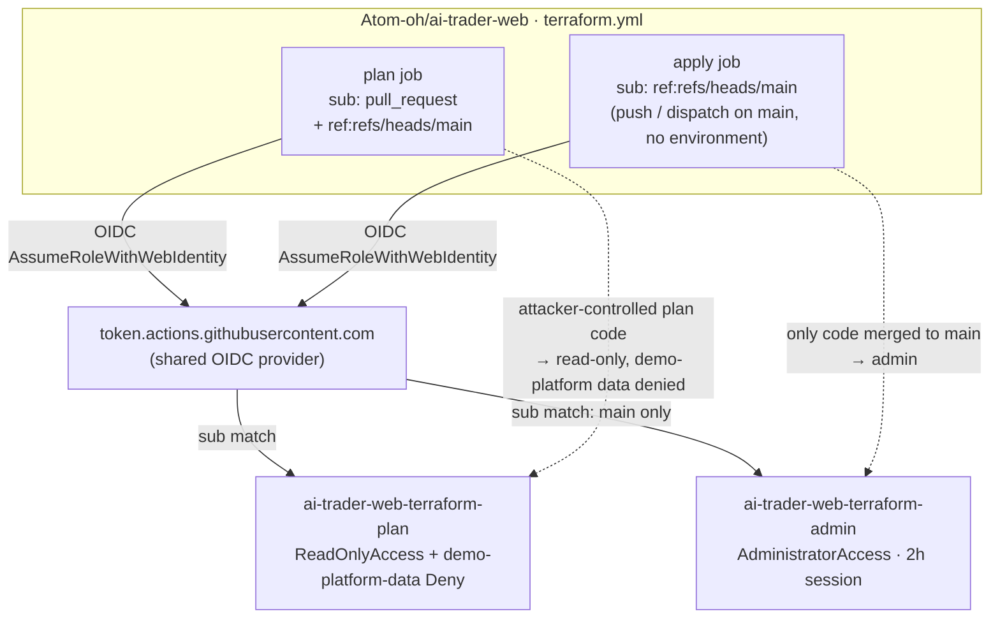

# ADR-012: ai-trader-web Terraform OIDC — Plan/Apply Privilege Split

---

# English

## Status

Accepted (2026-07-12). Extends the OIDC least-privilege convention already used by
`demo-platform-gha-ecr-push` (`infra/iam/gha-ecr-push-role.tf`) to a cross-repo,
higher-privilege case: the external `Atom-oh/ai-trader-web` repo's `terraform.yml`.

## Context

`ai-trader-web` runs its own `terraform.yml` (plan on PR/push, apply on push to `main` +
`workflow_dispatch`, apply job bound to a GitHub `environment: prod`). It manages IAM, ECS,
CloudFront, Cognito, NLB, Lambda@Edge, AgentCore — so its Terraform needs broad, effectively
account-admin permissions to apply. The repo already assumes `ai-trader-web-gha-deploy`
(`PowerUserAccess`), which cannot manage IAM; the ask was an **admin** role.

The naive design — one `AdministratorAccess` role whose trust lists all three subs
(`pull_request`, `ref:refs/heads/main`, `environment:prod`) — has a critical flaw the PR-review
panel (5/5 models, PR #69) independently surfaced:

**`terraform plan` executes code from the PR branch.** Provider plugins, `external` data
sources, and `data` lookups all run during plan. If the `pull_request` sub can assume an
admin role, then *anyone who can open a PR* against ai-trader-web (a repo collaborator, or an
attacker who compromises any CI dependency the plan step resolves) runs arbitrary code with
account-admin credentials — completely bypassing the `environment: prod` approval gate, whose
whole purpose is to require a human review before privileged actions. Pinning trust to "exact
subs" fixes *who* assumes the role but not *what code* executes under it.

This account hosts the entire demo-platform (EKS hub, Atlantis, Terraform state bucket), so
the blast radius of a compromised admin assume-path is platform-wide.

## Decision

Split into two roles (`infra/iam/ai-trader-web-gha-roles.tf`):

| Role | Managed policy | Trust (`sub`) | Used by |
|------|----------------|---------------|---------|
| `ai-trader-web-terraform-plan` | `ReadOnlyAccess` **+ inline Deny on demo-platform data** | `pull_request`, `ref:refs/heads/main` | plan job |
| `ai-trader-web-terraform-admin` | `AdministratorAccess` | `ref:refs/heads/main` only (IAM-enforced branch gate) | apply job |

- The plan job (attacker-influenceable) can only read, and ai-trader-web uses **local**
  Terraform state, so the plan role needs no permissions on its *own* state.
- **But `ReadOnlyAccess` grants `s3:Get*` / `dynamodb:Scan` account-wide**, and this account
  hosts the *shared, platform-wide* Terraform state (bucket `multi-region-mall-terraform-state`
  + lock table, may contain plaintext secrets) plus the demo-platform Lifecycle Controller
  DynamoDB tables. Since the plan role is assumable by attacker-controlled PR-branch code,
  "read-only" is not by itself safe — it would be a demo-platform-data exfiltration path. An
  **inline Deny** on the state bucket/lock table + a `demo-platform-*` DynamoDB wildcard
  **including `/index/*`** (a projection-ALL GSI on `demo-platform-jobs-dev` would leak the
  full item set past a table-only Deny, since `dynamodb:Query` authorizes on the index ARN) +
  a `/demo-platform/*` CloudWatch Logs Deny (`logs:*`, so `StartQuery`/`GetQueryResults` +
  `StartLiveTail` are covered, not just `GetLogEvents`) closes it, while ai-trader-web's own
  resources (it deploys into this same account) stay readable for plan refresh.
  `secretsmanager:GetSecretValue` / `kms:Decrypt` are already absent from `ReadOnlyAccess`, so
  the ExternalId/secret paths are closed by omission. (The state bucket + lock table live in
  `us-east-1`, per `backend.tf` — the lock-table Deny ARN is pinned there, not `local.region`.)
- **The admin role is gated on the `ref:refs/heads/main` sub, NOT an `environment:prod` sub.**
  An environment sub would delegate the branch gate to GitHub environment protection — which
  this repo's billing plan cannot enforce (no required-reviewer / branch-restriction rules on
  a private repo: `gh api .../environments/prod` → `protection_rules: []`, `PUT` → HTTP 422).
  `ref:refs/heads/main` is part of the **sub** (a real IAM condition key — unlike the
  non-evaluable `ref` *claim*, which AWS STS does not expose; that is why `gha-ecr-push-role.tf`
  also encodes the ref inside the sub). So IAM itself restricts admin to code already merged to
  `main`, gated by main's branch protection + PR review — no dependence on GitHub environment
  features. The ai-trader-web apply job must therefore run on push/`workflow_dispatch` on main
  **without** an `environment:` binding (a binding would flip the sub to `environment:prod` and
  break this trust).
- `max_session_duration = 7200` on the admin role so long applies don't expire mid-run.
- Both roles reuse the shared `data.aws_iam_openid_connect_provider.github`.
- Naming keeps the `ai-trader-web-*` prefix (deliberate deviation from `demo-platform-*`) to
  pair with the pre-existing out-of-band `ai-trader-web-gha-deploy` role.

### Trust / privilege split

## Consequences

- Attacker-controlled plan code is confined to read-only and cannot read demo-platform's
  state/data — the split can no longer be bypassed via the PR trigger.
- The admin gate is enforced **at the IAM layer** (`ref:refs/heads/main` sub), so it does not
  depend on GitHub environment protection — which this repo's plan cannot provide. Only code
  merged to `main` can assume admin, so main's branch protection + PR review are the human
  gate. (Earlier revisions of this ADR gated on `environment:prod`; that was dropped because
  the environment had no enforceable protection here — see the trust bullet above.)
- Follow-up (ai-trader-web PR): `terraform.yml` plan job → `role-to-assume:
  arn:aws:iam::180294183052:role/ai-trader-web-terraform-plan`; apply job →
  `arn:aws:iam::180294183052:role/ai-trader-web-terraform-admin` (ARNs exported as
  `ai_trader_web_terraform_{plan,admin}_role_arn` outputs). Both jobs still need
  `permissions: id-token: write`. The apply job must run on push / `workflow_dispatch` on main
  **without** an `environment:` key (an environment binding changes the OIDC sub to
  `environment:prod` and the admin trust — pinned to the `ref:refs/heads/main` sub — would
  reject it). It must also set `role-duration-seconds: 7200` on `configure-aws-credentials`
  for the 2h session to take effect (the action defaults to 1h).
- ai-trader-web uses local state on ephemeral runners (state is lost each run); if it later
  adopts a remote backend, the plan role's shared-state Deny must be revisited and the role
  given scoped read + lock on *its own* state.
- The pre-existing `ai-trader-web-gha-deploy` (PowerUser) role is left untouched; it can be
  retired separately once workflows migrate to the new pair.

---

# 한국어

## 상태

승인됨 (2026-07-12). 기존 `demo-platform-gha-ecr-push`(`infra/iam/gha-ecr-push-role.tf`)의
OIDC 최소권한 관례를, 외부 repo `Atom-oh/ai-trader-web`의 `terraform.yml`이라는 더 높은 권한이
필요한 cross-repo 사례로 확장한다.

## Context

`ai-trader-web`는 자체 `terraform.yml`(PR/push 시 plan, `main` push·`workflow_dispatch` 시
apply, apply job은 GitHub `environment: prod`에 바인딩)을 운영한다. IAM·ECS·CloudFront·
Cognito·NLB·Lambda@Edge·AgentCore를 관리하므로 apply에는 사실상 계정 admin 권한이 필요하다.
기존 `ai-trader-web-gha-deploy`(`PowerUserAccess`)는 IAM을 관리할 수 없어, **admin** 역할이
요청되었다.

단순 설계 — trust에 세 sub(`pull_request`, `ref:refs/heads/main`, `environment:prod`)를 모두
나열한 단일 `AdministratorAccess` 역할 — 에는 PR 리뷰 패널(5/5 모델, PR #69)이 독립적으로
지적한 치명적 결함이 있다:

**`terraform plan`은 PR 브랜치의 코드를 실행한다.** provider 플러그인, `external` data source,
`data` 조회가 모두 plan 중 실행된다. `pull_request` sub가 admin 역할을 assume할 수 있으면,
ai-trader-web에 *PR을 열 수 있는 누구나*(협업자, 또는 plan 단계가 해석하는 CI 의존성을 침해한
공격자)가 계정 admin 자격으로 임의 코드를 실행하게 되어, 권한 작업 전 사람의 리뷰를 요구하는
`environment: prod` 승인 게이트를 완전히 우회한다. trust를 "정확한 sub"로 고정하는 것은 *누가*
assume하는지는 막지만 *어떤 코드가* 실행되는지는 막지 못한다.

이 계정은 demo-platform 전체(EKS hub, Atlantis, Terraform state bucket)를 호스팅하므로,
admin assume 경로가 침해되면 blast radius가 플랫폼 전체다.

## Decision

두 역할로 분리한다(`infra/iam/ai-trader-web-gha-roles.tf`):

| 역할 | Managed policy | 신뢰 (`sub`) | 사용처 |
|------|----------------|-------------|--------|
| `ai-trader-web-terraform-plan` | `ReadOnlyAccess` **+ demo-platform 데이터 inline Deny** | `pull_request`, `ref:refs/heads/main` | plan job |
| `ai-trader-web-terraform-admin` | `AdministratorAccess` | `ref:refs/heads/main` 단독 (IAM 강제 branch 게이트) | apply job |

- 공격자 영향권인 plan job은 읽기만 가능하며, ai-trader-web는 **로컬** state를 쓰므로 *자체*
  state용 권한이 불필요.
- **그러나 `ReadOnlyAccess`는 계정 전역 `s3:Get*`/`dynamodb:Scan`을 부여**하며, 이 계정은
  *플랫폼 전체* 공유 state(버킷 `multi-region-mall-terraform-state` + lock 테이블, 평문 시크릿
  포함 가능)와 demo-platform Lifecycle Controller DynamoDB 테이블을 호스팅한다. plan 역할은
  공격자 통제 PR 브랜치 코드로 assume되므로 "읽기 전용" 자체가 안전하지 않다 — demo-platform
  데이터 exfiltration 경로가 된다. state 버킷/lock 테이블 + `demo-platform-*` DynamoDB 와일드카드
  (**`/index/*` 포함** — `demo-platform-jobs-dev`의 projection-ALL GSI는 `dynamodb:Query`가 index
  ARN으로 인가되어 테이블 단독 Deny를 우회하므로 전체 아이템이 노출됨) + `/demo-platform/*`
  CloudWatch Logs(`logs:*` — `GetLogEvents`뿐 아니라 `StartQuery`/`GetQueryResults`+`StartLiveTail`
  까지 커버)에 **inline Deny**를 부착해 차단하되, ai-trader-web 자체 리소스(같은 계정에 배포)는
  plan refresh용으로 읽기 가능하게 남긴다. `secretsmanager:GetSecretValue`/`kms:Decrypt`는
  `ReadOnlyAccess`에 없어 ExternalId/시크릿 경로는 이미 차단됨. (state 버킷+lock 테이블은
  `backend.tf` 기준 `us-east-1`에 있어 lock 테이블 Deny ARN은 `local.region`이 아닌 `us-east-1`.)
- **admin 역할은 `environment:prod` sub가 아니라 `ref:refs/heads/main` sub로 게이트한다.**
  environment sub는 branch 게이트를 GitHub environment protection에 위임하는데, 이 repo의 billing
  plan은 그것을 강제할 수 없다(private repo에 required-reviewer/branch 제한 rule 미지원:
  `gh api .../environments/prod` → `protection_rules: []`, `PUT` → HTTP 422). `ref:refs/heads/main`은
  **sub**의 일부(실제 IAM condition key — AWS STS가 노출하지 않는 `ref` *claim*과 다름; 그래서
  `gha-ecr-push-role.tf`도 ref를 sub 안에 넣는다)이므로, IAM 자체가 admin을 `main`에 병합된
  코드로만 제한하고, main의 branch protection + PR 리뷰가 사람 게이트가 된다 — GitHub environment
  기능에 의존하지 않는다. 따라서 ai-trader-web apply job은 main push/`workflow_dispatch`에서
  `environment:` 바인딩 **없이** 돌아야 한다(바인딩하면 sub가 `environment:prod`로 바뀌어 이 trust가
  깨진다).
- 장시간 apply 만료 방지를 위해 admin 역할에 `max_session_duration = 7200`.

### 신뢰 / 권한 분리

- 두 역할 모두 공유 `data.aws_iam_openid_connect_provider.github`를 재사용.
- `ai-trader-web-*` prefix 유지(`demo-platform-*`에서의 의도적 이탈) — 기존 out-of-band
  `ai-trader-web-gha-deploy` 역할과 짝을 이룸.

## Consequences

- 공격자가 통제하는 plan 코드는 읽기 전용으로 한정되고 demo-platform state/데이터를 읽을 수
  없다 — PR 트리거로 분리를 우회할 수 없다.
- admin 게이트는 **IAM 계층**(`ref:refs/heads/main` sub)에서 강제되므로 GitHub environment
  protection(이 repo 플랜이 제공 불가)에 의존하지 않는다. `main`에 병합된 코드만 admin을 assume할
  수 있어 main의 branch protection + PR 리뷰가 사람 게이트다. (이전 리비전은 `environment:prod`로
  게이트했으나, 여기서 강제 가능한 environment protection이 없어 폐기 — 위 trust 불릿 참조.)
- 후속(ai-trader-web PR): `terraform.yml` plan job → `role-to-assume:
  arn:aws:iam::180294183052:role/ai-trader-web-terraform-plan`, apply job →
  `arn:aws:iam::180294183052:role/ai-trader-web-terraform-admin` (ARN은
  `ai_trader_web_terraform_{plan,admin}_role_arn` output으로 export). 두 job 모두
  `permissions: id-token: write` 필요. apply job은 main push/`workflow_dispatch`에서
  `environment:` 키 **없이** 돌아야 한다(environment 바인딩 시 OIDC sub가 `environment:prod`로
  바뀌어 `ref:refs/heads/main` sub에 고정된 admin trust가 거부한다). 또한 2h 세션 적용을 위해
  `configure-aws-credentials`에 `role-duration-seconds: 7200`도 설정해야 한다(미설정 시 기본 1h).
- ai-trader-web는 ephemeral 러너에서 로컬 state를 쓴다(매 실행 소실). 이후 remote backend를
  도입하면 plan 역할의 공유-state Deny를 재검토하고 *자체* state에 대한 read + lock 권한을
  부여해야 한다.
- 기존 `ai-trader-web-gha-deploy`(PowerUser) 역할은 그대로 두며, 워크플로가 새 역할 쌍으로
  이전된 뒤 별도로 폐기 가능.
