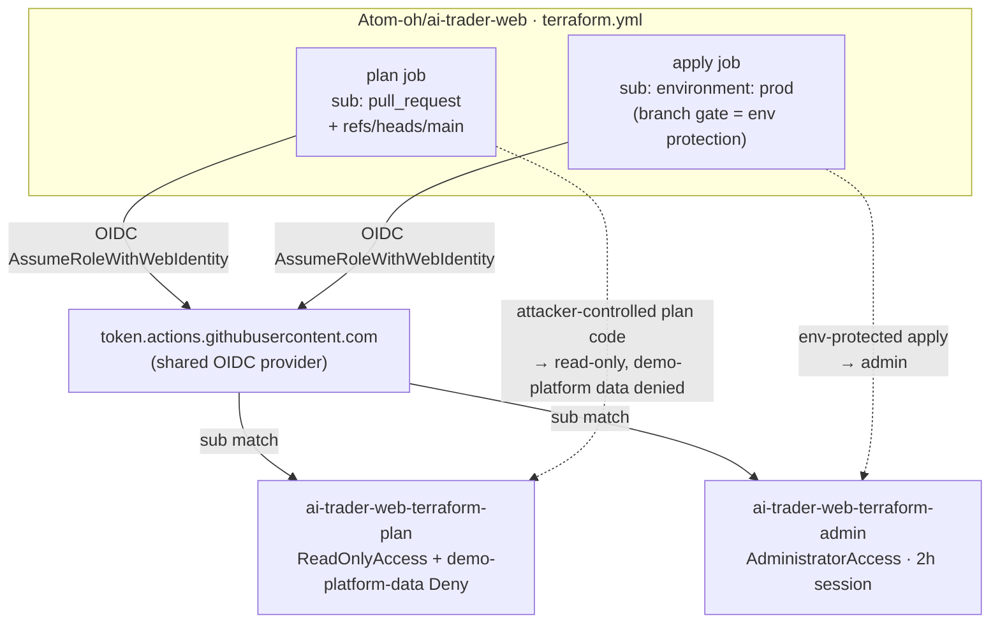
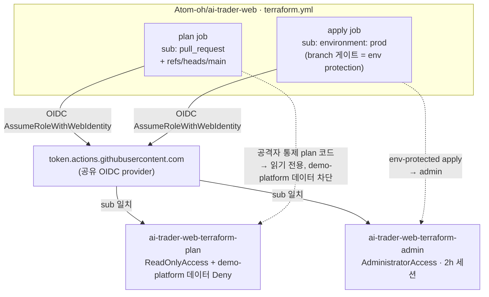

# ADR-012: ai-trader-web Terraform OIDC — Plan/Apply Privilege Split

---

# English

## Status

Accepted (2026-07-12). Extends the OIDC least-privilege convention already used by
`demo-platform-gha-ecr-push` (`infra/iam/gha-ecr-push-role.tf`) to a cross-repo,
higher-privilege case: the external `Atom-oh/ai-trader-web` repo's `terraform.yml`.

## Context

`ai-trader-web` runs its own `terraform.yml` (plan on PR/push, apply on push to `main` +
`workflow_dispatch`, apply job bound to a GitHub `environment: prod`). It manages IAM, ECS,
CloudFront, Cognito, NLB, Lambda@Edge, AgentCore — so its Terraform needs broad, effectively
account-admin permissions to apply. The repo already assumes `ai-trader-web-gha-deploy`
(`PowerUserAccess`), which cannot manage IAM; the ask was an **admin** role.

The naive design — one `AdministratorAccess` role whose trust lists all three subs
(`pull_request`, `ref:refs/heads/main`, `environment:prod`) — has a critical flaw the PR-review
panel (5/5 models, PR #69) independently surfaced:

**`terraform plan` executes code from the PR branch.** Provider plugins, `external` data
sources, and `data` lookups all run during plan. If the `pull_request` sub can assume an
admin role, then *anyone who can open a PR* against ai-trader-web (a repo collaborator, or an
attacker who compromises any CI dependency the plan step resolves) runs arbitrary code with
account-admin credentials — completely bypassing the `environment: prod` approval gate, whose
whole purpose is to require a human review before privileged actions. Pinning trust to "exact
subs" fixes *who* assumes the role but not *what code* executes under it.

This account hosts the entire demo-platform (EKS hub, Atlantis, Terraform state bucket), so
the blast radius of a compromised admin assume-path is platform-wide.

## Decision

Split into two roles (`infra/iam/ai-trader-web-gha-roles.tf`):

| Role | Managed policy | Trust (`sub`) | Used by |
|------|----------------|---------------|---------|
| `ai-trader-web-terraform-plan` | `ReadOnlyAccess` **+ inline Deny on demo-platform data** | `pull_request`, `ref:refs/heads/main` | plan job |
| `ai-trader-web-terraform-admin` | `AdministratorAccess` | `environment:prod` only (branch gate = GitHub `prod` environment protection) | apply job |

- The plan job (attacker-influenceable) can only read, and ai-trader-web uses **local**
  Terraform state, so the plan role needs no permissions on its *own* state.
- **But `ReadOnlyAccess` grants `s3:Get*` / `dynamodb:Scan` account-wide**, and this account
  hosts the *shared, platform-wide* Terraform state (bucket `multi-region-mall-terraform-state`
  + lock table, may contain plaintext secrets) plus the demo-platform Lifecycle Controller
  DynamoDB tables. Since the plan role is assumable by attacker-controlled PR-branch code,
  "read-only" is not by itself safe — it would be a demo-platform-data exfiltration path. An
  **inline Deny** on the state bucket/lock table + `demo-platform-{state,jobs,history}-dev`
  closes it, while ai-trader-web's own resources (it deploys into this same account) stay
  readable for plan refresh. `secretsmanager:GetSecretValue` / `kms:Decrypt` are already absent
  from `ReadOnlyAccess`, so the ExternalId/secret paths are closed by omission. (The state
  bucket + lock table live in `us-east-1`, per `backend.tf` — the lock-table Deny ARN is
  pinned there, not `local.region`.)
- The admin role's trust can only be gated by `sub` here: **AWS STS exposes only `aud`/`sub`
  (and `amr`/`azp`) from a GitHub OIDC token as IAM condition keys — the `ref` claim is NOT a
  usable condition key.** A `StringEquals` on `ref` would always be false → permanent
  `AccessDenied` (this is exactly why `gha-ecr-push-role.tf` encodes the ref *inside* the sub
  string). So the branch gate for apply lives in ai-trader-web's `prod` GitHub environment
  protection (required reviewers + deployment-branch restriction), **which must be verified in
  the ai-trader-web repo settings** — it cannot be enforced from this IaC.
- `max_session_duration = 7200` on the admin role so long applies don't expire mid-run.
- Both roles reuse the shared `data.aws_iam_openid_connect_provider.github`.
- Naming keeps the `ai-trader-web-*` prefix (deliberate deviation from `demo-platform-*`) to
  pair with the pre-existing out-of-band `ai-trader-web-gha-deploy` role.

### Trust / privilege split

## Consequences

- Attacker-controlled plan code is confined to read-only and cannot read demo-platform's
  state/data — the environment gate can no longer be bypassed via the PR trigger.
- The admin gate depends **entirely** on ai-trader-web's `prod` environment protection
  (required reviewers + deployment-branch restriction), since the `ref` claim is not
  IAM-enforceable (above). **KNOWN GAP (2026-07-12): ai-trader-web's `prod` environment
  currently has NO protection rules and NO branch policy, and its billing plan does not
  support required-reviewer / branch-restriction rules on a private repo** (`gh api
  .../environments/prod` → `protection_rules: []`; `PUT` returns HTTP 422). Until that is
  resolved (upgrade the plan and set a `main`-only branch policy, make the repo public, or
  move the environment to an account whose plan supports it), any branch that can run a
  `terraform.yml` job targeting `environment: prod` can assume `AdministratorAccess`. Treat the
  admin role as **effectively gated only by who can push/PR to ai-trader-web** until the
  environment protection is in place. The plan-role split still holds — the untrusted `plan`
  path is read-only and demo-platform data is denied regardless.
- Follow-up (ai-trader-web PR): `terraform.yml` plan job → `role-to-assume:
  arn:aws:iam::180294183052:role/ai-trader-web-terraform-plan`; apply job →
  `arn:aws:iam::180294183052:role/ai-trader-web-terraform-admin` (ARNs exported as
  `ai_trader_web_terraform_{plan,admin}_role_arn` outputs). Both jobs still need
  `permissions: id-token: write`. The apply job must also set `role-duration-seconds: 7200`
  on `configure-aws-credentials` for the 2h session to take effect (the action defaults to 1h).
- ai-trader-web uses local state on ephemeral runners (state is lost each run); if it later
  adopts a remote backend, the plan role's shared-state Deny must be revisited and the role
  given scoped read + lock on *its own* state.
- The pre-existing `ai-trader-web-gha-deploy` (PowerUser) role is left untouched; it can be
  retired separately once workflows migrate to the new pair.

---

# 한국어

## 상태

승인됨 (2026-07-12). 기존 `demo-platform-gha-ecr-push`(`infra/iam/gha-ecr-push-role.tf`)의
OIDC 최소권한 관례를, 외부 repo `Atom-oh/ai-trader-web`의 `terraform.yml`이라는 더 높은 권한이
필요한 cross-repo 사례로 확장한다.

## Context

`ai-trader-web`는 자체 `terraform.yml`(PR/push 시 plan, `main` push·`workflow_dispatch` 시
apply, apply job은 GitHub `environment: prod`에 바인딩)을 운영한다. IAM·ECS·CloudFront·
Cognito·NLB·Lambda@Edge·AgentCore를 관리하므로 apply에는 사실상 계정 admin 권한이 필요하다.
기존 `ai-trader-web-gha-deploy`(`PowerUserAccess`)는 IAM을 관리할 수 없어, **admin** 역할이
요청되었다.

단순 설계 — trust에 세 sub(`pull_request`, `ref:refs/heads/main`, `environment:prod`)를 모두
나열한 단일 `AdministratorAccess` 역할 — 에는 PR 리뷰 패널(5/5 모델, PR #69)이 독립적으로
지적한 치명적 결함이 있다:

**`terraform plan`은 PR 브랜치의 코드를 실행한다.** provider 플러그인, `external` data source,
`data` 조회가 모두 plan 중 실행된다. `pull_request` sub가 admin 역할을 assume할 수 있으면,
ai-trader-web에 *PR을 열 수 있는 누구나*(협업자, 또는 plan 단계가 해석하는 CI 의존성을 침해한
공격자)가 계정 admin 자격으로 임의 코드를 실행하게 되어, 권한 작업 전 사람의 리뷰를 요구하는
`environment: prod` 승인 게이트를 완전히 우회한다. trust를 "정확한 sub"로 고정하는 것은 *누가*
assume하는지는 막지만 *어떤 코드가* 실행되는지는 막지 못한다.

이 계정은 demo-platform 전체(EKS hub, Atlantis, Terraform state bucket)를 호스팅하므로,
admin assume 경로가 침해되면 blast radius가 플랫폼 전체다.

## Decision

두 역할로 분리한다(`infra/iam/ai-trader-web-gha-roles.tf`):

| 역할 | Managed policy | 신뢰 (`sub`) | 사용처 |
|------|----------------|-------------|--------|
| `ai-trader-web-terraform-plan` | `ReadOnlyAccess` **+ demo-platform 데이터 inline Deny** | `pull_request`, `ref:refs/heads/main` | plan job |
| `ai-trader-web-terraform-admin` | `AdministratorAccess` | `environment:prod` 단독 | apply job |

- 공격자 영향권인 plan job은 읽기만 가능하며, ai-trader-web는 **로컬** state를 쓰므로 *자체*
  state용 권한이 불필요.
- **그러나 `ReadOnlyAccess`는 계정 전역 `s3:Get*`/`dynamodb:Scan`을 부여**하며, 이 계정은
  *플랫폼 전체* 공유 state(버킷 `multi-region-mall-terraform-state` + lock 테이블, 평문 시크릿
  포함 가능)와 demo-platform Lifecycle Controller DynamoDB 테이블을 호스팅한다. plan 역할은
  공격자 통제 PR 브랜치 코드로 assume되므로 "읽기 전용" 자체가 안전하지 않다 — demo-platform
  데이터 exfiltration 경로가 된다. state 버킷/lock 테이블 + `demo-platform-{state,jobs,history}-dev`에
  **inline Deny**를 부착해 차단하되, ai-trader-web 자체 리소스(같은 계정에 배포)는 plan refresh용
  으로 읽기 가능하게 남긴다. `secretsmanager:GetSecretValue`/`kms:Decrypt`는 `ReadOnlyAccess`에
  없어 ExternalId/시크릿 경로는 이미 차단됨. (state 버킷+lock 테이블은 `backend.tf` 기준
  `us-east-1`에 있어 lock 테이블 Deny ARN은 `local.region`이 아닌 `us-east-1`로 고정.)
- admin 역할 trust는 여기서 `sub`로만 게이트 가능하다: **AWS STS는 GitHub OIDC 토큰에서
  `aud`/`sub`(및 `amr`/`azp`)만 IAM condition key로 노출하며, `ref` claim은 사용 가능한
  condition key가 아니다.** `ref`에 대한 `StringEquals`는 항상 false → 영구 `AccessDenied`가 된다
  (그래서 `gha-ecr-push-role.tf`는 ref를 sub 문자열 *안에* 넣어 매칭한다). 따라서 apply의 branch
  게이트는 ai-trader-web `prod` environment protection(required reviewer + deployment-branch
  제한)에 있으며, **ai-trader-web repo 설정에서 반드시 확인해야 한다** — 이 IaC로는 강제 불가.
- 장시간 apply 만료 방지를 위해 admin 역할에 `max_session_duration = 7200`.

### 신뢰 / 권한 분리

- 두 역할 모두 공유 `data.aws_iam_openid_connect_provider.github`를 재사용.
- `ai-trader-web-*` prefix 유지(`demo-platform-*`에서의 의도적 이탈) — 기존 out-of-band
  `ai-trader-web-gha-deploy` 역할과 짝을 이룸.

## Consequences

- 공격자가 통제하는 plan 코드는 읽기 전용으로 한정되고 demo-platform state/데이터를 읽을 수
  없다 — PR 트리거로 environment 게이트를 우회할 수 없다.
- admin 게이트는 `ref` claim이 IAM으로 강제 불가하므로 ai-trader-web `prod` environment
  protection(required reviewer + deployment-branch 제한)에 **전적으로** 의존한다.
  **알려진 갭(2026-07-12): ai-trader-web `prod` environment에는 현재 protection rule도 branch
  policy도 없고, private repo인 이 저장소의 billing plan이 required-reviewer/branch 제한 rule을
  지원하지 않는다**(`gh api .../environments/prod` → `protection_rules: []`; `PUT` HTTP 422).
  해결(플랜 업그레이드 후 `main`-only branch policy 설정, repo 공개 전환, 또는 플랜이 지원되는
  계정으로 environment 이전) 전까지는 `environment: prod`를 타깃하는 `terraform.yml` job을 돌릴
  수 있는 어느 브랜치든 `AdministratorAccess`를 assume할 수 있다. environment protection이
  갖춰지기 전까지 admin 역할은 **ai-trader-web에 push/PR 가능한 사람만이 게이트**라고 간주할 것.
  plan 역할 분리는 유효하다 — 비신뢰 `plan` 경로는 읽기 전용이고 demo-platform 데이터는 항상 차단.
- 후속(ai-trader-web PR): `terraform.yml` plan job → `role-to-assume:
  arn:aws:iam::180294183052:role/ai-trader-web-terraform-plan`, apply job →
  `arn:aws:iam::180294183052:role/ai-trader-web-terraform-admin` (ARN은
  `ai_trader_web_terraform_{plan,admin}_role_arn` output으로 export). 두 job 모두
  `permissions: id-token: write` 필요. apply job은 2h 세션이 적용되려면
  `configure-aws-credentials`에 `role-duration-seconds: 7200`도 설정해야 한다(미설정 시 기본 1h).
- ai-trader-web는 ephemeral 러너에서 로컬 state를 쓴다(매 실행 소실). 이후 remote backend를
  도입하면 plan 역할의 공유-state Deny를 재검토하고 *자체* state에 대한 read + lock 권한을
  부여해야 한다.
- 기존 `ai-trader-web-gha-deploy`(PowerUser) 역할은 그대로 두며, 워크플로가 새 역할 쌍으로
  이전된 뒤 별도로 폐기 가능.
