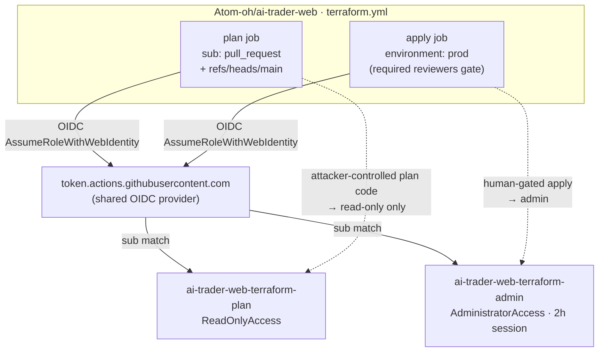

# ADR-012: ai-trader-web Terraform OIDC — Plan/Apply Privilege Split

---

# English

## Status

Accepted (2026-07-12). Extends the OIDC least-privilege convention already used by
`demo-platform-gha-ecr-push` (`infra/iam/gha-ecr-push-role.tf`) to a cross-repo,
higher-privilege case: the external `Atom-oh/ai-trader-web` repo's `terraform.yml`.

## Context

`ai-trader-web` runs its own `terraform.yml` (plan on PR/push, apply on push to `main` +
`workflow_dispatch`, apply job bound to a GitHub `environment: prod`). It manages IAM, ECS,
CloudFront, Cognito, NLB, Lambda@Edge, AgentCore — so its Terraform needs broad, effectively
account-admin permissions to apply. The repo already assumes `ai-trader-web-gha-deploy`
(`PowerUserAccess`), which cannot manage IAM; the ask was an **admin** role.

The naive design — one `AdministratorAccess` role whose trust lists all three subs
(`pull_request`, `ref:refs/heads/main`, `environment:prod`) — has a critical flaw the PR-review
panel (5/5 models, PR #69) independently surfaced:

**`terraform plan` executes code from the PR branch.** Provider plugins, `external` data
sources, and `data` lookups all run during plan. If the `pull_request` sub can assume an
admin role, then *anyone who can open a PR* against ai-trader-web (a repo collaborator, or an
attacker who compromises any CI dependency the plan step resolves) runs arbitrary code with
account-admin credentials — completely bypassing the `environment: prod` approval gate, whose
whole purpose is to require a human review before privileged actions. Pinning trust to "exact
subs" fixes *who* assumes the role but not *what code* executes under it.

This account hosts the entire demo-platform (EKS hub, Atlantis, Terraform state bucket), so
the blast radius of a compromised admin assume-path is platform-wide.

## Decision

Split into two roles (`infra/iam/ai-trader-web-gha-roles.tf`):

| Role | Managed policy | Trusted `sub` | Used by |
|------|----------------|---------------|---------|
| `ai-trader-web-terraform-plan` | `ReadOnlyAccess` | `pull_request`, `ref:refs/heads/main` | plan job |
| `ai-trader-web-terraform-admin` | `AdministratorAccess` | `environment:prod` **only** | apply job |

- The plan job (attacker-influenceable) can only read. ai-trader-web uses **local** Terraform
  state (no remote backend block), so the plan role needs no S3/DynamoDB state permissions —
  `ReadOnlyAccess` is sufficient for a plan refresh.
- The admin job is reachable **only** via the `prod` environment, whose GitHub protection
  rules (required reviewers + deployment-branch restriction) are the actual human gate.
- `max_session_duration = 7200` on the admin role so long applies don't expire mid-run.
- Both roles reuse the shared `data.aws_iam_openid_connect_provider.github`.
- Naming keeps the `ai-trader-web-*` prefix (deliberate deviation from `demo-platform-*`) to
  pair with the pre-existing out-of-band `ai-trader-web-gha-deploy` role.

### Trust / privilege split

## Consequences

- Attacker-controlled plan code is confined to read-only — the environment gate can no longer
  be bypassed via the PR trigger.
- The admin gate now depends on ai-trader-web's `prod` environment protection (required
  reviewers + deployment-branch restriction). **This must be verified in the ai-trader-web
  repo settings** — it is not enforceable from this IaC. The `environment:prod` sub carries no
  ref condition, so any branch deploying to `prod` can assume admin *if* the environment lets
  it; the environment's branch restriction is what closes that.
- Follow-up (ai-trader-web PR): `terraform.yml` plan job → `role-to-assume:
  ai-trader-web-terraform-plan`; apply job → `ai-trader-web-terraform-admin`. Both jobs still
  need `permissions: id-token: write`.
- The pre-existing `ai-trader-web-gha-deploy` (PowerUser) role is left untouched; it can be
  retired separately once workflows migrate to the new pair.

---

# 한국어

## 상태

승인됨 (2026-07-12). 기존 `demo-platform-gha-ecr-push`(`infra/iam/gha-ecr-push-role.tf`)의
OIDC 최소권한 관례를, 외부 repo `Atom-oh/ai-trader-web`의 `terraform.yml`이라는 더 높은 권한이
필요한 cross-repo 사례로 확장한다.

## Context

`ai-trader-web`는 자체 `terraform.yml`(PR/push 시 plan, `main` push·`workflow_dispatch` 시
apply, apply job은 GitHub `environment: prod`에 바인딩)을 운영한다. IAM·ECS·CloudFront·
Cognito·NLB·Lambda@Edge·AgentCore를 관리하므로 apply에는 사실상 계정 admin 권한이 필요하다.
기존 `ai-trader-web-gha-deploy`(`PowerUserAccess`)는 IAM을 관리할 수 없어, **admin** 역할이
요청되었다.

단순 설계 — trust에 세 sub(`pull_request`, `ref:refs/heads/main`, `environment:prod`)를 모두
나열한 단일 `AdministratorAccess` 역할 — 에는 PR 리뷰 패널(5/5 모델, PR #69)이 독립적으로
지적한 치명적 결함이 있다:

**`terraform plan`은 PR 브랜치의 코드를 실행한다.** provider 플러그인, `external` data source,
`data` 조회가 모두 plan 중 실행된다. `pull_request` sub가 admin 역할을 assume할 수 있으면,
ai-trader-web에 *PR을 열 수 있는 누구나*(협업자, 또는 plan 단계가 해석하는 CI 의존성을 침해한
공격자)가 계정 admin 자격으로 임의 코드를 실행하게 되어, 권한 작업 전 사람의 리뷰를 요구하는
`environment: prod` 승인 게이트를 완전히 우회한다. trust를 "정확한 sub"로 고정하는 것은 *누가*
assume하는지는 막지만 *어떤 코드가* 실행되는지는 막지 못한다.

이 계정은 demo-platform 전체(EKS hub, Atlantis, Terraform state bucket)를 호스팅하므로,
admin assume 경로가 침해되면 blast radius가 플랫폼 전체다.

## Decision

두 역할로 분리한다(`infra/iam/ai-trader-web-gha-roles.tf`):

| 역할 | Managed policy | 신뢰 `sub` | 사용처 |
|------|----------------|-----------|--------|
| `ai-trader-web-terraform-plan` | `ReadOnlyAccess` | `pull_request`, `ref:refs/heads/main` | plan job |
| `ai-trader-web-terraform-admin` | `AdministratorAccess` | `environment:prod` **만** | apply job |

- 공격자 영향권인 plan job은 읽기만 가능. ai-trader-web는 **로컬** Terraform state(remote
  backend 블록 없음)를 쓰므로 plan 역할에 S3/DynamoDB state 권한이 불필요 —
  plan refresh에는 `ReadOnlyAccess`로 충분.
- admin job은 **오직** `prod` environment 경유로만 도달 가능하며, 그 GitHub protection
  rule(required reviewer + deployment-branch 제한)이 실제 사람 게이트다.
- 장시간 apply 만료 방지를 위해 admin 역할에 `max_session_duration = 7200`.
- 두 역할 모두 공유 `data.aws_iam_openid_connect_provider.github`를 재사용.
- `ai-trader-web-*` prefix 유지(`demo-platform-*`에서의 의도적 이탈) — 기존 out-of-band
  `ai-trader-web-gha-deploy` 역할과 짝을 이룸.

## Consequences

- 공격자가 통제하는 plan 코드는 읽기 전용으로 한정 — PR 트리거로 environment 게이트를 우회할
  수 없다.
- admin 게이트는 이제 ai-trader-web의 `prod` environment protection(required reviewer +
  deployment-branch 제한)에 의존한다. **ai-trader-web repo 설정에서 반드시 확인해야 하며**, 이
  IaC로는 강제 불가. `environment:prod` sub에는 ref 조건이 없으므로, environment가 허용하면
  어느 브랜치든 `prod` 배포 시 admin을 assume할 수 있다 — environment의 branch 제한이 이를
  막는다.
- 후속(ai-trader-web PR): `terraform.yml` plan job → `role-to-assume:
  ai-trader-web-terraform-plan`, apply job → `ai-trader-web-terraform-admin`. 두 job 모두
  `permissions: id-token: write` 필요.
- 기존 `ai-trader-web-gha-deploy`(PowerUser) 역할은 그대로 두며, 워크플로가 새 역할 쌍으로
  이전된 뒤 별도로 폐기 가능.
