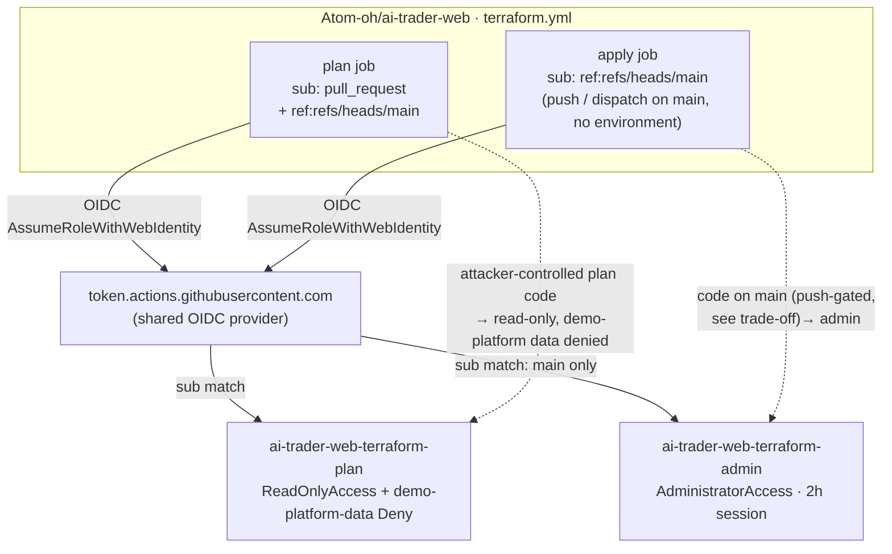

# ADR-012: ai-trader-web Terraform OIDC — Plan/Apply Privilege Split

## Status

Accepted (2026-07-12). Extends the OIDC least-privilege convention already used by
`demo-platform-gha-ecr-push` (`infra/iam/gha-ecr-push-role.tf`) to a cross-repo,
higher-privilege case: the external `Atom-oh/ai-trader-web` repo's `terraform.yml`.

## Context

`ai-trader-web` runs its own `terraform.yml` (plan on PR/push, apply on push to `main` +
`workflow_dispatch`, apply job bound to a GitHub `environment: prod`). It manages IAM, ECS,
CloudFront, Cognito, NLB, Lambda@Edge, AgentCore — so its Terraform needs broad, effectively
account-admin permissions to apply. The repo already assumes `ai-trader-web-gha-deploy`
(`PowerUserAccess`), which cannot manage IAM; the ask was an **admin** role.

The naive design — one `AdministratorAccess` role whose trust lists all three subs
(`pull_request`, `ref:refs/heads/main`, `environment:prod`) — has a critical flaw the PR-review
panel (5/5 models, PR #69) independently surfaced:

**`terraform plan` executes code from the PR branch.** Provider plugins, `external` data
sources, and `data` lookups all run during plan. If the `pull_request` sub can assume an
admin role, then *anyone who can open a PR* against ai-trader-web (a repo collaborator, or an
attacker who compromises any CI dependency the plan step resolves) runs arbitrary code with
account-admin credentials — completely bypassing the `environment: prod` approval gate, whose
whole purpose is to require a human review before privileged actions. Pinning trust to "exact
subs" fixes *who* assumes the role but not *what code* executes under it.

This account hosts the entire demo-platform (EKS hub, Atlantis, Terraform state bucket), so
the blast radius of a compromised admin assume-path is platform-wide.

## Decision

Split into two roles (`infra/iam/ai-trader-web-gha-roles.tf`):

| Role | Managed policy | Trust (`sub`) | Used by |
|------|----------------|---------------|---------|
| `ai-trader-web-terraform-plan` | `ReadOnlyAccess` **+ inline Deny on demo-platform data** | `pull_request`, `ref:refs/heads/main` | plan job |
| `ai-trader-web-terraform-admin` | `AdministratorAccess` | `ref:refs/heads/main` only (IAM-enforced branch gate) | apply job |

- The plan job (attacker-influenceable) can only read, and ai-trader-web uses **local**
  Terraform state, so the plan role needs no permissions on its *own* state.
- **But `ReadOnlyAccess` grants `s3:Get*` / `dynamodb:Scan` account-wide**, and this account
  hosts the *shared, platform-wide* Terraform state (bucket `multi-region-mall-terraform-state`
  + lock table, may contain plaintext secrets) plus the demo-platform Lifecycle Controller
  DynamoDB tables. Since the plan role is assumable by attacker-controlled PR-branch code,
  "read-only" is not by itself safe — it would be a demo-platform-data exfiltration path. An
  **inline Deny** on the state bucket/lock table + a `demo-platform-*` DynamoDB wildcard (an IAM
  resource wildcard `*` matches `/`, so `table/demo-platform-*` already spans the `.../index/*`
  GSI ARNs that `dynamodb:Query` authorizes on — the explicit `/index/*` line is a defensive
  duplicate) + a `/demo-platform/*` CloudWatch Logs Deny (`logs:*` — blocks `StartQuery` +
  `StartLiveTail`, the log-group-scoped read entry points, not just `GetLogEvents`) + a
  `demo-platform-*` SQS Deny (job queue + DLQ) + a `demo-platform/*` + `actions-runner-claude`
  ECR image Deny (a pulled layer can carry baked source/config) + a Cognito read Deny on the
  admin user pool covers the sensitive demo-platform stores, while ai-trader-web's own resources
  (it deploys into this same account, under `ai-trader-*` names) stay readable for plan refresh.
  This is a **targeted denylist of demo-platform's sensitive stores, not a blanket seal** —
  `ReadOnlyAccess` still grants broad account-wide `Describe`/`List` metadata; the goal is to
  deny the stores that hold secrets or payloads, not every read. A permissions-boundary /
  scoped-allowlist rewrite would be more robust and is noted as future work.
  **Secret VALUES**: `ReadOnlyAccess` (v187) does NOT include `secretsmanager:GetSecretValue` —
  only `Describe*`/`List*`/`GetResourcePolicy` — so the operator/terraformer ExternalId, GitHub
  PAT, ArgoCD token, cognito, and AI panel key are already unreadable; an explicit
  `GetSecretValue` Deny on `/demo-platform/*` pins that so a future AWS-managed-policy change
  can't silently reopen the path. (The state bucket + lock table live in `us-east-1`, per
  `backend.tf` — the lock-table Deny ARN is pinned there, not `local.region`.)
- **The admin role is gated on the `ref:refs/heads/main` sub, NOT an `environment:prod` sub.**
  An environment sub would delegate the branch gate to GitHub environment protection — which
  this repo's billing plan cannot enforce (no required-reviewer / branch-restriction rules on
  a private repo: `gh api .../environments/prod` → `protection_rules: []`, `PUT` → HTTP 422).
  `ref:refs/heads/main` is part of the **sub** (a real IAM condition key — unlike the
  non-evaluable `ref` *claim*, which AWS STS does not expose; that is why `gha-ecr-push-role.tf`
  also encodes the ref inside the sub). So IAM itself restricts admin to code on `main` — no
  dependence on GitHub environment features. (The intent is that main is review-gated, but that
  is NOT enforceable here — see the ACCEPTED TRADE-OFF in Consequences.) The ai-trader-web apply
  job must therefore run on push/`workflow_dispatch` on main
  **without** an `environment:` binding (a binding would flip the sub to `environment:prod` and
  break this trust).
- `max_session_duration = 7200` on the admin role so long applies don't expire mid-run.
- Both roles reuse the shared `data.aws_iam_openid_connect_provider.github`.
- Naming keeps the `ai-trader-web-*` prefix (deliberate deviation from `demo-platform-*`) to
  pair with the pre-existing out-of-band `ai-trader-web-gha-deploy` role.

### Trust / privilege split

```mermaid
flowchart TD
    subgraph gh["Atom-oh/ai-trader-web · terraform.yml"]
        pr["plan job<br/>sub: pull_request<br/>+ ref:refs/heads/main"]
        ap["apply job<br/>sub: ref:refs/heads/main<br/>(push / dispatch on main, no environment)"]
    end
    oidc["token.actions.githubusercontent.com<br/>(shared OIDC provider)"]
    plan["ai-trader-web-terraform-plan<br/>ReadOnlyAccess + demo-platform-data Deny"]
    admin["ai-trader-web-terraform-admin<br/>AdministratorAccess · 2h session"]
    pr -->|OIDC AssumeRoleWithWebIdentity| oidc
    ap -->|OIDC AssumeRoleWithWebIdentity| oidc
    oidc -->|sub match| plan
    oidc -->|sub match: main only| admin
    pr -.->|"attacker-controlled plan code<br/>→ read-only, demo-platform data denied"| plan
    ap -.->|"code on main (push-gated,<br/>see trade-off)→ admin"| admin
```

## Consequences

- Attacker-controlled plan code is confined to read-only and cannot read demo-platform's
  state/data — the split can no longer be bypassed via the PR trigger.
- The admin gate is enforced **at the IAM layer** (`ref:refs/heads/main` sub), so it does not
  depend on GitHub environment protection — which this repo's plan cannot provide. Only code
  on `main` can assume admin. (Earlier revisions gated on `environment:prod`; dropped because
  the environment had no enforceable protection here — see the trust bullet above.)
- **ACCEPTED TRADE-OFF (2026-07-13): main branch protection is NOT enforceable on this repo
  either.** ai-trader-web is a private repo on a plan that supports neither environment
  protection nor branch protection / rulesets (`gh api .../branches/main/protection` → HTTP
  403 "Upgrade to GitHub Pro or make this repository public"). So the "only code merged to
  main, gated by review" gate is aspirational, not enforced: **anyone who can push to `main`
  (a collaborator, or a stolen collaborator credential) gets `AdministratorAccess` in this
  account with no review** — and this account hosts the whole platform (EKS hub, Atlantis,
  shared tfstate). This is accepted for now because (a) the plan/apply split already closed
  the arbitrary-PR path (the untrusted `plan` role is read-only + demo-platform-data-denied),
  (b) the residual path requires main-push rights, and (c) this is a non-production account.
  To actually close it: upgrade the plan (or make the repo public) and enable a
  required-review branch/ruleset on `main`, then this bullet can be retired. Until then, treat
  admin as gated only by ai-trader-web's collaborator list.
- Follow-up (ai-trader-web PR): `terraform.yml` plan job → `role-to-assume:
  arn:aws:iam::180294183052:role/ai-trader-web-terraform-plan`; apply job →
  `arn:aws:iam::180294183052:role/ai-trader-web-terraform-admin` (ARNs exported as
  `ai_trader_web_terraform_{plan,admin}_role_arn` outputs). Both jobs still need
  `permissions: id-token: write`. The apply job must run on push / `workflow_dispatch` on main
  **without** an `environment:` key (an environment binding changes the OIDC sub to
  `environment:prod` and the admin trust — pinned to the `ref:refs/heads/main` sub — would
  reject it). It must also set `role-duration-seconds: 7200` on `configure-aws-credentials`
  for the 2h session to take effect (the action defaults to 1h).
- ai-trader-web uses local state on ephemeral runners (state is lost each run); if it later
  adopts a remote backend, the plan role's shared-state Deny must be revisited and the role
  given scoped read + lock on *its own* state.
- **The pre-existing `ai-trader-web-gha-deploy` (PowerUser) role trusted
  `repo:Atom-oh/ai-trader-web:*` — a wildcard including `pull_request`.** That defeated the
  split's premise: attacker-controlled PR plan code could assume *that* role for PowerUser
  instead. It is created out-of-band (not in this repo's nor ai-trader-web's Terraform), so this
  PR **adopts it via `terraform import`** and tightens its trust to `ref:refs/heads/main` **only**
  (NOT `pull_request`) — so PR-plan code can no longer reach PowerUser through it; it can only
  reach the read-only plan role. PowerUser attachment + inline IAM policy preserved. Kept (not
  deleted) because ai-trader-web's `terraform.yml` still uses it until it migrates to the
  plan/admin pair (its PR plan job moves to the read-only plan role then); retire once migrated.
