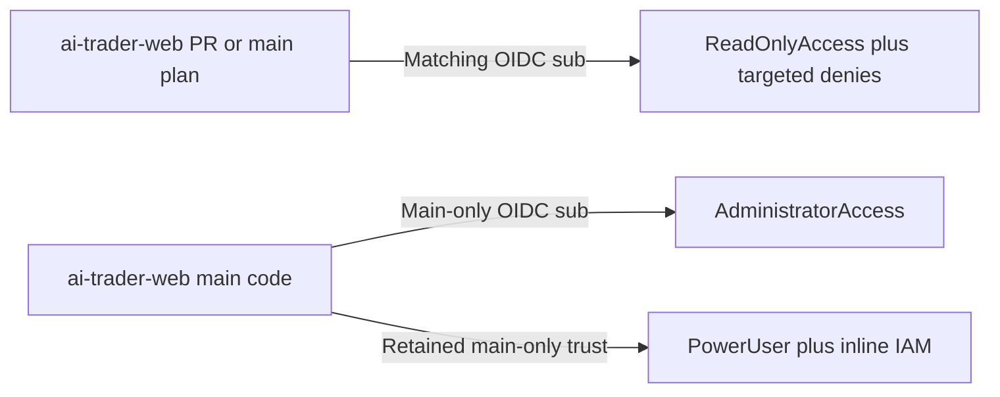

# ADR-012: ai-trader-web Terraform OIDC plan/apply privilege split

## Status

Accepted (2026-07-12), with the main-push risk accepted on 2026-07-13. Applies to
external repository `Atom-oh/ai-trader-web`; it does not grant this platform's
ordinary image-push jobs administrator access.

## Historical context

July review of ai-trader-web's `terraform.yml` found a request for broad apply
permissions alongside PR plans. A plan can execute PR-controlled providers and
data sources. Letting that code assume the same admin role as apply would defeat
a separate approval gate. Read-only access also needs scrutiny because the target
account hosts shared platform state and data.

The July investigation reported local state on ephemeral runners, an unprotected
`prod` environment and unavailable branch-protection features under ai-trader-web's
then-current GitHub plan (422/403 responses). Those are external-repository,
dated observations; this checkout cannot prove its current billing, state backend,
workflow migration or branch protections.

## Decision and implemented IAM

[`ai-trader-web-gha-roles.tf`](../../infra/iam/ai-trader-web-gha-roles.tf) defines:

| Role | Policy | Allowed OIDC `sub` for `repo:Atom-oh/ai-trader-web:` |
| --- | --- | --- |
| `ai-trader-web-terraform-plan` | ReadOnlyAccess plus targeted platform-store denies | `pull_request`, `ref:refs/heads/main` |
| `ai-trader-web-terraform-admin` | AdministratorAccess; maximum session 7200 seconds | `ref:refs/heads/main` only |
| `ai-trader-web-gha-deploy` | Retained PowerUserAccess and inline IAM permissions | `ref:refs/heads/main` only |

All use the shared GitHub OIDC provider and `aud=sts.amazonaws.com`. The retained
deploy role's former wildcard trust included PRs; declarative `import` blocks adopt
it and the configuration restricts it to main, closing that configured alternate
PR-to-PowerUser path. Verify live trust and remaining consumers before retirement.
The external-repository `ai-trader-web-*` names are intentional.

The plan denylist names the shared Terraform bucket/lock table, platform DynamoDB
tables/indexes, `/demo-platform/*` secret values/log groups, platform SQS, runtime
and runner ECR image pulls, and the specified admin Cognito pool. The lock-table
ARN is in `us-east-1`; most other selectors are in `ap-northeast-2`.
Inspect the source for exact actions, ARNs and the fixed pool ID.

This is a **targeted denylist, not complete account isolation**. ReadOnlyAccess
still exposes permitted account metadata/data outside those selectors; newly added
stores and AWS-managed policy changes need review. The explicit secret-value deny
is defense in depth, not reliance on a historical managed-policy version. A scoped
allowlist/boundary remains a possible hardening follow-up.

```mermaid
flowchart LR
  PR[ai-trader-web PR or main plan] -->|Matching OIDC sub| PLAN[ReadOnlyAccess plus targeted denies]
  MAIN[ai-trader-web main code] -->|Main-only OIDC sub| ADMIN[AdministratorAccess]
  MAIN -->|Retained main-only trust| LEGACY[PowerUser plus inline IAM]
```

## Accepted risk and integration requirements

Main-only trust excludes the PR `sub`; it does not prove code was reviewed.
Under the July protection limits, anyone able to push to **ai-trader-web main**
could obtain account-admin privileges without review, affecting this shared
non-production account. That residual main-push risk was explicitly accepted.
Recheck the external repository's actual rules/collaborators before describing
this as review-gated; this acceptance does not weaken AWS-Demo-Platform's release
requirements or authorize unrelated IAM expansion.

Consumer workflow requirements for this trust are:

- Plan selects the plan role; apply selects the admin role on main. Both need
  `id-token: write`; exported role ARNs are in `infra/iam/outputs.tf`.
- Apply must produce the expected main `sub`. An `environment: prod` binding under
  the described token configuration changes it to an environment `sub`, which
  does not match this trust. Verify any later customized subject configuration.
- Request `role-duration-seconds: 7200` when the full two-hour session is needed;
  the IAM maximum alone does not request that duration.
- If a remote state backend is adopted, grant only its required state/lock access;
  do not remove the shared platform-state deny to make a plan succeed.
- Retire the retained deploy role only after confirming all external consumers
  migrated. A source declaration is not evidence that its live import/apply ran.

See the [IAM guide](../../infra/iam/CLAUDE.md) and
[review/release procedure](../runbooks/review-and-release.md).
