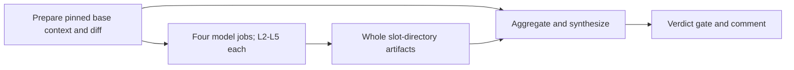

# ADR-015: Per-model review jobs with artifact aggregation

## Status

**2026-09-13 scoped supersession:** [ADR-020](ADR-020-specialist-review-protocol.md)
replaces repeated per-model lenses, permissive dropout counts and unconditional
chair invocation. The historical execution description below is not the current
coverage contract. Context, artifact isolation and runner ownership still apply.

Accepted (2026-08-06), corrected by the same-day PR #88 review. Supersedes ADR-016
for execution topology and the roster changes described here, not panel/chair
architecture or runner-image ownership. Later model selections are in ADR-014;
[current workflow behavior](../pr-review.md) is the configuration reference.

## Context and alternatives

One runner previously launched twenty CLI processes (five slots × four lenses),
then the chair. Contention, shared logs and loss of every response on Pod failure
made diagnosis difficult. All cells also shared a write-capable job context.

Per-cell jobs would increase scheduling/cold-start overhead; per-lens jobs would
mix vendors in each failure domain. Marketplace wrappers were considered at the
time but did not fit the required review-text aggregation, Bedrock auth or existing
CLI interface. Those evaluations are not claims about current third-party products.

## Decision

Run four per-model jobs, each invoking its four lenses concurrently; upload each
whole `slot/` directory, then let a separate chair job aggregate and synthesize.
This reduces each panel Pod to four concurrent clients. It does not guarantee
resource fit or isolate a Kiro-wide outage: the two Kiro jobs share a service/key.

- Each job independently prepares SHA-pinned inputs, avoiding a serial prep-runner
  cold start. PR code is diff data, not executable workflow code.
- `lib.sh` owns `KIRO_MODELS`/`PANEL_TAGS`; workflow matrix tags remain a second
  literal. Unknown tags fail; missing roster rows affect coverage.
- Panel jobs have read-only GitHub permissions; only Claude self-review receives
  the panel's explicit `GH_TOKEN`. Kiro receives no tools. Only the chair job can
  publish; credential/process separation beyond that remains proposed hardening.
- Whole-directory upload/download keeps artifact paths stable whether optional
  truncation flags exist. Chair clears old slots before download, tolerates absent
  artifacts and evaluates them as empty cells. Artifact retention is one day.
- Chair runs on panel failure with `!cancelled()`, avoiding execution after workflow
  cancellation. This reduces races but is not a final current-head check.
- Prompts/output use English for context efficiency. `glm-5` was dropped after
  repeated verified false positives; the remaining Kiro slots were renamed
  `kiro-fable` and `kiro-sol`. Exact catalog IDs changed later (ADR-014).
- Runner-node consolidation delay changed from 30 seconds to five minutes to
  improve the chance that the chair can reuse a node; reuse is not guaranteed.

## Amendment (2026-08-06)

PR #88 caught an artifact-root bug, an unreachable all-missing-artifact failure
path and cancellation races. Whole-directory transfer, missing-slot aggregation
and `!cancelled()` addressed these. It also tightened token scope, removed duplicate
Kiro dispatch tags, checked empty off-roster cells and reduced artifact retention.
Do not add `continue-on-error` to panel invocation merely to conceal roster errors.

A prior prompt incorrectly named Terraform 1.9.8; the repository pin is 1.9.6.
The old `atlantis.yaml` header records an image-bundled key failure. The
`k8s/system/atlantis/deployment.yaml` comment records renewal in v0.44.1; the
historical failure is not a current upgrade blocker. Keep the configured pin
until a separately reviewed version change, rather than inferring one from
either historical comment.

## Current limitations and later updates

A row with no non-empty cells generates a warning. At least three empty model rows
or any wholly empty lens forces severe-coverage failure. Non-empty output is still
counted without proving successful model execution or meaningful review. A Kiro
outage can empty two rows without forcing that threshold. Do not equate the
implemented minimum with complete operator-required review.

Later scrubbing fixes (ADR-016) establish the order: strip controls, scrub secrets,
then truncate; earlier descriptions of truncation before scrubbing are obsolete.
The September catalog recovery retains artifact tags while mapping `kiro-fable`
to Opus. The September context correction explicitly supplies base `AGENTS.md` to
isolated Kiro; local steering alone could not do so. See
[the current contract](../pr-review.md) and the
[remaining gate-hardening proposal](../superpowers/specs/2026-08-09-pr-review-gate-hardening-design.md).
