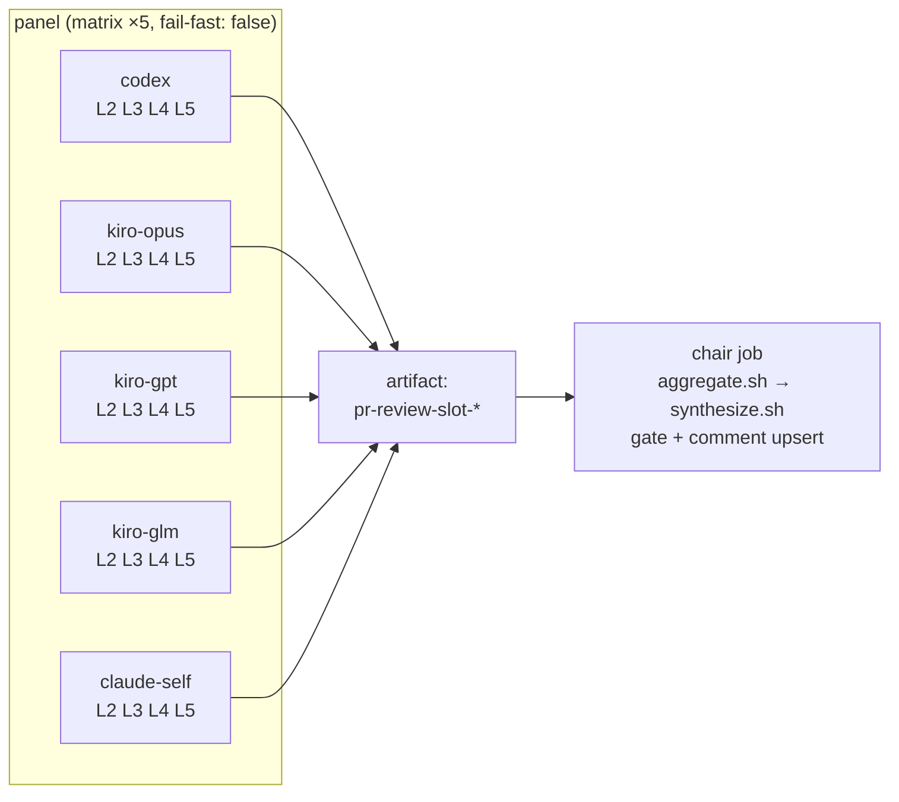

# ADR-015: PR-Review Panel — Per-Model Parallel Jobs (Artifact → Chair)

---

# English

## Status

Accepted (2026-08-06) — restructures the execution topology introduced by ADR-007 and
extended by the (undocumented, per ADR-011) lens×model matrix upgrade. The panel roster,
models, prompts, and gate/verdict rules from ADR-007/011/013/014 are unchanged; only *where*
the 20 cells run changes.

## Context

Before this ADR, `pr-review.yml` ran as a **single job on a single self-hosted runner pod**.
`run-panel.sh` launched all 20 lens×model cells (5 models × 4 lenses: Codex + Kiro×3 + Claude
self-review) as background (`&`) shell processes joined by one `wait`, then the same pod ran
`synthesize.sh` (the chair) inline. This had four costs:

- **Resource contention**: the runner pod requests `cpu: 1800m / memory: 3500Mi`
  (`argocd-apps/system/appset-helm-runner-claude-arm-aws-demo-platform.yaml`), but up to 20
  concurrent LLM CLI processes (node/rust) ran in it at once, with no limits set — burst
  capacity was whatever the node happened to have free.
- **No observability**: all 20 cells shared one job's log stream; a stuck/slow cell showed up
  only as a longer `wait`, with no per-cell timing or independent re-run in the Actions UI.
- **Pod death = total loss**: nothing was ever uploaded as an artifact. If the pod died
  mid-run, all 20 cells' output vanished with no post-mortem trail — only a scrubbed
  `tail -25` of `.err` reached the public log for cells that failed *and* left the pod alive
  long enough to log it.
- **Excess privilege**: every panel cell ran in a job context holding the `pull-requests:
  write` token, the exact threat surface the `persist-credentials: false` checkout comment
  (`pr-review.yml`) already worried about for a different reason (diff-injection → reading
  `.git/config` → token leak via a panel cell's stdout).

### Alternatives considered and rejected

**Marketplace GitHub Actions** (`konippi/kiro-cli-review-action`, `openai/codex-action`,
`anthropics/claude-code-action`) were evaluated as drop-in replacements for the hand-rolled
CLI invocations. All three are a downgrade from the current setup:

| Action | Blocker |
|---|---|
| `konippi/kiro-cli-review-action` (third-party, not an official AWS/Kiro action) | Outputs are only `review_result` (pass/fail/skip) + `exit_code` — **no output exposes the review text at all**; it posts its own inline PR comments instead. Nothing a chair could consume. Also `max_diff_size` defaults to 10000 chars and takes a single `model` input (this panel runs 3 Kiro models). |
| `openai/codex-action` | Requires `openai-api-key`; the only endpoint override is Azure's `responses-api-endpoint` — **no AWS Bedrock path**. Codex currently runs `openai.gpt-5.6-sol` via Bedrock on the node's IAM instance profile at no incremental API cost; adopting this action means provisioning a new paid OpenAI key. It also unconditionally `npm install -g @openai/codex`, discarding the version baked into the runner image. |
| `anthropics/claude-code-action` | Does support `use_bedrock` + an automation `prompt` mode, but it is a wrapper around the same `claude -p` call already made directly, and it adds a Claude GitHub App / OIDC federation dependency for no functional gain here. |

**Full 20-cell job matrix** (one GitHub Actions job per lens×model cell) was considered for
maximum isolation, but at `minRunners: 0` + on-demand-only (`k8s/system/karpenter/
runner-arm-nodepool.yaml`, see its own on-demand rationale comment), each job pays a fresh
Karpenter node cold start; 20 simultaneous jobs would push against the NodePool's `limits.cpu:
"128"` ceiling for marginal isolation gain over grouping by model.

**Per-lens job matrix** (one job per L2–L5, each running all 5 models) was considered as the
inverse split, but it still puts 5 concurrent CLI processes in one pod, and a single
vendor-wide outage (e.g. Kiro rate-limited) would degrade all four lens jobs simultaneously
rather than being isolated to that vendor's job.

**Per-model job matrix (chosen)**: 5 jobs (one per `codex`/`kiro-opus`/`kiro-gpt`/`kiro-glm`/
`claude-self`), each running its model's 4 lenses concurrently — 4 processes per pod instead
of 20, actually fitting the `1800m` request. A vendor outage is isolated to exactly one job.

## Decision

Split `pr-review.yml` into two jobs:

- **`prepare-inputs.sh`** (new): extracted the diff-fetch + lens-prompt-build steps
  unchanged, except the diff is now fetched via `gh api repos/.../compare/{base}...{head}`
  (SHA-pinned) instead of `gh pr diff` (which follows the PR's current head) — needed because
  6 jobs now regenerate the same inputs independently rather than one job producing them once;
  a push mid-run must not let some jobs see a different diff than others. No prep job is
  introduced — each job (5 panel + chair) re-derives its own copy in-pod, since a shared prep
  job would serialize a Karpenter cold start in front of everything.
- **`lib.sh`**: gained `KIRO_MODELS`/`PANEL_TAGS` as the single roster source, read by both
  `run-panel.sh` (cell execution) and `aggregate.sh` (floor judgment) — mitigating the
  model-id-in-multiple-places problem ADR-013/014 both had to patch around. The workflow's
  `strategy.matrix.model` list is still a separate YAML literal (a 6th copy) — accepted as a
  tradeoff, since drift in either direction is caught automatically (see below).
- **`run-panel.sh`**: gained a required 4th argument, `<model_tag>`, and now runs only that
  model's cells across all lenses. The aggregation/coverage-floor logic (`responded.txt`,
  `degraded-models.txt`, `degraded-lenses.txt`, `coverage-severe.flag`) moved out — a single
  model's job cannot judge cross-model coverage.
- **`aggregate.sh`** (new): the extracted floor/coverage logic, run once by the chair job
  after all 5 panel artifacts are merged into one `slot/` directory. It also guards against
  roster drift in both directions: an unknown tag present in the merged slot (matrix ahead of
  `lib.sh`) fails loudly; a `PANEL_TAGS` entry with zero responses (matrix behind `lib.sh`, or
  simply a dead panel job) is caught by the pre-existing degraded-model floor.
- **`synthesize.sh`**: one-line fix — `CELL_COUNT` (used to compute the fair per-cell byte cap)
  now counts only non-empty `.md` files, not skipped/empty ones. This mattered more after the
  split because the number of missing cells now varies run-to-run (a dead panel job drops 4
  cells at once, not 1).
- **Workflow permissions**: `panel` jobs run with `pull-requests: read` only — no write token
  in the context Codex/Kiro cells execute in, so a successful prompt-injection exfil attempt
  cannot use it to comment/modify the PR. Only the `chair` job holds `pull-requests: write`.
- **`.err` files now leave the pod** (as part of the uploaded artifact) for the first time —
  each panel job scrubs `slot/*.md` and `slot/*.err` with the existing `scrub_secrets()`
  in-place before upload, closing the new exposure path that artifact upload otherwise opens
  (any repo-read principal could download an unscrubbed `.err`, including a public repo's
  entire public). `synthesize.sh`'s existing cell-scrub is kept as defense in depth.
- **`chair` job runs with `if: always()`**, not just `needs: panel` — if every panel job fails
  or is cancelled, the chair still runs and the coverage-severe floor forces `VERDICT: FAIL`.
  Without `always()`, a total panel wipeout would skip the chair and silently drop the gate.
- **Karpenter**: `k8s/system/karpenter/runner-arm-nodepool.yaml`'s `consolidateAfter` raised
  `30s` → `5m` so the chair pod (scheduled right after the 5 panel pods finish) can reuse the
  same node instead of paying a second on-demand ARM cold start.

## Consequences

- 4 concurrent CLI processes per pod instead of 20 — fits the existing `1800m` CPU request
  without relying on node burst capacity.
- A dead/timed-out panel job no longer erases all 20 cells — its artifact is simply absent, and
  the pre-existing degraded-model floor treats "artifact missing" identically to "model
  produced empty output," escalating to forced `VERDICT: FAIL` only when ≥4/5 vendors are gone,
  same threshold as before the split.
- 5 panel jobs become pending simultaneously; Karpenter can bin-pack them onto one
  `c6g.4xlarge`-class node (9 vCPU / 17.5Gi requested across 5 pods) rather than provisioning 5
  separate nodes, though this depends on bin-packing behavior actually observed at merge time,
  not verified analytically here.
- The workflow now has 6 job-runs' worth of Karpenter cold-start exposure instead of 1 — offset
  by the `consolidateAfter` bump, but not eliminated; a PR that arrives when the runner-arm
  NodePool is fully scaled down still pays for at least one on-demand node boot.
- `CLAUDE.md`'s AI PR review summary and the panel topology description are updated to match
  (per-model parallel jobs + artifact → chair, not a single 20-process fan-out).

---

# 한국어

## 상태

승인됨 (2026-08-06) — ADR-007이 도입하고 (ADR-011 기준 문서화되지 않은 채) lens×model 매트릭스로
확장된 실행 토폴로지를 재구성한다. ADR-007/011/013/014의 패널 로스터·모델·프롬프트·게이트/판정
규칙은 그대로다 — 20개 셀이 *어디서* 도는지만 바뀐다.

## Context

이 ADR 이전 `pr-review.yml`은 **단일 job / 단일 self-hosted 러너 파드**로 돌았다.
`run-panel.sh`가 20개 lens×model 셀(5모델×4lens: Codex + Kiro×3 + Claude 셀프리뷰) 전부를
백그라운드(`&`) 셸 프로세스로 띄우고 `wait` 하나로 조인했고, 같은 파드가 이어서
`synthesize.sh`(의장)를 인라인으로 실행했다. 여기엔 네 가지 비용이 있었다:

- **자원 경합**: 러너 파드는 `cpu: 1800m / memory: 3500Mi`
  (`argocd-apps/system/appset-helm-runner-claude-arm-aws-demo-platform.yaml`)를 요청하는데,
  limits 없이 최대 20개 동시 LLM CLI(node/rust) 프로세스가 그 안에서 돌았다 — 실제 버스트
  가능 여력은 그 시점 노드에 남은 여유에 그대로 맡겨졌다.
- **관측 불가**: 20개 셀이 job 하나의 로그 스트림을 공유해, 느리거나 멈춘 셀은 `wait`가
  길어지는 것으로만 드러났고 Actions UI 상 셀별 타이밍·독립 재실행이 없었다.
- **파드 사망 = 전멸**: artifact 업로드가 전혀 없어서, 실행 중 파드가 죽으면 20셀 결과가
  사후 분석 자료 없이 그대로 사라졌다 — 실패했으면서도 로그를 남길 만큼 파드가 오래 살아남은
  셀만 scrub 된 `tail -25`가 public 로그에 남았다.
- **권한 과다**: 패널 셀 전부가 `pull-requests: write` 토큰이 있는 job 컨텍스트에서 돌았다 —
  `persist-credentials: false` 체크아웃 주석(`pr-review.yml`)이 이미(다른 이유로: diff 인젝션
  → `.git/config` 읽기 → 토큰 유출) 경계하던 그 위협 표면 그대로다.

### 검토했으나 기각한 대안

**마켓플레이스 GitHub 액션**(`konippi/kiro-cli-review-action`, `openai/codex-action`,
`anthropics/claude-code-action`)을 손수 만든 CLI 호출의 drop-in 대체재로 검토했다. 셋 다 현
구성 대비 downgrade다:

| 액션 | 걸림돌 |
|---|---|
| `konippi/kiro-cli-review-action`(third-party, AWS/Kiro 공식 아님) | outputs 가 `review_result`(pass/fail/skip) + `exit_code` **뿐** — 리뷰 텍스트를 노출하는 output 이 전혀 없다. 자체적으로 inline PR 코멘트를 단다. chair 에 먹일 입력이 존재하지 않음. `max_diff_size` 기본 10000자, `model` 입력 1개(현재 Kiro 3모델 운용). |
| `openai/codex-action` | `openai-api-key` 필수, endpoint override 는 Azure `responses-api-endpoint` 뿐 — **Bedrock 경로 없음**. Codex는 지금 노드 IAM instance profile 로 `openai.gpt-5.6-sol` 을 Bedrock 경유로 추가 비용 없이 호출 중 — 채택 시 유료 OpenAI 키를 새로 발급해야 한다. 또 `npm install -g @openai/codex` 를 무조건 실행해 baked 이미지의 버전을 무시한다. |
| `anthropics/claude-code-action` | `use_bedrock` + automation `prompt` 모드가 실제로 동작하지만, 이미 직접 호출 중인 `claude -p` 의 래퍼일 뿐이고 여기선 기능적 이득 없이 Claude GitHub App/OIDC federation 의존만 추가한다. |

**20셀 full job matrix**(lens×model 셀 하나당 job 하나)는 최대 격리를 위해 검토했으나,
`minRunners: 0` + on-demand-only(`k8s/system/karpenter/runner-arm-nodepool.yaml`, on-demand
근거는 그 파일 자체 주석 참조) 하에서 job 마다 Karpenter 노드 콜드스타트를 새로 낸다 — 20개
동시 job 은 NodePool `limits.cpu: "128"` 상한에 바로 부딪히고, 모델별로 묶는 것 대비 격리
이득은 미미하다.

**per-lens job matrix**(L2~L5 당 job 하나, 각각 5모델 전체 실행)는 반대 방향의 분할로
검토했으나, 여전히 파드 하나에 5개 CLI 프로세스가 동시에 돌고, 벤더 하나 전체 장애(예: Kiro
rate-limit)가 그 벤더의 job 하나로 격리되지 않고 4개 lens job 전부를 동시에 저하시킨다.

**모델별 job matrix(채택)**: 5개 job(`codex`/`kiro-opus`/`kiro-gpt`/`kiro-glm`/`claude-self`
각 1개), 각각 자기 모델의 lens 4개를 동시 실행 — 파드당 프로세스 20 → 4로 실제 `1800m` 요청에
맞는다. 벤더 장애가 정확히 그 job 하나로 격리된다.

## Decision

`pr-review.yml`을 job 2개로 분리한다(위 영문 섹션의 Mermaid 참조: panel matrix ×5 → artifact
→ chair).

- **`prepare-inputs.sh`(신규)**: diff 취득 + lens 프롬프트 생성 스텝을 그대로 이관했다. 단
  diff 취득만 `gh pr diff`(항상 PR 의 현재 head 를 따라감) 대신 `gh api repos/.../compare/
  {base}...{head}`(SHA 고정)로 교체 — 이제 6개 job 이 각자 같은 입력을 독립적으로 재생성하기
  때문에, 실행 중 push 가 들어와도 job 마다 다른 diff 를 보면 안 된다. prep job 은 따로 두지
  않는다 — 각 job(panel 5개 + chair)이 자기 파드에서 직접 재생성한다. 공유 prep job 을 두면
  Karpenter 콜드스타트가 파이프라인 맨 앞에 직렬로 붙는다.
- **`lib.sh`**: `KIRO_MODELS`/`PANEL_TAGS` 를 로스터 단일 소스로 추가 — `run-panel.sh`(셀
  실행)와 `aggregate.sh`(floor 판정) 가 같은 배열을 읽는다. ADR-013/014 가 매번 패치해야 했던
  "모델 id 가 여러 곳에 흩어져 있다" 문제의 완화. 워크플로 `strategy.matrix.model` 리스트는
  여전히 별도 YAML 리터럴(6번째 사본)로 남지만, 양방향 드리프트가 자동으로 잡히므로(아래) 감수
  가능한 트레이드오프로 받아들인다.
- **`run-panel.sh`**: 4번째 필수 인자 `<model_tag>` 추가 — 이제 그 모델의 셀만 lens 전체에
  대해 실행한다. 집계/커버리지 floor 로직(`responded.txt`, `degraded-models.txt`,
  `degraded-lenses.txt`, `coverage-severe.flag`)은 여기서 빠졌다 — 모델 하나짜리 job 은
  모델 간 커버리지를 판정할 수 없다.
- **`aggregate.sh`(신규)**: 빠져나온 floor/커버리지 로직. 5개 panel artifact 가 하나의
  `slot/` 로 합쳐진 뒤 chair job 이 한 번 실행한다. 로스터 드리프트를 양방향으로 가드 —
  합쳐진 slot 에 미지 태그가 있으면(매트릭스가 `lib.sh` 보다 앞섬) 즉시 실패하고, `PANEL_TAGS`
  항목 중 응답이 0건이면(매트릭스가 `lib.sh` 보다 뒤처짐, 혹은 단순히 panel job 하나가 죽음)
  기존 degraded-model floor 가 그대로 잡는다.
- **`synthesize.sh`**: 한 줄 수정 — 셀당 공정 바이트 캡을 계산하는 `CELL_COUNT` 가 이제 빈
  `.md`(스킵된 셀)를 제외하고 응답한 셀만 센다. 분할 이후 결측 셀 수가 실행마다 달라지므로(
  panel job 하나가 죽으면 셀 1개가 아니라 4개가 한꺼번에 빠짐) 이 구분이 더 중요해졌다.
- **워크플로 권한**: `panel` job 은 `pull-requests: read` 로만 돈다 — Codex/Kiro 셀이 실행되는
  컨텍스트에 쓰기 토큰이 없어, 프롬프트 인젝션 유출 시도가 성공해도 PR 코멘트/변경에 쓸 수
  없다. `pull-requests: write` 는 `chair` job 만 갖는다.
- **`.err` 파일이 처음으로 파드를 떠난다**(업로드되는 artifact 의 일부로) — 각 panel job 이
  업로드 직전 `slot/*.md`·`slot/*.err` 를 기존 `scrub_secrets()` 로 in-place 통과시켜, artifact
  업로드가 아니면 열리지 않았을 새 노출 경로(저장소 read 권한자 누구나 — public repo 면
  전원 — un-scrubbed `.err` 를 내려받을 수 있었음)를 막는다. `synthesize.sh` 의 기존 셀 scrub
  은 defense in depth 로 그대로 유지.
- **`chair` job 은 `needs: panel` 만이 아니라 `if: always()`** 로 돈다 — panel job 전부가
  실패/취소돼도 chair 가 돌아 coverage-severe floor 가 `VERDICT: FAIL` 을 강제한다. `always()`
  없이는 panel 전멸 시 chair 자체가 skip 돼 게이트가 조용히 사라진다.
- **Karpenter**: `k8s/system/karpenter/runner-arm-nodepool.yaml` 의 `consolidateAfter` 를
  `30s` → `5m` 으로 늘려, panel 5파드가 끝난 직후 뜨는 chair 파드가 같은 노드를 재사용하고
  두 번째 on-demand ARM 콜드스타트를 안 내게 한다.

## Consequences

- 파드당 동시 CLI 프로세스가 20 → 4 — 노드 버스트 여력에 의존하지 않고 기존 `1800m` CPU
  요청 안에서 실제로 맞는다.
- panel job 하나가 죽거나 timeout 나도 더 이상 20셀 전체가 사라지지 않는다 — 그 artifact가
  단순히 없을 뿐이고, 기존 degraded-model floor 가 "artifact 없음"을 "모델이 빈 응답을 냈음"과
  동일하게 취급해, 분할 이전과 같은 기준(벤더 4/5 이상 탈락)에서만 강제 `VERDICT: FAIL` 로
  승격한다.
- panel 5개 job 이 동시에 pending 되므로, Karpenter 가 `c6g.4xlarge` 급 노드 한 대(5파드 합산
  요청 9 vCPU/17.5Gi)로 bin-pack 할 수 있다 — 다만 이는 머지 시점 실제 관측이 필요한 가정이며
  여기서 분석적으로 증명하지는 않았다.
- 워크플로 하나가 이제 job 1개가 아니라 6개 분량의 Karpenter 콜드스타트 노출을 갖는다 —
  `consolidateAfter` 상향으로 완화되지만 제거되지는 않는다: runner-arm NodePool 이 완전히
  scale-down 된 시점에 PR 이 오면 최소 한 번의 on-demand 노드 부팅은 여전히 낸다.
- `CLAUDE.md` 의 AI PR review 요약과 패널 토폴로지 서술을 (단일 20-프로세스 fan-out 이 아니라)
  모델별 병렬 job + artifact → chair 로 갱신했다.
