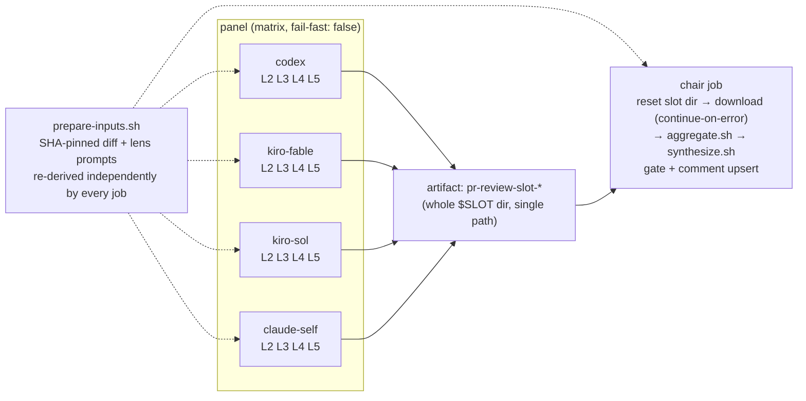

# ADR-015: PR-Review Panel — Per-Model Parallel Jobs (Artifact → Chair)

---

# English

## Status

Accepted (2026-08-06) — restructures the execution topology introduced by ADR-007 and
extended by the (undocumented, per ADR-011) lens×model matrix upgrade. **Amended same-day**
after this PR's own AI panel review (PR #88) caught a CRITICAL bug in the first cut plus
several MAJOR/MINOR issues — see [Amendment](#amendment-2026-08-06) below. Unlike ADR-007's
Context/Decision, which this ADR fully supersedes for *topology*, the panel's roster/prompts
are explicitly in scope here too (the original draft said they weren't — that was wrong, see
the amendment).

## Context

Before this ADR, `pr-review.yml` ran as a **single job on a single self-hosted runner pod**.
`run-panel.sh` launched all 20 lens×model cells (5 models × 4 lenses: Codex + Kiro×3 + Claude
self-review) as background (`&`) shell processes joined by one `wait`, then the same pod ran
`synthesize.sh` (the chair) inline. This had four costs:

- **Resource contention**: the runner pod requests `cpu: 1800m / memory: 3500Mi`
  (`argocd-apps/system/appset-helm-runner-claude-arm-aws-demo-platform.yaml`), but up to 20
  concurrent LLM CLI processes (node/rust) ran in it at once, with no limits set — burst
  capacity was whatever the node happened to have free.
- **No observability**: all 20 cells shared one job's log stream; a stuck/slow cell showed up
  only as a longer `wait`, with no per-cell timing or independent re-run in the Actions UI.
- **Pod death = total loss**: nothing was ever uploaded as an artifact. If the pod died
  mid-run, all 20 cells' output vanished with no post-mortem trail — only a scrubbed
  `tail -25` of `.err` reached the public log for cells that failed *and* left the pod alive
  long enough to log it.
- **Excess privilege**: every panel cell ran in a job context holding the `pull-requests:
  write` token, the exact threat surface the `persist-credentials: false` checkout comment
  (`pr-review.yml`) already worried about for a different reason (diff-injection → reading
  `.git/config` → token leak via a panel cell's stdout).

### Alternatives considered and rejected

**Marketplace GitHub Actions** (`konippi/kiro-cli-review-action`, `openai/codex-action`,
`anthropics/claude-code-action`) were evaluated as drop-in replacements for the hand-rolled
CLI invocations. All three are a downgrade from the current setup:

| Action | Blocker |
|---|---|
| `konippi/kiro-cli-review-action` (third-party, not an official AWS/Kiro action) | Outputs are only `review_result` (pass/fail/skip) + `exit_code` — **no output exposes the review text at all**; it posts its own inline PR comments instead. Nothing a chair could consume. Also `max_diff_size` defaults to 10000 chars and takes a single `model` input (this panel runs multiple Kiro models). |
| `openai/codex-action` | Requires `openai-api-key`; the only endpoint override is Azure's `responses-api-endpoint` — **no AWS Bedrock path**. Codex currently runs `openai.gpt-5.6-sol` via Bedrock on the node's IAM instance profile at no incremental API cost; adopting this action means provisioning a new paid OpenAI key. It also unconditionally `npm install -g @openai/codex`, discarding the version baked into the runner image. |
| `anthropics/claude-code-action` | Does support `use_bedrock` + an automation `prompt` mode, but it is a wrapper around the same `claude -p` call already made directly, and it adds a Claude GitHub App / OIDC federation dependency for no functional gain here. |

**Full 20-cell job matrix** (one GitHub Actions job per lens×model cell) was considered for
maximum isolation, but at `minRunners: 0` + on-demand-only (`k8s/system/karpenter/
runner-arm-nodepool.yaml`, see its own on-demand rationale comment), each job pays a fresh
Karpenter node cold start; 20 simultaneous jobs would push against the NodePool's `limits.cpu:
"128"` ceiling for marginal isolation gain over grouping by model.

**Per-lens job matrix** (one job per L2–L5, each running all models) was considered as the
inverse split, but it still puts several concurrent CLI processes in one pod, and a
vendor-wide outage (e.g. Kiro rate-limited) would degrade all four lens jobs simultaneously
rather than being isolated to that vendor's job. (Kiro-wide outages are still not fully
isolated even in the chosen design — see Amendment L5-MINOR below.)

**Per-model job matrix (chosen)**: one job per model, each running that model's 4 lenses
concurrently — 4 processes per pod instead of 20, actually fitting the `1800m` request. A
vendor outage is isolated to exactly one job (except when two tags share one underlying CLI —
see amendment).

## Decision

Split `pr-review.yml` into two jobs:

- **`prepare-inputs.sh`** (new): extracted the diff-fetch + lens-prompt-build steps, except the
  diff is now fetched via `gh api repos/.../compare/{base}...{head}` (SHA-pinned) instead of
  `gh pr diff` (which follows the PR's current head) — needed because every job now regenerates
  the same inputs independently rather than one job producing them once; a push mid-run must not
  let some jobs see a different diff than others. No prep job is introduced — each job (panel +
  chair) re-derives its own copy in-pod, since a shared prep job would serialize a Karpenter
  cold start in front of everything.
- **`lib.sh`**: gained `KIRO_MODELS`/`PANEL_TAGS` as the single roster source, read by
  `run-panel.sh` (cell execution) and `aggregate.sh` (floor judgment) — mitigating the
  model-id-in-multiple-places problem ADR-013/014 both had to patch around. The workflow's
  `strategy.matrix.model` list is still a separate YAML literal — accepted as a tradeoff, since
  drift in either direction is caught: an unknown tag in the merged slot fails loudly
  (`aggregate.sh`), and a roster entry with zero responses is caught by the degraded-model
  floor. `run-panel.sh`'s per-model branch also no longer re-lists Kiro tags — it branches on
  whether `$KIRO_TAG` (derived from `KIRO_MODELS`) is non-empty, so a 3rd Kiro model needs no
  second edit.
- **`aggregate.sh`** (new): the extracted floor/coverage logic, run once by the chair job after
  all panel artifacts are merged into one `slot/` directory. Its roster-drift guard checks every
  cell filename regardless of size (an empty drifted-tag cell must still be caught, not silently
  skipped).
- **`synthesize.sh`**: `CELL_COUNT` (used to compute the fair per-cell byte cap) counts only
  non-empty `.md` files, not skipped/empty ones — this matters more after the split because the
  number of missing cells now varies run-to-run (a dead panel job drops 4 cells at once, not 1).
- **Workflow permissions**: `panel` jobs run with `pull-requests: read` only — no write token in
  the context Codex/Kiro cells execute in, so a successful prompt-injection exfil attempt cannot
  use it to comment/modify the PR. Only the `chair` job holds `pull-requests: write`. Within the
  panel job, `GH_TOKEN`/`GITHUB_PERSONAL_ACCESS_TOKEN` are further scoped to the `claude-self`
  cell only — codex runs Bedrock-only (`-s read-only`) and Kiro cells get no tools at all
  (`--trust-tools=`), so neither ever needed a GitHub token in their process environment.
- **Artifact layout is a single directory, both ways** — `upload-artifact@v4` uploads
  `/tmp/pr-review/slot` as one path (not a multi-line list of wildcards), and `download-artifact`
  extracts back into the same path. This was **not** the first cut (see Amendment — CRITICAL).
- **`.err` files leave the pod** (as part of the uploaded artifact) for the first time — scrubbed
  in-place with the existing `scrub_secrets()` *and* truncated to `tail -c 4000` before upload
  (full stack traces don't need to be public; `synthesize.sh`'s cell-scrub stays as defense in
  depth), with `retention-days: 1` to minimize the window artifacts are downloadable.
- **`chair` job runs with `if: !cancelled()`** (not `always()`, and not just `needs: panel`) —
  runs when panel jobs fail/timeout (so the coverage-severe floor can still force
  `VERDICT: FAIL`), but skips when the whole *workflow run* was cancelled (e.g. a `synchronize`
  push superseding it under workflow-level `concurrency`), avoiding a stale chair racing an
  upsert against the new run's comment.
- **Chair resets `slot/` before downloading**, and `download-artifact` has
  `continue-on-error: true` — if every panel job failed/was cancelled and no artifacts exist,
  `aggregate.sh` still runs against an empty (but freshly created, non-stale) `slot/` and the
  degraded-model floor escalates to `coverage-severe.flag` instead of the step hard-failing with
  no gate signal at all.
- **Karpenter**: `k8s/system/karpenter/runner-arm-nodepool.yaml`'s `consolidateAfter` raised
  `30s` → `5m` so the chair pod (scheduled right after the panel pods finish) can reuse the same
  node instead of paying a second on-demand ARM cold start.
- **Panel/chair prompts and all chair-generated review text are English-only** — the lens
  prompts (L2–L5), the Claude self-review addendum, the chair synthesis prompt, and every
  chair-generated banner (degraded coverage, lens collapse, Kiro truncation, coverage-severe,
  chair-failed) were bilingual Korean/English; since every panel model reprocesses these per PR
  and the chair reprocesses the full panel bundle, this is switched to English-only for
  token/context efficiency. This is a genuine policy change, not a side effect of the topology
  split, and belongs in this Decision explicitly (the first draft of this ADR incorrectly
  claimed prompts were unchanged).
- **Kiro roster**: dropped `glm-5` (tag `kiro-glm`) — in this PR's own panel review, that model
  alone produced 4 confirmed false positives in a single run (a nonexistent subshell-scoping
  bug, an already-always-set variable claimed unset, an already-present stdin redirect claimed
  missing, and a wrong claim about test fixture behavior). More models isn't better if the
  extra model mostly adds noise. The two remaining Kiro slots were upgraded from
  `claude-opus-5`/`gpt-5.6-terra` to the top-of-catalog `claude-fable-5`/`gpt-5.6-sol` (verified
  present via `kiro-cli chat --list-models`, kiro-cli 2.11.1) and retagged `kiro-fable`/
  `kiro-sol` to match. `claude-fable-5` carries a catalog label of "Internal — development use
  cases only, not for customer data/ITAR/PII"; this repo already trusts the same model as the
  chair *primary* (ADR-007) reviewing the same PR diffs, so this isn't a new exposure category.
  Credits per review rose accordingly (4.40x/2.40x vs. the prior 2.20x/1.00x) — accepted
  explicitly, not re-litigated here.
- **Terraform version in the prompts corrected**: the lens/chair prompts asserted "Terraform
  1.9.8 pin" as a project rule, but the actual pin (per `CLAUDE.md`) is 1.9.6 — 1.9.8 fails to
  download on an expired upstream HashiCorp GPG key. This pre-existing inaccuracy (carried over
  from the original single-job workflow, not introduced by the topology split) was giving the
  panel grounds to flag the correct 1.9.6 pin as a violation; fixed while these files were
  already being rewritten.

## Consequences

- 4 concurrent CLI processes per pod instead of 20 — fits the existing `1800m` CPU request
  without relying on node burst capacity.
- A dead/timed-out panel job no longer erases all cells for every model — its artifact is simply
  absent, and the degraded-model floor treats "artifact missing" identically to "model produced
  empty output," escalating to forced `VERDICT: FAIL` only when ≥3 of 4 vendors are gone.
- Panel jobs become pending simultaneously; Karpenter can potentially bin-pack them onto one
  node rather than provisioning one per job, though this depends on bin-packing behavior
  actually observed at merge time, not verified analytically here.
- The workflow now has multiple job-runs' worth of Karpenter cold-start exposure instead of 1 —
  offset by the `consolidateAfter` bump, but not eliminated; a PR that arrives when the
  runner-arm NodePool is fully scaled down still pays for at least one on-demand node boot.
- The two Kiro-tagged jobs still share one underlying `kiro-cli` + one `KIRO_API_KEY` — a
  Kiro-service-wide outage degrades both Kiro jobs at once, not "exactly one job" as an earlier
  draft of this ADR claimed. With 2 Kiro models out of 4 total vendors, that's still below the
  ≥3-degraded severe threshold, so a Kiro-wide outage alone does not force fail-closed — worth
  knowing, not yet worth a design change.
- `CLAUDE.md` and `docs/architecture.md`'s AI PR review summaries are updated to match: 4 panel
  models, English-only prompts/output, `!cancelled()` (not `always()`), and the corrected
  artifact/roster details below.

## Amendment (2026-08-06)

This PR's own AI panel (Codex + `kiro-fable`/`kiro-sol` + Claude self-review) reviewed the diff
that introduced this ADR and found a real **CRITICAL** plus several MAJOR/MINOR issues, all
folded into the Decision/Consequences above rather than left here as a separate to-do list.
Recorded for the record, since an ADR that says "prompts unchanged" one day and "prompts are
now English-only" earlier in the same document would be self-contradictory to a future reader:

- **CRITICAL (fixed)**: `upload-artifact@v4` computes its artifact root as the least-common
  ancestor of whatever paths *actually matched* — not the literal pattern list. The original
  cut uploaded `slot/*.md`, `slot/*.err`, and a sibling `kiro-diff-truncated.flag` that only
  exists sometimes (never for codex/claude-self, and only for Kiro when the diff exceeds
  `KIRO_DIFF_CAP`). In the common case (no truncation) that flag never matches, so the LCA
  collapses to `slot/` itself and the artifact's internal layout silently changes — the download
  step then can't find `slot/` and `aggregate.sh` fails on every normal run. Fixed by uploading
  and downloading the whole `$SLOT` directory as a single explicit path (no per-file wildcards)
  and moving the flag file inside `$SLOT` so its presence no longer affects the LCA at all.
- **MAJOR (fixed)**: the promised fail-closed path for "every panel job died" was unreachable —
  `aggregate.sh` used to hard-`exit 1` when `slot/` didn't exist, which meant no coverage-severe
  flag, no banner, no comment, just a red job. Fixed: missing `slot/` is now created empty and
  treated as full degradation; `download-artifact` got `continue-on-error: true` so this path is
  actually reached.
- **MAJOR (fixed)**: `if: always()` on the chair also runs when the *workflow run itself* was
  cancelled (e.g. `synchronize` superseding it under the now-workflow-level `concurrency`),
  letting a stale chair from an old SHA race a comment-upsert against the new run. Changed to
  `if: !cancelled()`.
- **MINOR (fixed)**: least-privilege — `GH_TOKEN`/`GITHUB_PERSONAL_ACCESS_TOKEN` were injected
  into all 4 panel cells' environments even though only `claude-self` ever uses them; scoped to
  that cell only.
- **MINOR (fixed)**: `run-panel.sh`'s dispatch re-listed Kiro tags in a second place
  (`kiro-fable|kiro-sol)` case arm) duplicating `KIRO_MODELS` — refactored to branch on whether
  `$KIRO_TAG` is set, removing the second copy.
- **MINOR (fixed)**: the roster-drift guard in `aggregate.sh` skipped empty cells (`[ -s ]`),
  so a drifted tag that only ever produced empty responses would pass silently. Now checked
  regardless of cell size.
- **MINOR (fixed)**: the Terraform pin inaccuracy above.
- **MINOR (fixed)**: `.err` artifacts uploaded in full; now truncated to a 4000-byte tail before
  scrub+upload, and `retention-days` dropped from 7 to 1.
- **Roster change, not from the review but decided alongside it**: `kiro-glm` dropped (see
  Decision), remaining Kiro slots upgraded to `claude-fable-5`/`gpt-5.6-sol`.
- **Not adopted**: a suggestion to add `continue-on-error: true` to the *panel* job's steps was
  explicitly rejected — one review cell flagged this as a fix, but doing so would remove the
  only signal that currently catches roster drift between `strategy.matrix.model` and
  `lib.sh`'s `PANEL_TAGS` (a panel job crashing on an unknown tag). Adopting it without an
  independent drift check in the chair would silently reopen a gate bypass.

---

# 한국어

## 상태

승인됨 (2026-08-06) — ADR-007이 도입하고 (ADR-011 기준 문서화되지 않은 채) lens×model 매트릭스로
확장된 실행 토폴로지를 재구성한다. **같은 날 개정** — 이 PR 자신의 AI 패널 리뷰(PR #88)가 최초
버전의 CRITICAL 버그 하나와 여러 MAJOR/MINOR 이슈를 잡아냈다. 아래 [개정](#개정-2026-08-06) 참조.
ADR-007 의 Context/Decision 은 *토폴로지* 관점에서 이 ADR 이 완전히 대체하지만, 패널의
로스터/프롬프트도 이 ADR 의 범위에 명시적으로 포함된다(최초 초안은 "범위 밖"이라고 잘못 서술했다
— 개정 참조).

## Context

이 ADR 이전 `pr-review.yml`은 **단일 job / 단일 self-hosted 러너 파드**로 돌았다.
`run-panel.sh`가 20개 lens×model 셀(5모델×4lens: Codex + Kiro×3 + Claude 셀프리뷰) 전부를
백그라운드(`&`) 셸 프로세스로 띄우고 `wait` 하나로 조인했고, 같은 파드가 이어서
`synthesize.sh`(의장)를 인라인으로 실행했다. 여기엔 네 가지 비용이 있었다:

- **자원 경합**: 러너 파드는 `cpu: 1800m / memory: 3500Mi`
  (`argocd-apps/system/appset-helm-runner-claude-arm-aws-demo-platform.yaml`)를 요청하는데,
  limits 없이 최대 20개 동시 LLM CLI(node/rust) 프로세스가 그 안에서 돌았다 — 실제 버스트
  가능 여력은 그 시점 노드에 남은 여유에 그대로 맡겨졌다.
- **관측 불가**: 20개 셀이 job 하나의 로그 스트림을 공유해, 느리거나 멈춘 셀은 `wait`가
  길어지는 것으로만 드러났고 Actions UI 상 셀별 타이밍·독립 재실행이 없었다.
- **파드 사망 = 전멸**: artifact 업로드가 전혀 없어서, 실행 중 파드가 죽으면 20셀 결과가
  사후 분석 자료 없이 그대로 사라졌다 — 실패했으면서도 로그를 남길 만큼 파드가 오래 살아남은
  셀만 scrub 된 `tail -25`가 public 로그에 남았다.
- **권한 과다**: 패널 셀 전부가 `pull-requests: write` 토큰이 있는 job 컨텍스트에서 돌았다 —
  `persist-credentials: false` 체크아웃 주석(`pr-review.yml`)이 이미(다른 이유로: diff 인젝션
  → `.git/config` 읽기 → 토큰 유출) 경계하던 그 위협 표면 그대로다.

### 검토했으나 기각한 대안

**마켓플레이스 GitHub 액션**(`konippi/kiro-cli-review-action`, `openai/codex-action`,
`anthropics/claude-code-action`)을 손수 만든 CLI 호출의 drop-in 대체재로 검토했다. 셋 다 현
구성 대비 downgrade다:

| 액션 | 걸림돌 |
|---|---|
| `konippi/kiro-cli-review-action`(third-party, AWS/Kiro 공식 아님) | outputs 가 `review_result`(pass/fail/skip) + `exit_code` **뿐** — 리뷰 텍스트를 노출하는 output 이 전혀 없다. 자체적으로 inline PR 코멘트를 단다. chair 에 먹일 입력이 존재하지 않음. `max_diff_size` 기본 10000자, `model` 입력 1개(이 패널은 여러 Kiro 모델을 운용). |
| `openai/codex-action` | `openai-api-key` 필수, endpoint override 는 Azure `responses-api-endpoint` 뿐 — **Bedrock 경로 없음**. Codex는 지금 노드 IAM instance profile 로 `openai.gpt-5.6-sol` 을 Bedrock 경유로 추가 비용 없이 호출 중 — 채택 시 유료 OpenAI 키를 새로 발급해야 한다. 또 `npm install -g @openai/codex` 를 무조건 실행해 baked 이미지의 버전을 무시한다. |
| `anthropics/claude-code-action` | `use_bedrock` + automation `prompt` 모드가 실제로 동작하지만, 이미 직접 호출 중인 `claude -p` 의 래퍼일 뿐이고 여기선 기능적 이득 없이 Claude GitHub App/OIDC federation 의존만 추가한다. |

**20셀 full job matrix**(lens×model 셀 하나당 job 하나)는 최대 격리를 위해 검토했으나,
`minRunners: 0` + on-demand-only(`k8s/system/karpenter/runner-arm-nodepool.yaml`, on-demand
근거는 그 파일 자체 주석 참조) 하에서 job 마다 Karpenter 노드 콜드스타트를 새로 낸다 — 20개
동시 job 은 NodePool `limits.cpu: "128"` 상한에 바로 부딪히고, 모델별로 묶는 것 대비 격리
이득은 미미하다.

**per-lens job matrix**(L2~L5 당 job 하나, 각각 전 모델 실행)는 반대 방향의 분할로 검토했으나,
여전히 파드 하나에 여러 CLI 프로세스가 동시에 돌고, 벤더 전체 장애(예: Kiro rate-limit)가 그
벤더의 job 하나로 격리되지 않고 4개 lens job 전부를 동시에 저하시킨다(Kiro 전체 장애는 채택한
설계에서도 완전히 격리되지 않는다 — 아래 Consequences 참조).

**모델별 job matrix(채택)**: 모델당 job 하나, 각각 자기 모델의 lens 4개를 동시 실행 — 파드당
프로세스 20 → 4로 실제 `1800m` 요청에 맞는다. 벤더 장애가 정확히 그 job 하나로 격리된다(단,
두 태그가 같은 CLI 를 공유하면 예외 — 개정 참조).

## Decision

`pr-review.yml`을 job 2개로 분리한다(위 영문 섹션의 Mermaid 참조).

- **`prepare-inputs.sh`(신규)**: diff 취득 + lens 프롬프트 생성 스텝을 이관했다. diff 취득은
  `gh pr diff`(항상 PR 의 현재 head 를 따라감) 대신 `gh api repos/.../compare/{base}...{head}`
  (SHA 고정)로 교체 — 이제 모든 job 이 각자 같은 입력을 독립적으로 재생성하기 때문에, 실행 중
  push 가 들어와도 job 마다 다른 diff 를 보면 안 된다. prep job 은 따로 두지 않는다 — 각
  job(panel + chair)이 자기 파드에서 직접 재생성한다. 공유 prep job 을 두면 Karpenter
  콜드스타트가 파이프라인 맨 앞에 직렬로 붙는다.
- **`lib.sh`**: `KIRO_MODELS`/`PANEL_TAGS` 를 로스터 단일 소스로 추가 — `run-panel.sh`(셀
  실행)와 `aggregate.sh`(floor 판정) 가 같은 배열을 읽는다. ADR-013/014 가 매번 패치해야 했던
  "모델 id 가 여러 곳에 흩어져 있다" 문제의 완화. 워크플로 `strategy.matrix.model` 리스트는
  여전히 별도 YAML 리터럴로 남지만, 양방향 드리프트가 잡힌다: 합쳐진 slot 에 미지 태그가
  있으면(`aggregate.sh`) 즉시 실패, 로스터 항목이 응답 0건이면 degraded-model floor 가 잡는다.
  `run-panel.sh` 의 모델별 분기도 더 이상 Kiro 태그를 재나열하지 않는다 — `KIRO_MODELS` 에서
  파생한 `$KIRO_TAG` 가 비어있는지로 분기해, 3번째 Kiro 모델을 추가해도 수정 지점이 하나뿐이다.
- **`aggregate.sh`(신규)**: 빠져나온 floor/커버리지 로직. 전체 panel artifact 가 하나의
  `slot/` 로 합쳐진 뒤 chair job 이 한 번 실행한다. 로스터 드리프트 가드는 파일 크기와
  무관하게 모든 셀 파일명을 검사한다(드리프트된 태그가 매번 빈 응답이어도 조용히 통과하면 안
  됨).
- **`synthesize.sh`**: 셀당 공정 바이트 캡을 계산하는 `CELL_COUNT` 가 빈 `.md`(스킵된 셀)를
  제외하고 응답한 셀만 센다 — 분할 이후 결측 셀 수가 실행마다 달라지므로(panel job 하나가
  죽으면 셀 4개가 한꺼번에 빠짐) 이 구분이 더 중요해졌다.
- **워크플로 권한**: `panel` job 은 `pull-requests: read` 로만 돈다 — Codex/Kiro 셀이 실행되는
  컨텍스트에 쓰기 토큰이 없어, 프롬프트 인젝션 유출 시도가 성공해도 PR 코멘트/변경에 쓸 수
  없다. `pull-requests: write` 는 `chair` job 만 갖는다. panel job 내에서도
  `GH_TOKEN`/`GITHUB_PERSONAL_ACCESS_TOKEN` 은 `claude-self` 셀에만 주입 — codex 는
  Bedrock-only(`-s read-only`), Kiro 셀은 툴 자체가 없어(`--trust-tools=`) 둘 다 GitHub 토큰이
  프로세스 env 에 있을 필요가 없었다.
- **아티팩트 레이아웃은 양방향 모두 단일 디렉터리** — `upload-artifact@v4` 가
  `/tmp/pr-review/slot` 을 (와일드카드 여러 줄이 아니라) 경로 하나로 통째로 올리고,
  `download-artifact` 도 같은 경로 하나로 풀어낸다. 이건 최초 버전이 **아니었다**(아래
  개정 — CRITICAL 참조).
- **`.err` 파일이 처음으로 파드를 떠난다**(업로드되는 artifact 의 일부로) — 기존
  `scrub_secrets()` 로 in-place scrub *하고* 업로드 전 `tail -c 4000` 으로 축소(전문
  스택트레이스를 공개할 필요는 없다; `synthesize.sh` 의 셀 scrub 은 defense in depth 로
  유지), `retention-days: 1` 로 다운로드 가능한 시간을 최소화한다.
- **`chair` job 은 `if: always()` 대신 `if: !cancelled()`** 로 돈다(`needs: panel` 만도
  아님) — panel job 이 실패/timeout 나도 실행돼(coverage-severe floor 가 여전히
  `VERDICT: FAIL` 을 강제할 수 있게) 하지만, *워크플로 실행 자체*가 취소된 경우(예:
  workflow-level `concurrency` 하에서 `synchronize` push 가 이전 실행을 대체)는 건너뛴다 —
  구 SHA 기준 stale chair 가 새 실행의 코멘트 upsert 와 경합하는 걸 막는다.
- **chair 가 download 전에 `slot/` 을 리셋**하고, `download-artifact` 에
  `continue-on-error: true` 를 둔다 — panel job 전부가 실패/취소돼 artifact 가 하나도 없어도
  `aggregate.sh` 는 (새로 만든, stale 하지 않은) 빈 `slot/` 에 대해 그대로 돌아 degraded-model
  floor 가 `coverage-severe.flag` 로 승격시킨다 — 스텝이 아무 게이트 신호도 없이 그냥
  hard-fail 하지 않는다.
- **Karpenter**: `k8s/system/karpenter/runner-arm-nodepool.yaml` 의 `consolidateAfter` 를
  `30s` → `5m` 으로 늘려, panel 파드들이 끝난 직후 뜨는 chair 파드가 같은 노드를 재사용하고
  두 번째 on-demand ARM 콜드스타트를 안 내게 한다.
- **패널/체어 프롬프트와 체어가 생성하는 모든 리뷰 텍스트는 English-only** — lens 프롬프트
  (L2–L5), Claude 셀프리뷰 addendum, 체어 종합 프롬프트, 체어가 생성하는 모든 배너(커버리지
  저하/lens 붕괴/Kiro truncation/coverage-severe/chair-failed)가 한글·영문 혼용이었다. 매
  PR 마다 패널 모델 전부가 이걸 다시 처리하고 체어는 패널 합본 전체를 다시 처리하므로,
  토큰/컨텍스트 효율을 위해 English-only 로 전환한다. 이건 토폴로지 분리의 부산물이 아니라
  별도의 명시적 정책 변경이며 이 Decision 에 그대로 포함한다(이 ADR 최초 초안은 "프롬프트
  불변"이라고 잘못 서술했었다).
- **Kiro 로스터**: `glm-5`(태그 `kiro-glm`) 를 제외한다 — 이 PR 자신의 패널 리뷰에서 이 모델
  만 단일 실행에서 확인된 오탐 4건을 냈다(존재하지 않는 subshell 스코프 버그, 이미 항상
  세팅되는 변수를 미설정이라 주장, 이미 있는 stdin 리다이렉트를 없다고 주장, 테스트 픽스처
  동작에 대한 잘못된 주장). 모델이 많다고 신호가 좋아지는 게 아니라, 추가 모델이 주로 잡음만
  더한다면 오히려 해롭다. 남은 두 Kiro 슬롯은 `claude-opus-5`/`gpt-5.6-terra` 에서 Kiro
  카탈로그(`kiro-cli chat --list-models`, kiro-cli 2.11.1 로 실측) 최상위 모델인
  `claude-fable-5`/`gpt-5.6-sol` 로 교체하고 태그도 `kiro-fable`/`kiro-sol` 로 개명해 맞췄다.
  `claude-fable-5` 는 카탈로그 상 "Internal — development use cases only, not for customer
  data/ITAR/PII" 라벨이 있으나, 이 리포는 이미 같은 모델을 chair primary(ADR-007)로 정확히
  같은 PR diff 에 쓰고 있어 새로운 노출 범주는 아니다. 리뷰당 크레딧은 그만큼 올랐다(4.40x/
  2.40x, 기존 2.20x/1.00x 대비) — 여기서 재론하지 않고 명시적으로 감수.
- **프롬프트의 Terraform 버전 정정**: lens/체어 프롬프트가 "Terraform 1.9.8 pin" 을 프로젝트
  룰로 단언했으나, 실제 pin(`CLAUDE.md` 기준)은 1.9.6 이다 — 1.9.8 은 만료된 업스트림
  HashiCorp GPG 키로 다운로드가 실패한다. 이 부정확함은 원래 단일 job 워크플로에서 그대로
  이관된 pre-existing 오류(토폴로지 분리가 만든 게 아님)였는데, 정확한 1.9.6 pin 을 패널이
  위반으로 오탐할 근거를 주고 있었다 — 이 파일들을 다시 쓰는 김에 함께 고쳤다.

## Consequences

- 파드당 동시 CLI 프로세스가 20 → 4 — 노드 버스트 여력에 의존하지 않고 기존 `1800m` CPU
  요청 안에서 실제로 맞는다.
- panel job 하나가 죽거나 timeout 나도 그 모델의 전체 셀이 사라질 뿐, 다른 모델은 영향받지
  않는다 — 그 artifact가 단순히 없을 뿐이고, degraded-model floor 가 "artifact 없음"을 "모델이
  빈 응답을 냈음"과 동일하게 취급해, 4개 벤더 중 3개 이상 탈락에서만 강제 `VERDICT: FAIL` 로
  승격한다.
- panel job 들이 동시에 pending 되므로 Karpenter 가 노드 하나로 bin-pack 할 가능성이 있으나,
  이는 머지 시점 실제 관측이 필요한 가정이며 여기서 분석적으로 증명하지는 않았다.
- 워크플로 하나가 이제 job 1개가 아니라 여러 개 분량의 Karpenter 콜드스타트 노출을 갖는다 —
  `consolidateAfter` 상향으로 완화되지만 제거되지는 않는다: runner-arm NodePool 이 완전히
  scale-down 된 시점에 PR 이 오면 최소 한 번의 on-demand 노드 부팅은 여전히 낸다.
- Kiro 태그가 붙은 두 job 은 여전히 같은 `kiro-cli` + 같은 `KIRO_API_KEY` 를 공유한다 — Kiro
  서비스 전체 장애는 두 job 을 동시에 저하시킨다("정확히 job 하나로 격리"라는 이전 초안의
  서술은 부정확했다). 4개 벤더 중 2개면 여전히 severe 승격 기준(3개 이상 탈락) 미달이라 Kiro
  전체 장애만으로 fail-closed 는 안 되지만, 알고 있을 가치는 있다 — 아직 설계 변경까지는 아님.
- `CLAUDE.md`·`docs/architecture.md` 의 AI PR review 요약을 갱신: 4개 패널 모델,
  English-only 프롬프트/출력, `!cancelled()`(`always()` 아님), 아래 정정된 아티팩트/로스터
  세부사항.

## 개정 (2026-08-06)

이 PR 자신의 AI 패널(Codex + `kiro-fable`/`kiro-sol` + Claude 셀프리뷰)이 이 ADR 을 도입한
diff 를 리뷰해 실제 **CRITICAL** 하나와 여러 MAJOR/MINOR 이슈를 찾았고, 별도 TODO 목록으로
남기지 않고 위 Decision/Consequences 에 전부 접어 넣었다. "프롬프트 불변"이라고 썼다가 같은
문서 앞쪽에서 "이제 English-only"라고 쓰면 미래 독자에게 자기 모순으로 보이므로, 기록을 위해
여기 남긴다:

- **CRITICAL(수정됨)**: `upload-artifact@v4` 는 아티팩트 루트를 "패턴이 아니라 실제로 매치된
  경로들의 최소 공통 조상(LCA)"으로 계산한다. 최초 버전은 `slot/*.md`, `slot/*.err`, 그리고
  존재 여부가 실행마다 다른 형제 파일 `kiro-diff-truncated.flag`(codex/claude-self 에서는
  절대 안 생기고, Kiro 도 diff 가 `KIRO_DIFF_CAP` 을 넘을 때만 생김) 를 함께 올렸다. truncation
  이 없는 보통 케이스엔 그 flag 가 전혀 매치되지 않아 LCA 가 `slot/` 자체로 붕괴 — 아티팩트
  내부 구조가 조용히 바뀌어, 다운로드 스텝이 `slot/` 을 못 찾고 `aggregate.sh` 가 정상 실행
  때마다 실패했다. `$SLOT` 디렉터리 전체를 (와일드카드 나열 없이) 경로 하나로 올리고 내리며,
  flag 파일을 `$SLOT` 안으로 옮겨 존재 여부가 LCA 에 전혀 영향을 못 미치게 고쳤다.
- **MAJOR(수정됨)**: "panel job 전부 사망" 시의 fail-closed 경로가 도달 불가였다 —
  `aggregate.sh` 가 `slot/` 부재 시 hard-`exit 1` 해, coverage-severe flag 도 배너도 코멘트도
  없이 그냥 job 만 빨갰다. 수정: `slot/` 부재를 빈 슬롯 생성 + 전 모델 degraded 로 처리하고,
  `download-artifact` 에 `continue-on-error: true` 를 둬 이 경로가 실제로 도달하게 했다.
- **MAJOR(수정됨)**: chair 의 `if: always()` 는 *워크플로 실행 자체*가 취소된 경우에도 실행돼
  (예: workflow-level `concurrency` 하 `synchronize` push 가 이전 실행을 대체), 구 SHA 기준
  stale chair 가 새 실행과 코멘트 upsert 를 경합할 수 있었다. `if: !cancelled()` 로 변경.
- **MINOR(수정됨)**: least-privilege — `GH_TOKEN`/`GITHUB_PERSONAL_ACCESS_TOKEN` 이 4개 panel
  셀 전부의 env 에 주입됐지만 실제로 쓰는 건 `claude-self` 뿐이었다 — 그 셀에만 한정.
- **MINOR(수정됨)**: `run-panel.sh` 의 분기가 Kiro 태그를 (`kiro-fable|kiro-sol)` case arm 으로)
  두 번째로 나열해 `KIRO_MODELS` 의 사본이 하나 더 있었다 — `$KIRO_TAG` 설정 여부로 분기하도록
  리팩터링해 사본을 제거.
- **MINOR(수정됨)**: `aggregate.sh` 의 로스터 드리프트 가드가 빈 셀(`[ -s ]`)을 건너뛰어,
  드리프트된 태그가 매번 빈 응답만 내면 조용히 통과했다 — 이제 셀 크기와 무관하게 검사.
- **MINOR(수정됨)**: 위 Terraform pin 부정확함.
- **MINOR(수정됨)**: `.err` artifact 가 전문 업로드였다 — scrub 전 `tail -c 4000` 으로 축소,
  `retention-days` 를 7 → 1 로.
- **로스터 변경(리뷰가 아니라 리뷰와 함께 결정)**: `kiro-glm` 제외(Decision 참조), 남은 Kiro
  슬롯을 `claude-fable-5`/`gpt-5.6-sol` 로 상향.
- **채택하지 않음**: panel job 스텝에 `continue-on-error: true` 를 추가하라는 리뷰 셀의 제안은
  명시적으로 기각했다 — 채택하면 `strategy.matrix.model` 과 `lib.sh` 의 `PANEL_TAGS` 간 로스터
  드리프트를 잡는 유일한 신호(미지 태그로 panel job 이 죽는 것)가 사라진다. chair 쪽에
  독립적인 드리프트 체크 없이 이걸 채택하면 게이트 우회가 조용히 재발한다.
