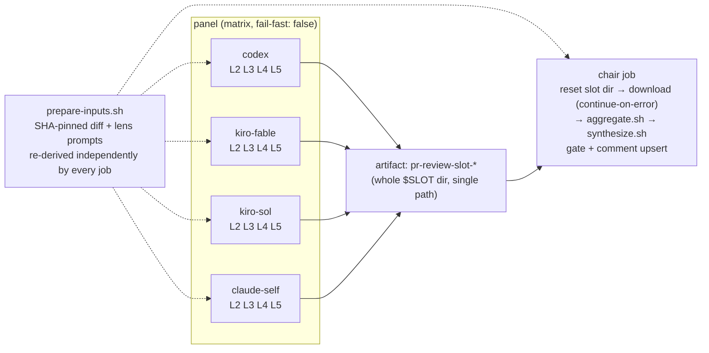

# ADR-015: PR-Review Panel — Per-Model Parallel Jobs (Artifact → Chair)

## Status

Accepted (2026-08-06) — restructures the execution topology introduced by ADR-016 and
extended by the (undocumented, per ADR-011) lens×model matrix upgrade. **Amended same-day**
after this PR's own AI panel review (PR #88) caught a CRITICAL bug in the first cut plus
several MAJOR/MINOR issues — see [Amendment](#amendment-2026-08-06) below. Unlike ADR-016's
Context/Decision, which this ADR fully supersedes for *topology*, the panel's roster/prompts
are explicitly in scope here too (the original draft said they weren't — that was wrong, see
the amendment).

## Context

Before this ADR, `pr-review.yml` ran as a **single job on a single self-hosted runner pod**.
`run-panel.sh` launched all 20 lens×model cells (5 models × 4 lenses: Codex + Kiro×3 + Claude
self-review) as background (`&`) shell processes joined by one `wait`, then the same pod ran
`synthesize.sh` (the chair) inline. This had four costs:

- **Resource contention**: the runner pod requests `cpu: 1800m / memory: 3500Mi`
  (`argocd-apps/system/appset-helm-runner-claude-arm-aws-demo-platform.yaml`), but up to 20
  concurrent LLM CLI processes (node/rust) ran in it at once, with no limits set — burst
  capacity was whatever the node happened to have free.
- **No observability**: all 20 cells shared one job's log stream; a stuck/slow cell showed up
  only as a longer `wait`, with no per-cell timing or independent re-run in the Actions UI.
- **Pod death = total loss**: nothing was ever uploaded as an artifact. If the pod died
  mid-run, all 20 cells' output vanished with no post-mortem trail — only a scrubbed
  `tail -25` of `.err` reached the public log for cells that failed *and* left the pod alive
  long enough to log it.
- **Excess privilege**: every panel cell ran in a job context holding the `pull-requests:
  write` token, the exact threat surface the `persist-credentials: false` checkout comment
  (`pr-review.yml`) already worried about for a different reason (diff-injection → reading
  `.git/config` → token leak via a panel cell's stdout).

### Alternatives considered and rejected

**Marketplace GitHub Actions** (`konippi/kiro-cli-review-action`, `openai/codex-action`,
`anthropics/claude-code-action`) were evaluated as drop-in replacements for the hand-rolled
CLI invocations. All three are a downgrade from the current setup:

| Action | Blocker |
|---|---|
| `konippi/kiro-cli-review-action` (third-party, not an official AWS/Kiro action) | Outputs are only `review_result` (pass/fail/skip) + `exit_code` — **no output exposes the review text at all**; it posts its own inline PR comments instead. Nothing a chair could consume. Also `max_diff_size` defaults to 10000 chars and takes a single `model` input (this panel runs multiple Kiro models). |
| `openai/codex-action` | Requires `openai-api-key`; the only endpoint override is Azure's `responses-api-endpoint` — **no AWS Bedrock path**. Codex currently runs `openai.gpt-5.6-sol` via Bedrock on the node's IAM instance profile at no incremental API cost; adopting this action means provisioning a new paid OpenAI key. It also unconditionally `npm install -g @openai/codex`, discarding the version baked into the runner image. |
| `anthropics/claude-code-action` | Does support `use_bedrock` + an automation `prompt` mode, but it is a wrapper around the same `claude -p` call already made directly, and it adds a Claude GitHub App / OIDC federation dependency for no functional gain here. |

**Full 20-cell job matrix** (one GitHub Actions job per lens×model cell) was considered for
maximum isolation, but at `minRunners: 0` + on-demand-only (`k8s/system/karpenter/
runner-arm-nodepool.yaml`, see its own on-demand rationale comment), each job pays a fresh
Karpenter node cold start; 20 simultaneous jobs would push against the NodePool's `limits.cpu:
"128"` ceiling for marginal isolation gain over grouping by model.

**Per-lens job matrix** (one job per L2–L5, each running all models) was considered as the
inverse split, but it still puts several concurrent CLI processes in one pod, and a
vendor-wide outage (e.g. Kiro rate-limited) would degrade all four lens jobs simultaneously
rather than being isolated to that vendor's job. (Kiro-wide outages are still not fully
isolated even in the chosen design — see Amendment L5-MINOR below.)

**Per-model job matrix (chosen)**: one job per model, each running that model's 4 lenses
concurrently — 4 processes per pod instead of 20, actually fitting the `1800m` request. A
vendor outage is isolated to exactly one job (except when two tags share one underlying CLI —
see amendment).

## Decision

Split `pr-review.yml` into two jobs:

- **`prepare-inputs.sh`** (new): extracted the diff-fetch + lens-prompt-build steps, except the
  diff is now fetched via `gh api repos/.../compare/{base}...{head}` (SHA-pinned) instead of
  `gh pr diff` (which follows the PR's current head) — needed because every job now regenerates
  the same inputs independently rather than one job producing them once; a push mid-run must not
  let some jobs see a different diff than others. No prep job is introduced — each job (panel +
  chair) re-derives its own copy in-pod, since a shared prep job would serialize a Karpenter
  cold start in front of everything.
- **`lib.sh`**: gained `KIRO_MODELS`/`PANEL_TAGS` as the single roster source, read by
  `run-panel.sh` (cell execution) and `aggregate.sh` (floor judgment) — mitigating the
  model-id-in-multiple-places problem ADR-013/014 both had to patch around. The workflow's
  `strategy.matrix.model` list is still a separate YAML literal — accepted as a tradeoff, since
  drift in either direction is caught: an unknown tag in the merged slot fails loudly
  (`aggregate.sh`), and a roster entry with zero responses is caught by the degraded-model
  floor. `run-panel.sh`'s per-model branch also no longer re-lists Kiro tags — it branches on
  whether `$KIRO_TAG` (derived from `KIRO_MODELS`) is non-empty, so a 3rd Kiro model needs no
  second edit.
- **`aggregate.sh`** (new): the extracted floor/coverage logic, run once by the chair job after
  all panel artifacts are merged into one `slot/` directory. Its roster-drift guard checks every
  cell filename regardless of size (an empty drifted-tag cell must still be caught, not silently
  skipped).
- **`synthesize.sh`**: `CELL_COUNT` (used to compute the fair per-cell byte cap) counts only
  non-empty `.md` files, not skipped/empty ones — this matters more after the split because the
  number of missing cells now varies run-to-run (a dead panel job drops 4 cells at once, not 1).
- **Workflow permissions**: `panel` jobs run with `pull-requests: read` only — no write token in
  the context Codex/Kiro cells execute in, so a successful prompt-injection exfil attempt cannot
  use it to comment/modify the PR. Only the `chair` job holds `pull-requests: write`. Within the
  panel job, `GH_TOKEN`/`GITHUB_PERSONAL_ACCESS_TOKEN` are further scoped to the `claude-self`
  cell only — codex runs Bedrock-only (`-s read-only`) and Kiro cells get no tools at all
  (`--trust-tools=`), so neither ever needed a GitHub token in their process environment.
- **Artifact layout is a single directory, both ways** — `upload-artifact@v4` uploads
  `/tmp/pr-review/slot` as one path (not a multi-line list of wildcards), and `download-artifact`
  extracts back into the same path. This was **not** the first cut (see Amendment — CRITICAL).
- **`.err` files leave the pod** (as part of the uploaded artifact) for the first time — scrubbed
  in-place with the existing `scrub_secrets()` *and* truncated to `tail -c 4000` before upload
  (full stack traces don't need to be public; `synthesize.sh`'s cell-scrub stays as defense in
  depth), with `retention-days: 1` to minimize the window artifacts are downloadable.
- **`chair` job runs with `if: !cancelled()`** (not `always()`, and not just `needs: panel`) —
  runs when panel jobs fail/timeout (so the coverage-severe floor can still force
  `VERDICT: FAIL`), but skips when the whole *workflow run* was cancelled (e.g. a `synchronize`
  push superseding it under workflow-level `concurrency`), avoiding a stale chair racing an
  upsert against the new run's comment.
- **Chair resets `slot/` before downloading**, and `download-artifact` has
  `continue-on-error: true` — if every panel job failed/was cancelled and no artifacts exist,
  `aggregate.sh` still runs against an empty (but freshly created, non-stale) `slot/` and the
  degraded-model floor escalates to `coverage-severe.flag` instead of the step hard-failing with
  no gate signal at all.
- **Karpenter**: `k8s/system/karpenter/runner-arm-nodepool.yaml`'s `consolidateAfter` raised
  `30s` → `5m` so the chair pod (scheduled right after the panel pods finish) can reuse the same
  node instead of paying a second on-demand ARM cold start.
- **Panel/chair prompts and all chair-generated review text are English-only** — the lens
  prompts (L2–L5), the Claude self-review addendum, the chair synthesis prompt, and every
  chair-generated banner (degraded coverage, lens collapse, Kiro truncation, coverage-severe,
  chair-failed) were bilingual Korean/English; since every panel model reprocesses these per PR
  and the chair reprocesses the full panel bundle, this is switched to English-only for
  token/context efficiency. This is a genuine policy change, not a side effect of the topology
  split, and belongs in this Decision explicitly (the first draft of this ADR incorrectly
  claimed prompts were unchanged).
- **Kiro roster**: dropped `glm-5` (tag `kiro-glm`) — in this PR's own panel review, that model
  alone produced 4 confirmed false positives in a single run (a nonexistent subshell-scoping
  bug, an already-always-set variable claimed unset, an already-present stdin redirect claimed
  missing, and a wrong claim about test fixture behavior). More models isn't better if the
  extra model mostly adds noise. The two remaining Kiro slots were upgraded from
  `claude-opus-5`/`gpt-5.6-terra` to the top-of-catalog `claude-fable-5`/`gpt-5.6-sol` (verified
  present via `kiro-cli chat --list-models`, kiro-cli 2.11.1) and retagged `kiro-fable`/
  `kiro-sol` to match. `claude-fable-5` carries a catalog label of "Internal — development use
  cases only, not for customer data/ITAR/PII"; this repo already trusts the same model as the
  chair *primary* (ADR-016) reviewing the same PR diffs, so this isn't a new exposure category.
  Credits per review rose accordingly (4.40x/2.40x vs. the prior 2.20x/1.00x) — accepted
  explicitly, not re-litigated here.
- **Terraform version in the prompts corrected**: the lens/chair prompts asserted "Terraform
  1.9.8 pin" as a project rule, but the actual pin (per `CLAUDE.md`) is 1.9.6 — 1.9.8 fails to
  download on an expired upstream HashiCorp GPG key. This pre-existing inaccuracy (carried over
  from the original single-job workflow, not introduced by the topology split) was giving the
  panel grounds to flag the correct 1.9.6 pin as a violation; fixed while these files were
  already being rewritten.

## Consequences

- 4 concurrent CLI processes per pod instead of 20 — fits the existing `1800m` CPU request
  without relying on node burst capacity.
- A dead/timed-out panel job no longer erases all cells for every model — its artifact is simply
  absent, and the degraded-model floor treats "artifact missing" identically to "model produced
  empty output," escalating to forced `VERDICT: FAIL` only when ≥3 of 4 vendors are gone.
- Panel jobs become pending simultaneously; Karpenter can potentially bin-pack them onto one
  node rather than provisioning one per job, though this depends on bin-packing behavior
  actually observed at merge time, not verified analytically here.
- The workflow now has multiple job-runs' worth of Karpenter cold-start exposure instead of 1 —
  offset by the `consolidateAfter` bump, but not eliminated; a PR that arrives when the
  runner-arm NodePool is fully scaled down still pays for at least one on-demand node boot.
- The two Kiro-tagged jobs still share one underlying `kiro-cli` + one `KIRO_API_KEY` — a
  Kiro-service-wide outage degrades both Kiro jobs at once, not "exactly one job" as an earlier
  draft of this ADR claimed. With 2 Kiro models out of 4 total vendors, that's still below the
  ≥3-degraded severe threshold, so a Kiro-wide outage alone does not force fail-closed — worth
  knowing, not yet worth a design change.
- `CLAUDE.md` and `docs/architecture.md`'s AI PR review summaries are updated to match: 4 panel
  models, English-only prompts/output, `!cancelled()` (not `always()`), and the corrected
  artifact/roster details below.

## Amendment (2026-08-06)

This PR's own AI panel (Codex + `kiro-fable`/`kiro-sol` + Claude self-review) reviewed the diff
that introduced this ADR and found a real **CRITICAL** plus several MAJOR/MINOR issues, all
folded into the Decision/Consequences above rather than left here as a separate to-do list.
Recorded for the record, since an ADR that says "prompts unchanged" one day and "prompts are
now English-only" earlier in the same document would be self-contradictory to a future reader:

- **CRITICAL (fixed)**: `upload-artifact@v4` computes its artifact root as the least-common
  ancestor of whatever paths *actually matched* — not the literal pattern list. The original
  cut uploaded `slot/*.md`, `slot/*.err`, and a sibling `kiro-diff-truncated.flag` that only
  exists sometimes (never for codex/claude-self, and only for Kiro when the diff exceeds
  `KIRO_DIFF_CAP`). In the common case (no truncation) that flag never matches, so the LCA
  collapses to `slot/` itself and the artifact's internal layout silently changes — the download
  step then can't find `slot/` and `aggregate.sh` fails on every normal run. Fixed by uploading
  and downloading the whole `$SLOT` directory as a single explicit path (no per-file wildcards)
  and moving the flag file inside `$SLOT` so its presence no longer affects the LCA at all.
- **MAJOR (fixed)**: the promised fail-closed path for "every panel job died" was unreachable —
  `aggregate.sh` used to hard-`exit 1` when `slot/` didn't exist, which meant no coverage-severe
  flag, no banner, no comment, just a red job. Fixed: missing `slot/` is now created empty and
  treated as full degradation; `download-artifact` got `continue-on-error: true` so this path is
  actually reached.
- **MAJOR (fixed)**: `if: always()` on the chair also runs when the *workflow run itself* was
  cancelled (e.g. `synchronize` superseding it under the now-workflow-level `concurrency`),
  letting a stale chair from an old SHA race a comment-upsert against the new run. Changed to
  `if: !cancelled()`.
- **MINOR (fixed)**: least-privilege — `GH_TOKEN`/`GITHUB_PERSONAL_ACCESS_TOKEN` were injected
  into all 4 panel cells' environments even though only `claude-self` ever uses them; scoped to
  that cell only.
- **MINOR (fixed)**: `run-panel.sh`'s dispatch re-listed Kiro tags in a second place
  (`kiro-fable|kiro-sol)` case arm) duplicating `KIRO_MODELS` — refactored to branch on whether
  `$KIRO_TAG` is set, removing the second copy.
- **MINOR (fixed)**: the roster-drift guard in `aggregate.sh` skipped empty cells (`[ -s ]`),
  so a drifted tag that only ever produced empty responses would pass silently. Now checked
  regardless of cell size.
- **MINOR (fixed)**: the Terraform pin inaccuracy above.
- **MINOR (fixed)**: `.err` artifacts uploaded in full; now truncated to a 4000-byte tail before
  scrub+upload, and `retention-days` dropped from 7 to 1.
- **Roster change, not from the review but decided alongside it**: `kiro-glm` dropped (see
  Decision), remaining Kiro slots upgraded to `claude-fable-5`/`gpt-5.6-sol`.
- **Not adopted**: a suggestion to add `continue-on-error: true` to the *panel* job's steps was
  explicitly rejected — one review cell flagged this as a fix, but doing so would remove the
  only signal that currently catches roster drift between `strategy.matrix.model` and
  `lib.sh`'s `PANEL_TAGS` (a panel job crashing on an unknown tag). Adopting it without an
  independent drift check in the chair would silently reopen a gate bypass.
