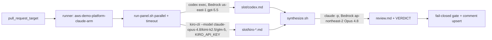

# ADR-016: Multi-AI co-agent PR review panel (Codex + Kiro) with a Claude chair

> Renumbered from ADR-007 (numbering collision with
> [ADR-007-mgmt-observability-internal-nlb-exception](ADR-007-mgmt-observability-internal-nlb-exception.md)).

## Status
Accepted (2026-06-14). Superseded in part by [ADR-011](ADR-011-pr-review-kiro-roster-gpt55-drop-v3.md)
(Kiro roster `kimi-k2.5` → `gpt-5.5`, drop `--v3`) — this document's roster/flag
references below are historical. Execution topology (single-job fan-out) is
superseded by [ADR-015](ADR-015-pr-review-per-model-parallel-jobs.md)
(per-model parallel jobs).

## Context

### Update (2026-09-12) — ai-trader-web compatibility exception

The dedicated `ai-trader-web-claude-arm` fleet uses a retained version tag plus
immutable image digest while that consumer verifies Claude CLI `2.1.240`.
This is a scoped exception to shared `latest` consumption; other fleets and the
weekly image build remain unchanged. Native Claude self-update is disabled in
this fleet so the checked binary remains consistent through the review.
Platform CI and ai-trader-web maintainers own coordinated contract/image upgrades.
See the [compatibility and recovery runbook](../runbooks/ai-trader-review-runner.md)
for dated evidence, tag retention and the removal/upgrade trigger.

`pr-review.yml` runs a single `claude` CLI review (Bedrock Opus 4.8) on the
self-hosted `aws-demo-platform-claude-arm` runner and gates the PR on a final
`VERDICT: PASS|FAIL` line. We want a multi-AI panel — Codex and Kiro — to feed a
Claude chair that synthesizes one review, mirroring the `/co-agent review`
pattern. The runner image (`actions-runner-claude`) was previously built outside
this repo; we also fold its build into this repo as the management area
consolidates here.

## Options Considered

### Option 1: Independent verdicts, combined gate
- **Pros**: simple; each AI emits its own VERDICT; gate = AND/majority.
- **Cons**: no synthesis; noisy comment; disagreement handling is mechanical.

### Option 2: Claude chairs & synthesizes (chosen)
- **Pros**: one coherent review; matches `/co-agent`; chair reconciles panel agreement/dissent; single VERDICT keeps the existing fail-closed gate unchanged.
- **Cons**: chair is a single point; 5 model calls/PR latency.

### Option 3: Panel + synthesis, both shown
- **Pros**: transparency of raw panel takes.
- **Cons**: bulky comment; raw panel output rarely actionable vs the synthesis.

## Decision

**Option 2.** Panel = Codex (1) + Kiro (`claude-opus-4.8`, `kimi-k2.5`, `glm-5`).
Panelists emit findings only; **Claude Opus 4.8 is the chair** and produces the
single review + `VERDICT`. Orchestration lives in repo scripts
(`scripts/pr-review/`), not inline YAML. Auth: **Codex uses Bedrock
natively** via baked `~/.codex/config.toml` (`model_provider = "amazon-bedrock"`,
`openai.gpt-5.5`, `us-east-1`) — no key, reusing the runner node IAM, whose
`ci_runner_bedrock` policy is already `Resource=*` (all regions). **Kiro uses
`KIRO_API_KEY`** read from the existing Secrets Manager secret
`/demo-platform/actions/AI-key` via an `external-secrets.io/v1` ExternalSecret
(`ai-panel-keys`) into the runner pod env — no new slot. The runner stays in **ap-northeast-2**
(cross-region Bedrock latency is negligible vs generation time; relocating would
need a new cluster/ECR/secrets in us-east). The runner image is built in this
repo (`docker/actions-runner-claude/` + `runner-image.yml`, ADR-003 OIDC→ECR).

No-hang is guaranteed by non-interactive flags (`codex exec`, `kiro-cli
--no-interactive --trust-tools=read,grep`) + `timeout` + stdin isolation; any
panelist failure/absence is a graceful `[skip]`, and an all-skip degrades to the
prior Claude-solo behavior.

## Consequences

### Positive
- Cross-family review diversity (OpenAI gpt-5.5 + Kiro opus/kimi/glm) with one synthesized verdict.
- Existing gate (fail-closed), comment upsert, and concurrency invariants are untouched.
- Runner image and its build pipeline are now owned and PR-reviewed in this repo.
- No new secret slot — reuses the existing `/demo-platform/actions/AI-key` secret.

### Negative
- Up to 5 model calls per PR (latency; acceptable for non-prod async review).
- Chair is a single synthesis point; a bad chair run still fail-closes via the VERDICT rule.
- `kimi-k2.5` may be account-tier gated → that panelist silently skips.
- Adds an ExternalSecret-syncing ArgoCD Application to operate.

## Update (2026-06-23) — runner image ownership, Kiro v3

Rebased the runner image off the official ARC image (the previous `FROM
actions-runner-claude:latest` was self-referential — a weekly cron would keep
stacking on its own output). Pinned CLI versions (later unpinned — see
[ADR-013](ADR-013-pr-review-gpt56-model-bump.md)), baked Claude Code plugins, and
added a weekly rebuild (`runner-image.yml` schedule, best-effort — a failed build
never reaches `docker push`). Panel calls used `kiro-cli --v3 chat` at this point
(binary `kiro-cli`, never bare `kiro`); `--v3` was dropped later per
[ADR-011](ADR-011-pr-review-kiro-roster-gpt55-drop-v3.md). Dropped Antigravity
(`agy`) — headless API-key auth doesn't work and it requires interactive OAuth.
Fixed a runner-credentials gap: the shared `claude-runner` SA was missing from
`infra/eks-mgmt` `runner_service_accounts`, so pods had no Bedrock access.

## Update (2026-06-23b) — Claude self-review panelist

Added an independent `claude -p` self-review to the panel, using the code-review
methodology and read-only tools to see context beyond the truncated diff — findings
only, no comment/VERDICT authority. The original allowlist included GitHub MCP read
tools alongside bounded `gh` commands; the 2026-08-31 update below removes the MCP
tools and keeps the `gh` commands.
Auth is job-scoped (`github.token`), not a pod-wide PAT; in the
`pull_request_target` write context, tool access is a read-only allowlist (no
`gh api`/comment ability). See
[ADR-010](ADR-010-bedrock-account-data-retention-for-fable-mythos.md) for the
Bedrock data-retention posture behind the `claude-fable-5` chair model. The
chair-primary switch from Opus 4.8 to Fable 5 itself has no ADR of its own —
[ADR-014](ADR-014-pr-review-opus5-model-bump.md) treats it as an unchanged
prior fact when adding the Opus 5 fallback.

## Update (2026-08-31) — bounded GitHub context and chair input hardening

Removed GitHub MCP tools from the Claude self-review and chair allowlists after MCP
authentication failures caused the CLI to wait until the panel or chair timeout. Both
roles retain `Read`/`Grep`/`Glob` and bounded read-only `gh` commands, preserving the
required repository and PR context without depending on MCP tool calls.
`GITHUB_PERSONAL_ACCESS_TOKEN`, which only the MCP plugin consumed, is dropped from both
`pr-review.yml` jobs: an unused standing credential in the environment of a process that
ingests untrusted PR content is leak surface with no remaining consumer.

The chair still receives the diff and panel outputs through stdin to stay below the
kernel argv limit. Each run now wraps those inputs in matching unpredictable nonce
boundaries and explicitly treats marker-like text inside the diff block as untrusted
data. On every path that reaches a public log — panel cells, chair stdout, chair stderr, the
skipped-cell stderr tail in `run-panel.sh`, and the cell/stderr artifacts uploaded by
`pr-review.yml`, which anyone with repo read access can download — escape and control
sequences are removed before credential scrubbing, so none of them can split a credential
past the redaction regexes while rendering invisibly. The shared `strip_ansi` in `lib.sh` is
a UTF-8-aware byte state machine rather than a set of `sed` byte classes, because `0x9b`
(CSI) and `0x9d` (OSC) are also legitimate UTF-8 continuation bytes: stripping them by byte
deletes real text and, via a `0x9d`…`0x9c` rule, silently swallows whole spans of a Korean
finding. Valid UTF-8 sequences are emitted untouched, with overlong forms, surrogates and
out-of-range code points rejected; `C2 80`–`C2 9F` is the one exception, since it is both
structurally valid UTF-8 and the canonical encoding of `U+0080`–`U+009F`, so it is routed to
the same handling as the raw C1 bytes it decodes to rather than passed through as text. That
makes it safe to cover every C1 introducer (CSI, OSC, DCS, SOS, PM, APC, lone ST) in both
raw and UTF-8-encoded form, alongside the ESC-introduced CSI/OSC/charset forms, the
intermediates-plus-final ESC grammar, and C0 controls other than tab, LF and CR (`DEL` is
stripped with them). Control string payloads are stepped a whole UTF-8 sequence at a time, so
a continuation byte that happens to be `0x9c` does not terminate them early. Parsing is
record-at-a-time, so control-string state does not carry across a newline and a multiline
payload is emitted as text from its second line on; that direction is safe, because the text
still reaches `scrub_secrets` contiguously and leaves no open control string behind. Out of
scope: invalid bytes that are not
C0/C1, which cannot introduce a sequence, and invisible-format code points (zero-width
joiners, `U+FEFF`, bidi controls), which split a token without being control sequences —
`scrub_secrets` stays the documented last line of defense for both. Truncation always follows scrubbing — on the chair's stderr excerpt and on the
uploaded `.err` artifacts alike — because every `scrub_secrets` pattern is prefix-anchored, so
cutting first can remove a token's `ghp_`/`AKIA` prefix and publish the still-secret suffix.
Chair stderr is scrubbed in
full before its excerpt is truncated and folded to a single line (both `\n` and `\r`, since
the runner treats either as a line terminator and would otherwise let stderr open a new
workflow command). The diff itself is passed through verbatim apart from a normalizing
trailing newline: it is already public on GitHub, and altering it would misrepresent the
code under review.

Chair generation failure remains fail-closed, but is distinct from a code-finding
failure: an invalid primary and fallback response creates `chair-failed.flag`, and every run
clears the flag up front, so a stale one from a reused work directory cannot outlive a
subsequent success. The workflow can
therefore request a rerun without misrepresenting an infrastructure failure as a
confirmed CRITICAL or MAJOR code finding.
