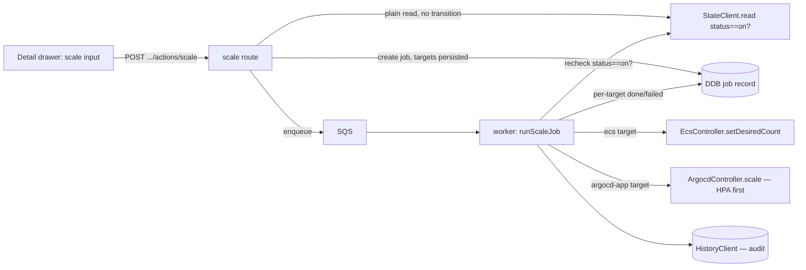

# ADR-017: Demo-scale job operation (ArgoCD/HPA replicas, ECS desiredCount)

## Status
Accepted (2026-08-19).

## Context

Ahead of a live demo, an operator sometimes needs more headroom on a resource
than its restored baseline gives it — bump an ArgoCD-managed HPA's replica
count, or an ECS service's `desiredCount` — independent of the existing on/off
restoration flow. `turn_on`/`turn_off` restore a resource to whatever capacity
it had before the last `turn_off`; they have no concept of "bigger than
that," and folding one in would conflate two different state machines (on/off
transitions vs. an arbitrary resize).

## Options Considered

### Option 1: Fold into `turn_on` as a "resize" variant
- **Pros**: no new route, no new job operation.
- **Cons**: `turn_on` restores from `restoration_data` and always transitions
  `transitioning → on`; a resize needs neither. Overloading it would make the
  on/off state machine's transitions conditional on an unrelated concern.

### Option 2: Synchronous API call, no job model
- **Pros**: simpler, immediate feedback.
- **Cons**: breaks the one execution path this platform already has (ADR-001:
  API validates → DDB job → SQS → worker); the API would need its own
  cross-account ArgoCD/AWS credentials, duplicating the assume-role wiring
  `worker` already owns and contradicting `dashboard/CLAUDE.md`'s
  backend-does-cross-account convention.

### Option 3: New `scale` job operation, `targets` persisted on the job record (chosen)
- **Pros**: reuses the existing async job model end to end (route → DDB → SQS →
  worker → DDB), including restart recovery, job status polling, and history —
  the only new primitive is the operation and its per-target payload.
- **Cons**: `targets` don't fit the `turn_on`/`turn_off` job shape exactly (no
  `restoration_data`, no status transition), so the job-runner branch has to be
  structurally separate rather than reusing the existing postlude as-is.

## Decision

**Option 3.** A new job `operation: 'scale'` with a `targets` array (each
`{ stepKey, replicas? | desiredCount? }`) **persisted on the job record
itself**, not only carried in the SQS message body — `sweepRunningJobs`'
restart recovery rebuilds in-flight jobs from DDB, not the queue, so
SQS-only targets would recover to nothing to act on.

Exposed via `POST /api/projects/:owner/:name/actions/scale`, a route distinct
from the existing `:op` route (different body shape) rather than a third `:op`
value. Its precondition — project status is currently `on` — is a **plain,
eventually-consistent status read** via the existing `StateClient.read()`, not
an atomic conditional write: `scale` has no status transition of its own to
attach a DynamoDB `ConditionExpression` to. This narrows, but does not
eliminate, a race against a concurrent `turn_off` — the worker mitigates the
rest of that window with a **start-of-branch status recheck**: at the top of
the `scale` branch, the worker re-reads `state.status` and aborts the whole
job — zero per-target `appendProgress` calls, not a per-target failure — if
the project is no longer `on`.

The job-runner's `scale` branch (`runScaleJob`) is **structurally separate**
from the `turn_on`/`turn_off` postlude: it only ever updates the *job's*
status, never calls `markOn`/`markError` on the project's `state.status`. Per
target, it dispatches by resource type: `argocd-app` calls a new
`ArgocdController.scale(application, replicas)` that dispatches **per
workload handle by kind** — `patchReplicas(replicas)` for
Deployment/StatefulSet, `patchHpaBounds({min: replicas, max: replicas})` for
HPA, **HPA-kind handles patched before Deployment/StatefulSet-kind handles**
(carrying over the existing `turnOn`/`turnOff` "HPA first, to prevent
re-scaling" convention). `ecs` targets call a new, standalone
`EcsController.setDesiredCount`, independent of the existing turn-on/off
restoration capture. Both controllers reject a non-integer, non-positive, or
`MAX_SCALE_REPLICAS`-exceeding (20) value before calling AWS/ArgoCD at all —
the same shared constant the route validates against, so a restart-recovered
job (which re-enters the controller directly from the DDB record, bypassing
route validation) is still bounded.

A job is `partial_failure` if some but not all targets fail, `failed` only if
every target fails — a convention **new to `scale`**: the existing `runJob`
path for `turn_on`/`turn_off` never actually sets `failed` itself, only
`partial_failure` for any error (including all-targets-failed); only the
route's own enqueue-rollback path sets `failed`. Aggregation is at the
**target level**, not per-workload-handle: within a single `argocd-app`
target backed by multiple handles, one handle failing marks that whole target
(and, if it's the only target, the whole job) as failed even if a sibling
handle on the same application patched successfully.

A `scale` job appends a `HistoryClient` record the way `turn_on`/`turn_off`
do, for audit parity — including on the two abort paths (empty targets,
status-recheck failure), so a rejected scale attempt is still part of the
audit trail.

## Consequences

### Positive
- Reuses the existing async job model end to end — no new execution path, no
  new credential wiring, restart recovery and job polling work unchanged.
- The scale/`turn_off` race is narrowed by two independent checks (route-level
  read, worker-level recheck) without needing a distributed lock or a
  synthetic transitional status.
- Both controllers validate against one shared ceiling constant regardless of
  entry path (fresh request vs. restart recovery).

### Negative — accepted limitations
1. **`argocd-app` scaling irreversibly collapses the HPA's autoscaling
   range** — at the moment of the scale itself, not only after a later
   `turn_off`. `scale` pins `patchHpaBounds({min, max})` to a single value;
   nothing captures the pre-scale asymmetric range, and scaling back down
   goes through the same pin-to-a-single-value path, so the original range
   can never be recovered through this feature. `ecs` has no such range to
   lose.
2. **The `turn_off` race is narrowed, not eliminated** — a `scale` and a
   concurrent `turn_off` can still race in the window between the route's
   read and the worker's own recheck (SQS latency, or minutes if a
   restart/sweep-recovery cycle intervenes).
3. **One replica value is broadcast to every workload handle** on a
   multi-workload ArgoCD application — "the current value" isn't even
   well-defined per-application when it backs multiple Deployments/HPAs with
   different counts, so this pass scales them all to the same requested
   number rather than building per-handle targeting.
4. **A job can be left orphaned `pending`** if the SQS-enqueue-failure
   rollback (`markFailed`) itself also fails — `sweepRunningJobs` only
   recovers `running` jobs, so a `pending` job that never got marked `failed`
   is stuck until manually inspected.

> **Update (2026-08-20):** limitation 1 originally listed here — the ArgoCD
> client's workload-listing filter carrying a hardcoded `namespace:
> 'placeholder'`, so `listWorkloads` matched zero handles for every real
> application — is fixed. `ArgocdClient.listWorkloads` now takes `namespace`
> as a call-time argument instead of a client-construction-time option, and
> `ArgocdController`/`job-runner.ts` thread each project resource's own
> `workload_selector.namespace` through on every `turnOff`/`turnOn`/`scale`
> call. This also unblocks the `turn_on`/`turn_off` ArgoCD path, which shared
> the same bug. The frontend's `argocd-app` scale control in `DetailDrawer.tsx`
> is enabled accordingly. The range-collapse limitation above (now numbered 1)
> remains — fixing the namespace bug did not change that behavior.
6. **A mixed-kind `argocd-app` target's failure status can mask a completed
   mutation**: HPA-first ordering means the HPA may already be irreversibly
   pinned before a sibling Deployment/StatefulSet handle fails and the whole
   target aggregates to `failed`. The frontend's reminder-toast logic works
   around this by warning on any non-idle progress-entry outcome for
   `argocd-app` targets (not just `done`), but the underlying job-status
   ambiguity itself isn't fixed.
7. **No in-flight guard** prevents two `scale` requests targeting the same
   resource from overlapping.
8. **A restart-recovered `scale` job replays every target** in its `targets`
   array rather than consulting its own `progress` map to skip ones already
   recorded `done` before the restart — usually idempotent (re-applying the
   same value), but not guaranteed so given limitation 7's overlap gap.
9. **A `failed:` progress entry for an `ecs` target can, in principle, mask an
   `UpdateServiceCommand` that actually reached AWS** before a later step
   timed out. The frontend accepts this narrow ambiguity for `ecs` rather than
   over-warning the way it does for `argocd-app` (limitation 6), since `ecs`'s
   failure surface is a single call with no multi-handle aggregation.

`scale`, like the existing `turn_off` HPA-2 pattern before it, also depends on
the cluster-wide ArgoCD `ignoreDifferences` for Deployment/StatefulSet
`/spec/replicas` and HPA `/spec/{min,max}Replicas`
(`k8s/system/argocd/values.yaml`) — stated precisely, not overstated:
`ignoreDifferences` only suppresses ArgoCD's own diff/self-heal
reconciliation, so a covered Application is protected from ArgoCD *reverting*
a `scale` patch on its own, but a **git-triggered sync** (an unrelated commit
auto-syncing that Application mid-demo) still re-applies the manifest's
replicas/HPA bounds and undoes the patch regardless of coverage. Full
protection additionally requires that Application to set
`RespectIgnoreDifferences=true`, which today only the self-managed
`argocd-apps/system/argocd.yaml` does, not tenant Applications. This is the
same pre-existing exposure the `turn_off` HPA-2 pattern already carries —
nothing is newly broken by `scale` — but it's an operator-relevant mid-demo
risk worth recording precisely rather than implying covered Applications are
fully safe.
