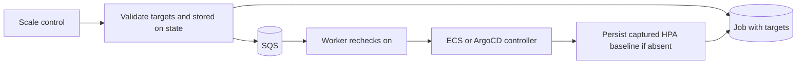

# ADR-017: Demo-scale job operation (ArgoCD/HPA replicas, ECS desiredCount)

## Status

Accepted 2026-08-19. Evolution and current applicability reconciled 2026-09-13.

## Context and decision

Demo preparation sometimes needs extra capacity while a project remains on.
The existing lifecycle operations restore saved state; a resize should not
change their state machine.

| Option | Rationale at adoption |
| --- | --- |
| Resize through `turn_on` | Conflates arbitrary capacity with restoration and `transitioning → on` |
| Synchronous API mutation | Adds a second execution path and duplicates worker credential/controller wiring |
| Separate `scale` job (chosen) | Reuses queue, controllers, polling and history without changing project status |

`POST /api/projects/:owner/:name/actions/scale` accepts a nonempty `targets`
array. Each unique `stepKey` must identify an ECS or ArgoCD resource in that
project: ECS requires `desiredCount`, ArgoCD requires `replicas`, and the other
field is rejected. API and controllers enforce integer values 1–20. The API
returns 400 for invalid targets, 409 unless project state is `on`, or
`202 {job_id}` after creation/enqueue. Targets persist in DynamoDB as well as SQS
so the startup sweep can reconstruct scale requests.

The worker rechecks `on` at branch entry and never changes project status.
It patches ECS desired count, or all matching ArgoCD HPA bounds first and then
Deployment/StatefulSet replicas. One requested count applies to every handle
in that Application/namespace; zero matching handles fails explicitly.

Scale aggregates outcomes per target: all succeed → `succeeded`, some fail →
`partial_failure`, all fail → `failed`. Empty targets or a failed status recheck
also yield `failed` before target processing. Such aborts write no new progress;
a replay may retain old progress. Worker outcomes append history, including those
aborts; route validation rejection does not. History durability and lifecycle's
different failure aggregation are documented in
[ADR-001](ADR-001-sqs-worker-for-async-jobs.md).

## Dated evolution

- **2026-08-20:** per-call `workload_selector.namespace` replaced the client's
  placeholder filter, enabling real Application handles for on/off/scale.
- **2026-08-21:** a permanent `hpa-baseline#<stepKey>` state item added conditional
  write-once HPA bounds. This addressed the original loss of elasticity after
  successful sequential scale calls: off prefers an available saved baseline,
  and on restores the resulting restoration data. It did not make mutation and
  persistence atomic.
- **2026-09-12 (PR #103):** the mounted UI control gained duplicate-submit
  protection, and HPA guidance was qualified for first partial failures.
  A failure notice asks operators to verify bounds; it does not promise recovery.
- **2026-09-13 (PR #107):** the mounted dashboard coordinates lifecycle and scale
  through per-project locks that survive drawer close/reopen, with up to four
  active client attempts. Bulk lifecycle operations use a local queue and retained
  results. This does not add backend locks or persistence across browser reloads.

## Current limitations

The historical limitation numbers are retained for existing references.

- **1. Baseline recovery is conditional.** The original range-loss limitation is
   mitigated by a saved baseline, not eliminated in every failure case. The first
   successfully persisted nonempty HPA map wins, not necessarily the earliest
   observation. Only explicitly numeric live min/max pairs are captured. The item
   has no TTL or update/merge path for later HPA additions or desired baseline
   changes. There is no standalone reset-to-baseline API/UI.
- **2. Scale can race with off.** Both status reads are eventually consistent;
   neither is a lock. Off can begin after the worker recheck, or a stale read
   can still report `on`. There is no per-target recheck or conditional mutation.
- **3. Targeting is per resource, not per workload handle.** One ArgoCD replica
   value is broadcast to every matching Deployment, StatefulSet and HPA.
- **4. Enqueue recovery is incomplete.** If enqueue fails, the route attempts
   `markFailed`. If that also fails, the pending job is not recovered by the
   running-only startup sweep. General replay limits belong to ADR-001.
- **6. A failed target may already have mutated resources.** The controller reads
   each HPA before pinning it, patches the remaining HPAs and then sibling
   Deployment/StatefulSet handles, and returns captured bounds only after all
   succeed. `runScaleJob` then persists the baseline and writes `done`. A sibling
   patch failure, baseline-write failure or crash can leave the first HPA pinned
   without a baseline. Off has the same capture → mutate → persist gap.

   **Before the next `turn_off` or scale after a failed first scale, inspect live
   bounds and the stored baseline.** Otherwise off can record already-pinned
   bounds as the permanent baseline. An off/on cycle cannot reconstruct original
   bounds that were never saved. A baseline read is also eventually consistent;
   off falls back to its freshly captured map if no baseline is returned.
   A different resource's failure does not undo a successfully saved baseline.
- **7. Scale requests can overlap outside local attempt locks.** There is no
   backend/cross-client in-flight guard. Since PR #107, `useOperations` locks one
   attempt per project across lifecycle and scale in the mounted dashboard, even
   when the drawer closes/reopens; a running batch blocks individual mutations.
   Dashboard Refresh retains those locks, but browser reload/unmount and other
   tabs/operators/direct clients do not share them. A lock also ends when local
   polling settles or times out, even if the backend job continues. Concurrent
   first captures can still persist out of observation order, so write-once does
   not prove original bounds.
- **8. Recovery replays every target.** The runner does not skip recorded `done`
   entries or reject completed-job redelivery. Reapplying an older requested
   count can overwrite a newer scale, despite being a repeat of the same job.
- **9. ECS failure can also be ambiguous.** A timed-out update may have reached AWS.
   UI reminders use `done` for ECS; ArgoCD also warns on `failed:` progress because
   it aggregates multiple handle mutations. Poll timeout/error does not cancel
   either operation or establish that nothing changed.

## ArgoCD sync exposure

[Cluster-wide diff exclusions](../../k8s/system/argocd/values.yaml) cover workload
replicas and HPA min/max. They suppress differences; they do not alone preserve
live patches when an Application sync reapplies Git manifests. The repository's
`RespectIgnoreDifferences=true` setting is on the self-managed
[ArgoCD Application](../../argocd-apps/system/argocd.yaml), not its tenant
Applications. Verify the owning Application's policy before a demo; a later sync
can undo off/scale changes. This exposure predates scale.

## Evidence

- [Route](../../dashboard/backend/packages/api/src/routes/scale.ts),
  [runner](../../dashboard/backend/packages/worker/src/job-runner.ts),
  [ArgoCD controller](../../dashboard/backend/packages/worker/src/controllers/argocd.ts),
  [baseline persistence](../../dashboard/backend/packages/shared/src/ddb/state.ts)
- [Route tests](../../dashboard/backend/packages/api/src/__tests__/scale.test.ts),
  [runner tests](../../dashboard/backend/packages/worker/src/__tests__/job-runner.test.ts),
  [DynamoDB integration tests](../../dashboard/backend/packages/shared/src/ddb/__tests__/state.int.test.ts)
  cover validation, outcomes and sequential write-once behavior; they do not prove
  first-failure or concurrent-capture recovery.
- [Frontend guide](../../dashboard/frontend/CLAUDE.md) owns UI limits, polling and
  the manually mirrored 1–20 cap.
